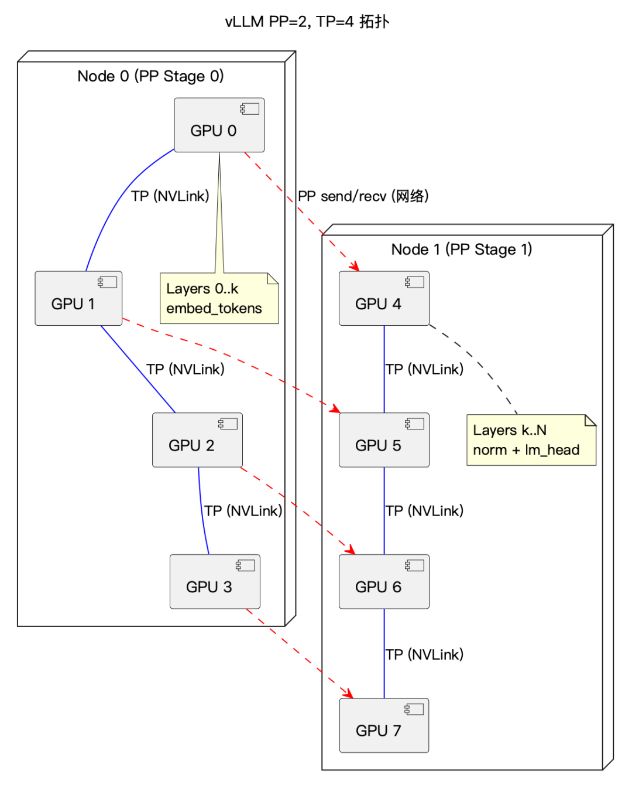
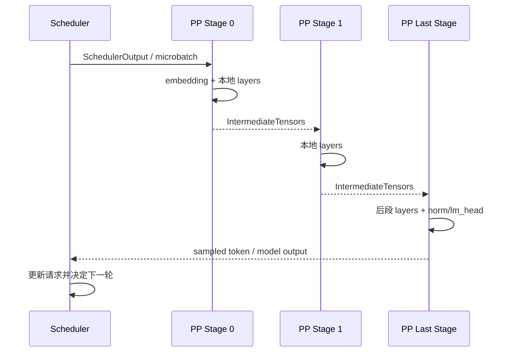
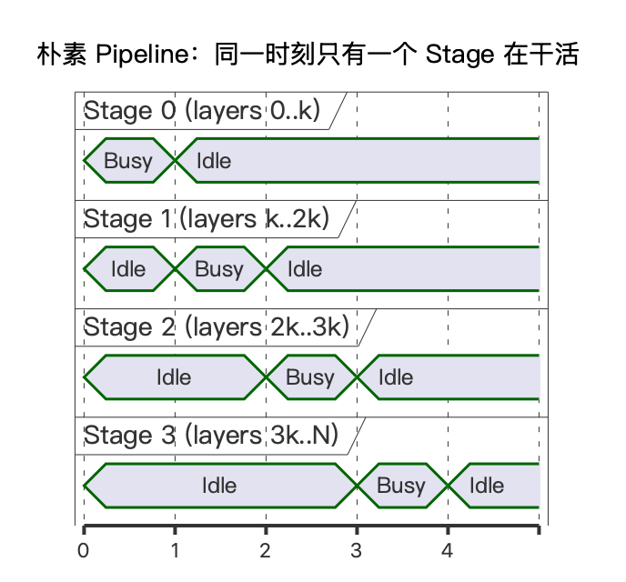
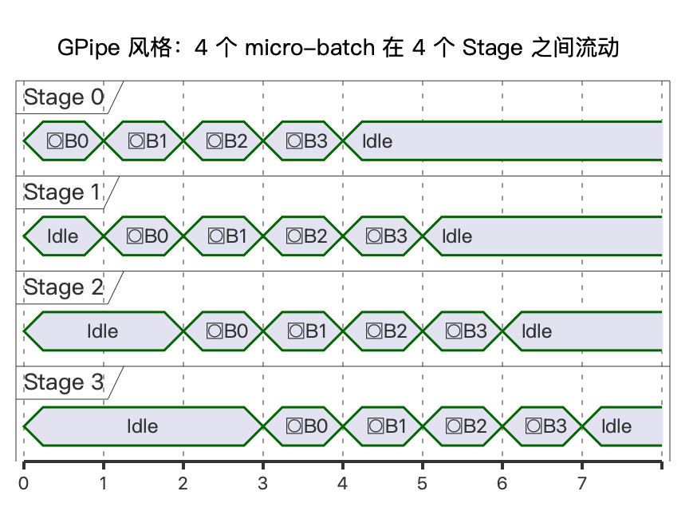
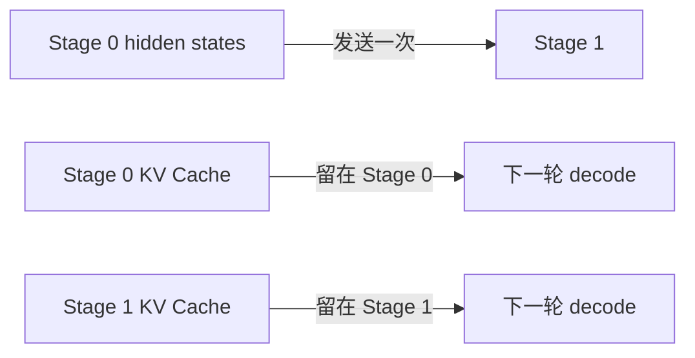
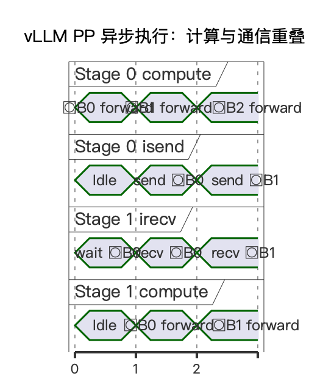
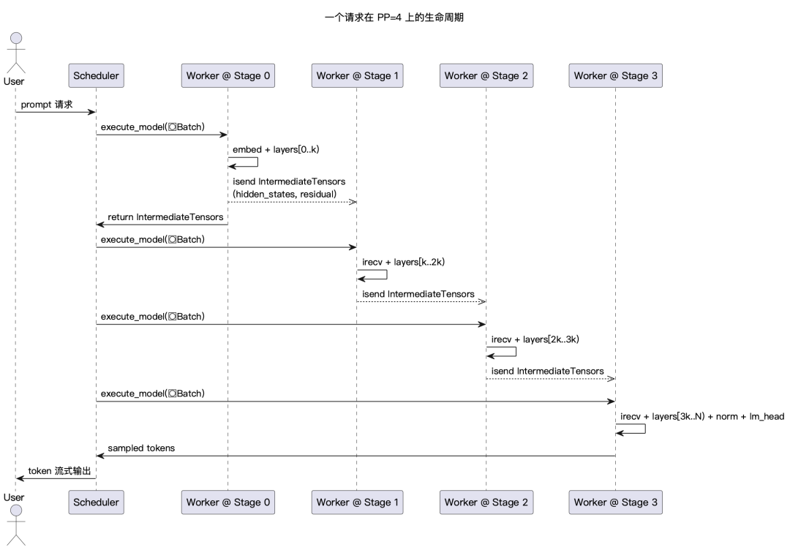

# vLLM Pipeline Parallel 流水线并行学习文档

本文面向第一次了解 vLLM Pipeline Parallel 的同学，沿着“一条请求怎样穿过多个 stage”来理解 PP：

- 模型层怎样切；
- TP group 与 PP group 怎样交叉编队；
- `IntermediateTensors` 里到底传什么；
- 异步 send/recv 怎样与计算重叠；
- Scheduler 为什么要知道请求仍在流水线中。

原文以源码路径和代码片段讲解 vLLM，但本文仍属于**第三方资料整理型学习文档**。本文没有逐行核对当前 vLLM 仓库，因此函数签名、行号、参数和支持状态都以原文读取时的版本为边界。

## 0. 阅读基线与范围

| 项目 | 内容 |
| --- | --- |
| 原文标题 | LLM推理优化-vLLM PP并行 |
| 原文链接 | [https://mp.weixin.qq.com/s/GurfyWIOBUqrS8T6ex-SeA](https://mp.weixin.qq.com/s/GurfyWIOBUqrS8T6ex-SeA) |
| 作者 | elrond-g |
| 发布时间 | 2026-05-01 |
| 读取时间 | 2026-07-27 |
| 资料类型 | 基于源码路径的第三方图文讲解 |
| 整理范围 | vLLM PP 的拓扑、层切分、中间张量、异步通信、调度感知和部署边界 |
| 不展开内容 | 训练 PP 的反向调度、SGLang PP、PD 分离下的 KV 传输 |
| 验证边界 | 未对当前 vLLM 源码做复核，未启动 PP 集群，未复现文章性能判断 |

### 怎么读本文

每次看到一个对象，都问它属于哪一层：

| 层次 | 关键问题 |
| --- | --- |
| 模型层 | 这个 rank 真正加载哪些 Transformer layer？ |
| 通信层 | hidden states 要发给哪个 PP rank？ |
| 调度层 | 哪个 microbatch 正在路上，能否再次调度？ |
| 生命周期 | 最后一个 stage 产生的新 token 怎样回到 Scheduler？ |

### 术语速查

| 术语 | 人话解释 | 原文源码锚点 |
| --- | --- | --- |
| PP | 按层把模型切成多个 stage | `parallel_state.py`、`distributed/utils.py` |
| TP | 同一 stage 内把矩阵/head 切到多张卡 | `parallel_state.py` |
| PP rank/stage | 流水线上的一个工位 | `get_pp_group()` |
| microbatch | 为填满流水线而独立向前推进的一小批请求/token | Scheduler 与 Worker |
| bubble | 某些 stage 没有活干的空转时隙 | 调度与并发共同决定 |
| `PPMissingLayer` | 不属于本 stage 的层占位符 | `model_executor/models/utils.py` |
| `IntermediateTensors` | stage 间传递的 hidden states、residual 等 | `sequence.py` |
| `AsyncIntermediateTensors` | 带异步通信 handle、按需等待的中间张量 | `v1/worker/gpu_worker.py` |
| first/last rank | 负责 embedding 或最终 norm/lm_head 的边界 stage | `get_pp_group().is_first_rank/is_last_rank` |

---

## 1. 先建立整体地图

### 人话版

PP 把一个很深的模型分成多段：

```text
Stage 0: embedding + layers 0..k
Stage 1: layers k..2k
Stage 2: layers 2k..N + norm/lm_head
```

一条请求先在 Stage 0 变成 hidden states，再把中间激活发给 Stage 1。Stage 1 不再需要原始 `input_ids`，只接着算自己的层。最后一个 stage 才得到 logits 并采样 token。

如果还开了 TP，同一个 stage 内又有多个 TP rank。于是：

- TP 负责“同一层一起算”；
- PP 负责“不同层接力算”。

### 拓扑图



**图意解读**

- Node 0 上 GPU 0-3 组成 Stage 0 的 TP group，负责前段层。
- Node 1 上 GPU 4-7 组成 Stage 1 的 TP group，负责后段层。
- 蓝线表示 stage 内高频 TP 通信，通常希望走 NVLink/NVSwitch。
- 红色虚线表示相同 TP 位置跨 stage 的 PP send/recv，形成 `0->4`、`1->5` 等 PP group。
- PP 发送的是中间激活分片，而不是每层都做跨节点 all-reduce；这正是 TP 节点内、PP 节点间常见部署方式的原因。

### 控制流和数据流



### 三类数据不要混

| 数据 | 内容 | 生命周期 |
| --- | --- | --- |
| 原始调度输入 | request id、token、position、block table 等 | 一个调度 step |
| PP 中间激活 | `hidden_states`、`residual` 等 | 当前 forward 在 stage 间流动 |
| KV Cache | 每个 stage 自己负责层的历史 K/V | 跟随请求跨多个 decode step |

PP 只把中间激活发给下一 stage。每个 stage 的 KV Cache 留在本 stage，下一轮 decode 继续复用。

---

## 2. 为什么朴素 PP 会空转

### 2.1 一条请求、四个 stage



**图意解读**

- 每个时刻只有一个 stage 为 Busy，其余 stage 都在 Idle。
- 一条 microbatch 必须依次经过 Stage 0、1、2、3。
- 如果只有这一条工作，设备利用率接近 `1 / stage 数`。
- PP 能把模型放下，但不会自动带来吞吐；还需要多个 microbatch 或请求填流水线。

### 2.2 多个 microbatch



**图意解读**

- Stage 0 在处理后续 microbatch 时，Stage 1、2、3 同时处理更早的 microbatch。
- 中间稳定区多个 stage 都在工作；首尾仍存在灌入和排空气泡。
- 原图中的方框字符是绘图字体缺失，语义是 `μB0..μB3`。
- 推理没有训练反向传播，因此真实 vLLM 调度不会机械照搬 GPipe；图只说明“错峰并行”的原则。

### 2.3 气泡从哪里来

原文给出近似直觉：

```text
bubble ratio ≈ (stages - 1) / (stages + microbatches - 1)
```

它说明：

- stage 越多，灌入/排空气泡越大；
- 同时在飞的 microbatch 越多，气泡占比越低。

但在线推理的真实气泡还受：

- 请求到达率；
- prefill/decode 混合；
- 每个 stage 的层负载；
- KV Cache 容量；
- Scheduler 是否允许足够多 in-flight 工作；
- 异步通信是否被隐藏；

共同影响。公式只能当作教学近似。

---

## 3. 进程组怎样编队

### 3.1 World、TP group、PP group

以 `TP=4, PP=2` 为例，共 8 个 worker：

```text
TP group 0: [0, 1, 2, 3]  -> PP Stage 0
TP group 1: [4, 5, 6, 7]  -> PP Stage 1

PP group 0: [0, 4]
PP group 1: [1, 5]
PP group 2: [2, 6]
PP group 3: [3, 7]
```

### 3.2 原文源码锚点

| 行为 | 原文给出的源码位置 |
| --- | --- |
| `pipeline_parallel_size` 配置 | `vllm/config/parallel.py` |
| world size 计算 | `ParallelConfig.__post_init__` |
| `get_pp_group()` | `vllm/distributed/parallel_state.py` |
| PP group 创建 | `initialize_model_parallel()` |
| first/last rank 判断 | `GroupCoordinator` |

原文读取时把 world size 描述为：

```text
world_size = TP × PP × PCP
```

这是文章对应版本的实现描述。DCP 通常复用 TP rank，因此不作为新的 world-size 乘数。当前版本是否仍采用相同维度顺序，应检查 `ParallelConfig` 和启动校验。

### 3.3 为什么 PP group 是“列”

TP group 是同一 stage 的一整行；PP group 是不同 stage 中相同 TP 分片位置组成的一列。

这样做的好处是：

- TP rank 0 的激活分片直接发给下一 stage 的 TP rank 0；
- 跨节点只传 `1/TP` 左右的中间激活；
- 接收侧再在本地 TP group 内恢复所需布局；
- 避免每张卡都跨节点发送完整 hidden states。

---

## 4. 模型层怎样切到各 stage

### 4.1 `get_pp_indices`

原文将层切分入口定位到：

```text
vllm/distributed/utils.py::get_pp_indices
```

其职责是根据：

```text
num_hidden_layers
pp_rank
pp_size
```

返回：

```text
[start_layer, end_layer)
```

### 4.2 为什么最后一个 stage 可能少分层

最后一个 stage 通常还承担：

- final norm；
- lm_head；
- logits 处理或采样相关工作。

因此原文所示默认切法不会简单把余数都堆到最后 stage，而会尝试把额外层分给前面的 stage，降低尾段拖慢整条流水线的风险。

### 4.3 `PPMissingLayer`

#### 人话版

每个 rank 仍保留“完整层号目录”，但不属于自己的层只是空占位，不加载真实权重。

原文给出的模型构建心智模型是：

```python
modules = (
    [PPMissingLayer() for _ in range(start_layer)]
    + [real_layer(i) for i in range(start_layer, end_layer)]
    + [PPMissingLayer() for _ in range(end_layer, num_layers)]
)
```

#### 这样设计的价值

- 权重名仍使用全局绝对层号；
- checkpoint loader 不必理解每种 PP 拓扑；
- 模型代码可继续通过 `self.layers[i]` 定位；
- 只有本 stage 的真实层分配权重显存。

#### 不能误解的地方

`PPMissingLayer` 只是模型结构占位，不负责：

- stage 间通信；
- Scheduler 的 in-flight 状态；
- KV Cache 生命周期；
- 权重自动迁移。

### 4.4 首尾 stage 的特殊模块

典型模型会根据 PP rank 决定：

| 模块 | 谁持有 |
| --- | --- |
| input embedding | first PP rank |
| 中间 Transformer layers | 各自 stage |
| final norm | last PP rank |
| lm_head | last PP rank，权重共享时可能有例外 |

自定义模型若直接构造完整 `nn.ModuleList`，没有使用 PP-aware 的层创建与首尾守卫，可能在每个 stage 都加载不该加载的权重。

---

## 5. `IntermediateTensors` 传的是什么

### 人话版

Stage 1 不需要重新从 token 开始算。它只需要 Stage 0 计算后的中间激活。

原文把容器定位到：

```text
vllm/sequence.py::IntermediateTensors
```

核心可理解为：

```python
IntermediateTensors(
    tensors={
        "hidden_states": ...,
        "residual": ...,
    },
    kv_connector_output=...,
)
```

### 为什么不只传一个 hidden state

不同模型层可能需要跨 stage 保留：

- hidden states；
- residual；
- auxiliary hidden states；
- 某些 connector 输出或模型特有状态。

因此用 `dict[str, Tensor]` 比写死一个 tensor 更容易适配模型。

### 预分配接收缓冲区

原文提到 `make_empty_intermediate_tensors_factory` 会提前创建固定地址的接收 buffer。新数据到达后使用 `copy_()` 覆盖，而不是每次换一个 tensor 对象。

目的包括：

- 减少显存分配和碎片；
- 让 CUDA Graph 看到稳定地址；
- 方便按最大 batch 预分配，再按有效 token 切片；
- 避免通信接收后重新构造复杂容器。

### 中间激活与 KV Cache 的边界



同一 forward 会同时：

- 把本 stage 新 token 的 K/V 写入本地 KV Cache；
- 把层输出作为 `IntermediateTensors` 发给下一 stage。

两者不是同一种数据。

---

## 6. 异步 send/recv 怎样隐藏通信

### 6.1 阻塞路径

最简单的流程是：

```text
recv -> wait -> compute -> send -> wait
```

CPU 和 GPU 很容易在通信等待期间空转。

### 6.2 `AsyncIntermediateTensors`

原文给出的关键思想是“懒同步”：

1. 提前调用 `irecv_tensor_dict()`；
2. 保存通信 handle，不马上等待；
3. CPU 继续准备 batch、metadata、KV；
4. 真正读取 `.tensors` 时才 `wait_for_comm()`；
5. 计算结束后立即 `isend_tensor_dict()`。



**图意解读**

- Stage 0 的 forward、isend 与 Stage 1 的 irecv/forward 在时间上错开。
- Stage 1 可以先发起接收，再做不依赖张量内容的准备工作。
- 真正使用中间张量前才等待，缩短显式阻塞区间。
- 原图有少量字体缺失，但四条时间线分别表示 Stage 0 compute/send 与 Stage 1 recv/compute。

### 6.3 为什么“异步 API”不等于自动重叠

要真正重叠，还要满足：

- send/recv 使用的 stream 与计算有合理依赖；
- CPU 没有立刻访问 tensor 触发等待；
- 下一个 microbatch 已经准备好；
- 通信 buffer 生命周期足够长；
- collective/P2P 没有被其他大通信占满；
- stage 计算时间足以覆盖通信。

---

## 7. 模型 forward 怎样感知 PP

### First stage

```text
input_ids
-> embedding
-> 本 stage layers
-> IntermediateTensors
```

### Middle stage

```text
IntermediateTensors
-> 取 hidden_states/residual
-> 本 stage layers
-> 新 IntermediateTensors
```

### Last stage

```text
IntermediateTensors
-> 后段 layers
-> norm
-> lm_head/logits
-> sampled token
```

### 原文源码锚点

| 行为 | 原文给出的路径 |
| --- | --- |
| LLaMA PP-aware 初始化 | `vllm/model_executor/models/llama.py::LlamaModel.__init__` |
| 按 stage 选择输入 | `LlamaModel.forward` |
| 只遍历本地层 | `islice(self.layers, start_layer, end_layer)` |
| 非最后 stage 返回中间张量 | `IntermediateTensors` 分支 |
| Worker 衔接 recv/forward/send | `vllm/v1/worker/gpu/model_runner.py::execute_model` |

这些路径来自原文。阅读当前源码时应先 `rg "class IntermediateTensors|PPMissingLayer|is_first_rank"` 再确认实际位置。

---

## 8. Scheduler 为什么要感知 PP

### 人话版

单卡场景里，一个调度 step 完成后，结果很快回到 Scheduler。PP 场景里，请求可能已经把 prompt token 全部“送进”流水线，却还没从最后一个 stage 出来。

此时 Scheduler 必须区分：

- 没有新 token 可调度；
- token 已经调度，但仍在 PP pipeline 中；
- 最后 stage 已完成，可以进入下一轮 decode。

### 请求生命周期



**图意解读**

- Scheduler 把同一逻辑 batch 交给各 stage 的执行链路。
- 每个 stage 接收上游 `IntermediateTensors`，运行本地层，再发给下游。
- 最后 stage 产生 sampled token 并回到 Scheduler。
- 图是原文的顺序化心智模型；实际异步 executor 会让多个 microbatch 同时在不同 stage 飞行，并不要求 Scheduler 串行等完每条箭头。

### In-flight 状态

Scheduler 至少需要知道：

- 请求是否已经进入 pipeline；
- 当前有多少 token 在飞；
- 是否可以再次分配 KV slot；
- sampled token 是否已经返回；
- 请求是否完成或被取消；
- 某个 stage 失败时怎样收敛状态。

如果把“已调度”误当作“已完成”，可能造成：

- 同一 token 重复执行；
- KV slot 重复写；
- 请求过早释放；
- 输出 token 次序错乱。

---

## 9. 部署与层平衡

### 9.1 单机示例

原文示例：

```bash
vllm serve /path/to/model \
  --tensor-parallel-size 4 \
  --pipeline-parallel-size 2
```

这会要求 8 个 worker。参数名和 executor 支持应以目标版本 `vllm serve --help` 为准。

### 9.2 多机示例

原文建议多机 PP 配合分布式 executor，例如 Ray：

```bash
vllm serve /path/to/model \
  --tensor-parallel-size 8 \
  --pipeline-parallel-size 2 \
  --distributed-executor-backend ray
```

这不是通用部署保证。实际还要配置：

- 节点发现和资源标签；
- 模型权重访问；
- NCCL 网络接口；
- RDMA/TCP；
- 容器共享内存；
- 故障恢复和日志聚合。

### 9.3 自定义层切分

原文提到环境变量：

```bash
export VLLM_PP_LAYER_PARTITION="24,8"
```

它用于异构 GPU 或层耗时不均。使用前应确认当前版本是否保留该变量以及总和校验规则。

### 9.4 平衡的不只是层数

最后一个 stage 常多出 norm/lm_head；不同层也可能有：

- dense 与 MoE 差异；
- 稀疏 attention；
- 多模态 encoder/adapter；
- 不同 KV Cache 大小；
- logits processor。

所以“每 stage 层数相同”不等于“每 stage 时间相同”。

正确做法是测量每个 stage：

```text
compute time
send/recv time
KV usage
峰值显存
等待时间
```

然后让最慢 stage 接近其他 stage。

---

## 10. PP、TP、DP 怎么选

| 目标 | 更合适的主方向 | 原因 |
| --- | --- | --- |
| 单个节点内加速一层 | TP | 高频通信可走 NVLink |
| 模型跨节点放不下 | PP | 跨节点主要传中间激活 |
| 提升独立请求吞吐 | DP | 副本间通信少 |
| 一条超长 prompt 需要更多算力 | PCP | 沿序列给单请求加资源 |

常见组合：

```text
节点内：TP
节点间：PP
多副本：DP
超长 prefill：按支持情况叠加 PCP
```

但并行维越多，进程组、KV 布局、调度状态和故障面都会变复杂。应从满足容量的最小并行组合开始。

---

## 11. 小白排障地图

| 现象 | 可能原因 | 优先检查 |
| --- | --- | --- |
| 某 stage OOM | 层/embedding/lm_head 分配不均 | `start_layer/end_layer`、层分区 |
| 所有 stage 利用率低 | 请求并发不足，pipeline 没填满 | in-flight microbatch 数 |
| 跨节点网络很高 | 发送了完整 hidden states 或 TP/PP 拓扑不当 | PP group、TP all-gather 优化 |
| 第二个 stage 一直等 | 上游没 send、shape 不一致或 handle 未完成 | send/recv 顺序、tensor metadata |
| CUDA Graph 反复捕获 | 接收 buffer 地址/shape 不稳定 | 预分配、`copy_()`、padding 桶 |
| 自定义模型每个 stage 都加载全模型 | 没用 PP-aware `make_layers` | `PPMissingLayer`、首尾守卫 |
| sampled token 不回 Scheduler | last rank 或 executor 回传路径错误 | `is_last_rank`、in-flight 状态 |
| 增加 PP 后延迟明显升高 | 单请求气泡、每 stage 算力变少 | 并发、stage 数、层平衡 |
| 手动分层后启动失败 | 分层总和或 stage 数不匹配 | 环境变量与模型层数 |

### 排障顺序

1. 先画出 rank 到 `PP stage × TP rank` 的映射。
2. 确认每个 rank 实际加载的层。
3. 记录每个 stage 收发张量的 key、shape、dtype。
4. 观察 sampled token 是否只由 last stage 产生。
5. 最后再分析性能和通信重叠。

---

## 12. 一句话总结

**vLLM PP 把模型层分给多个 stage，用 `IntermediateTensors` 传递短生命周期激活，用本地 KV Cache 保留长生命周期历史，再由 Scheduler 管理多条在途 microbatch；性能关键是 stage 平衡、足够并发和异步通信重叠。**

## 13. 参考与延伸

- [LLM推理优化-vLLM PP并行](https://mp.weixin.qq.com/s/GurfyWIOBUqrS8T6ex-SeA)
- [SGLang Pipeline Parallel 模式学习文档](../../sglang/parallelism/SGLang%20Pipeline%20Parallel%20模式学习文档.md)
- [PD 分离下的 PP 源码学习文档](../../sglang/disaggregation/PD%20分离下的%20PP%20源码学习文档.md)

本文基于原文整理，文中源码路径、参数与行为均应在目标 vLLM 版本中重新确认。
