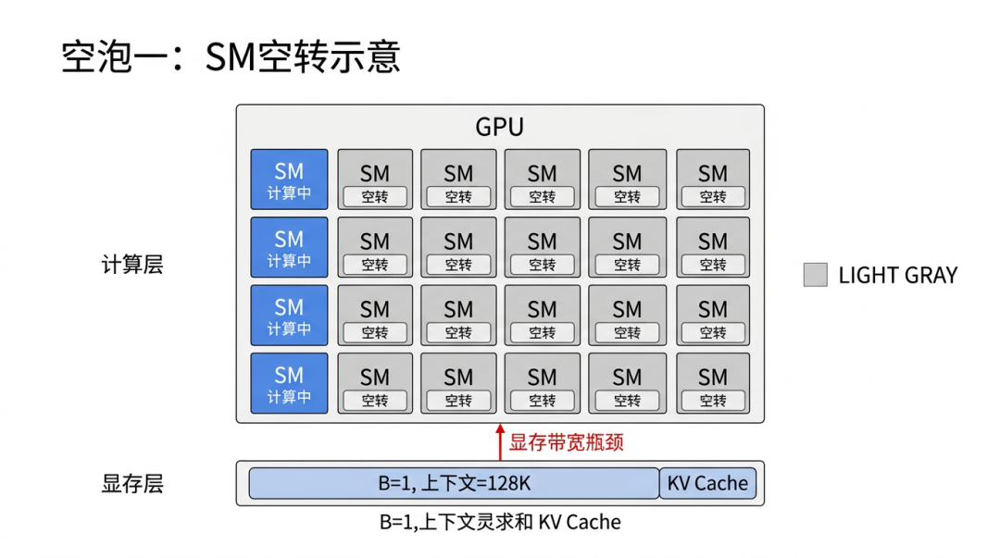
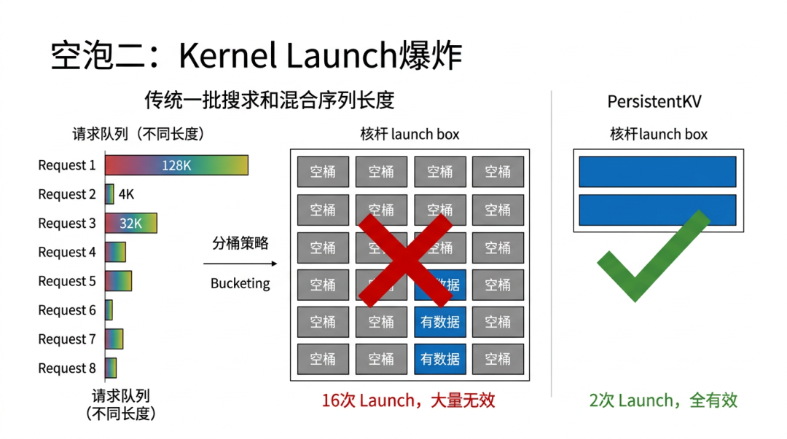
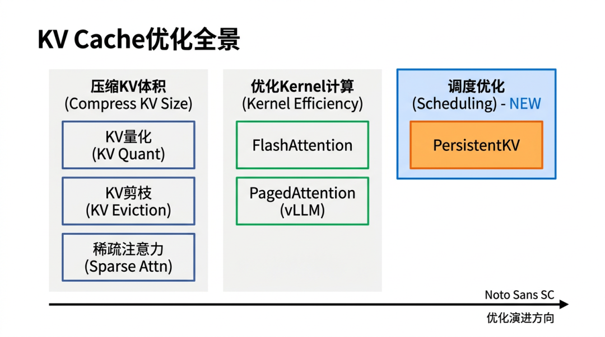
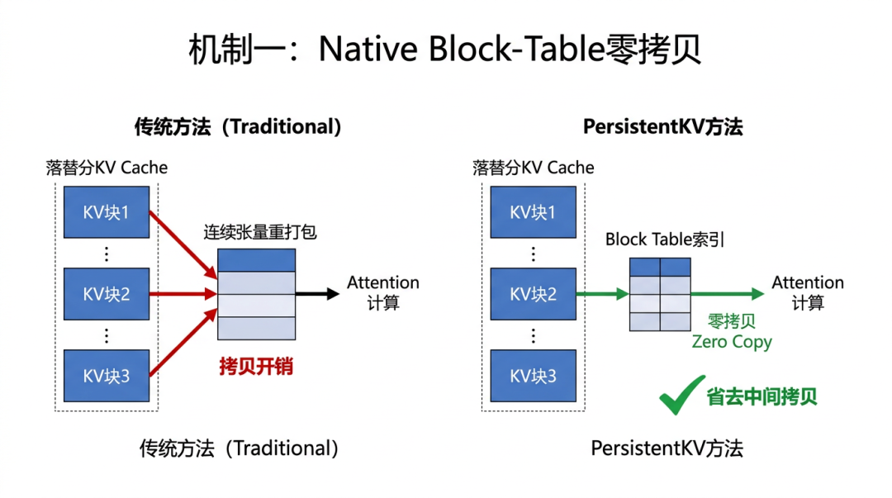
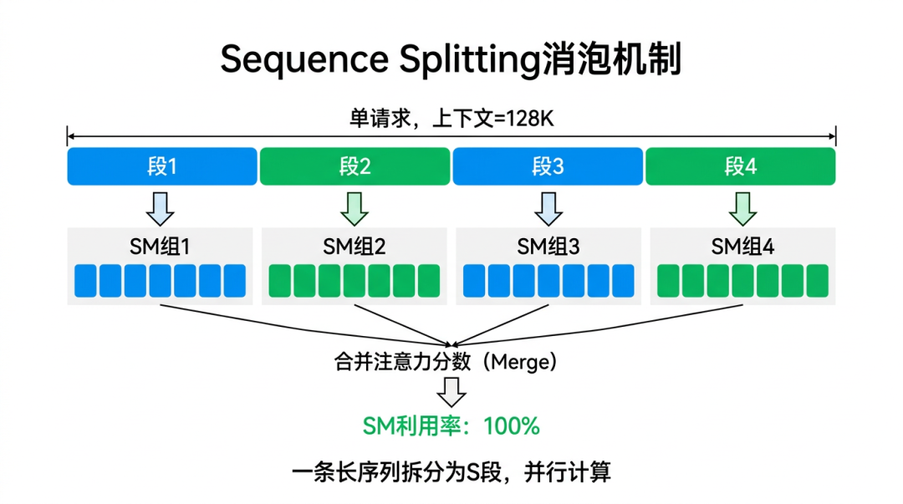
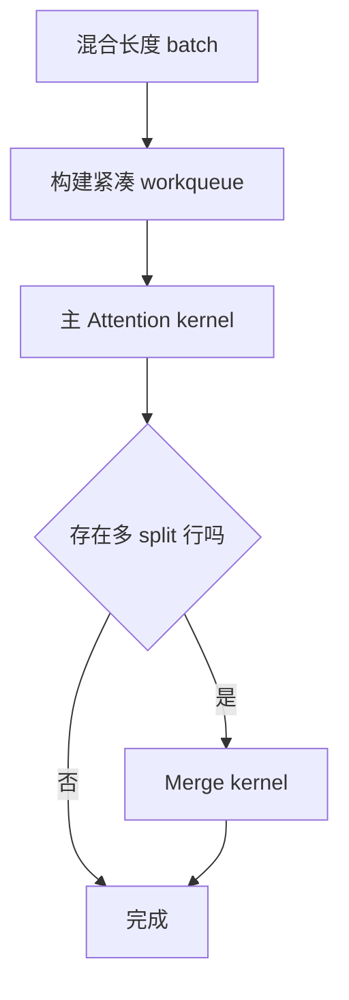
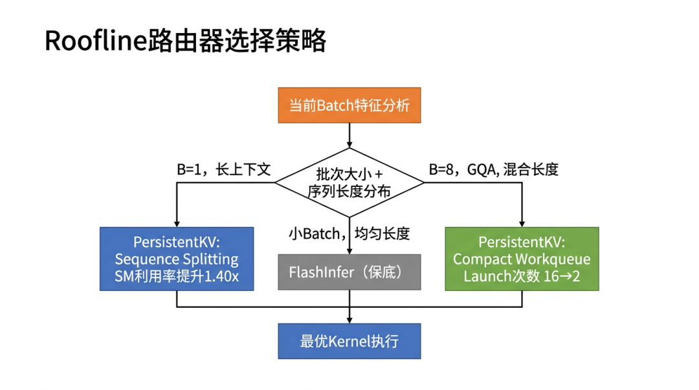
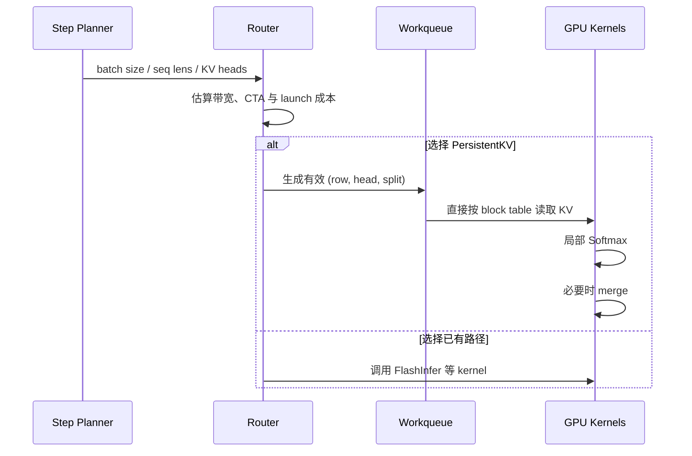
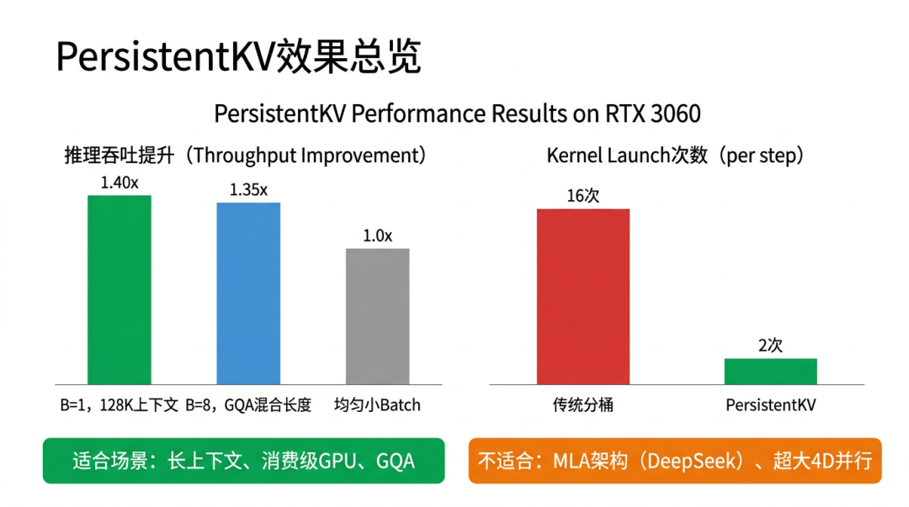

# PersistentKV 长上下文注意力调度学习文档

本文面向已经知道 PagedAttention 和 Decode 基本流程、但第一次接触 kernel 工作调度的同学。PersistentKV 讨论的不是“KV 怎么压缩”或“前缀怎么命中”，而是更靠近 GPU 的问题：

> 在每个 Decode step 里，如何把不等长序列的 Attention 工作拆成足够多、又足够紧凑的 GPU 任务？

本文把 PersistentKV 视为一种面向 vLLM/Paged KV 布局的注意力调度方案。原文没有提供可核验的上游论文或 vLLM 合入链接，因此不能据此认定它是 vLLM 当前内置能力。

## 0. 阅读基线与范围

| 项目 | 内容 |
| --- | --- |
| 原文标题 | 《GPU空等：KV Cache调度优化》 |
| 原文链接 | https://mp.weixin.qq.com/s/Ha3uOnwBeplvGfSDJndC7Q |
| 作者/机构 | 老许漫谈AIInfra |
| 发布时间 | 2026-07-15 |
| 读取时间 | 2026-07-25 |
| 资料类型 | 技术图文 |
| 整理范围 | Native Block-Table Execution、Sequence Splitting、Compact Workqueue、Roofline Router |
| 不展开内容 | PersistentKV 源码、论文证明、在数据中心 GPU 和 MLA/DSA 上的外推 |
| 验证边界 | 原文机制与图片的二次整理；未定位一手实现，未复现实验 |

### 怎么读本文

1. 第 1、2 节先看两类 GPU 空泡。
2. 第 3 节辨认它与 KV 量化、PagedAttention 的生态位。
3. 第 4～7 节看三层机制和选择器。
4. 第 8 节只在原始测试条件下理解性能。

### 术语速查

| 术语 | 人话解释 |
| --- | --- |
| SM | GPU 上执行线程块的计算单元 |
| CTA | CUDA Cooperative Thread Array，通常可近似理解为 thread block |
| Kernel launch | CPU/运行时向 GPU 发起一次 kernel 执行 |
| GQA | 多个 Query heads 共享较少的 KV heads |
| Block table | 分页 KV 的逻辑块到物理块映射 |
| Sequence split | 把同一条长历史切成多个区间并行计算 |
| Softmax state | 可合并的局部最大值、归一化和加权输出 |
| Workqueue | GPU 要处理的紧凑任务列表 |
| Roofline | 用计算量、带宽量判断工作更偏 compute-bound 还是 memory-bound |

## 1. 先看两个不在“单个 kernel”里的空泡

### 1.1 空泡一：B=1 长上下文喂不满 SM



**图意解读：** 图把一个长请求映射成少量 GPU 工作单元，剩余 SM 没有可并行任务。它要表达的是工作分解粒度不足，不是说 KV 数据“完全搬不动”。控制权在调度/launch 规划层：如果能把一条序列沿历史长度切成多个独立片段，单请求也能产生更多 CTA。

人话版：

```text
一个请求很长
!= 天然有很多可并行任务
```

如果 kernel 的网格主要按 batch row 或 KV-head group 展开，`batch_size=1` 时可发射的 CTA 数可能太少。即使每个 CTA 工作很重，也会出现部分 SM 忙、部分 SM 等。

### 1.2 空泡二：混合长度让分桶 launch 膨胀



**图意解读：** 图中的多个长度桶把一轮 Attention 拆成很多 launch。短序列、长序列和 GQA head 组合不均时，一些桶只包含很少工作，却仍支付一次 launch 和调度成本。问题不是单次 kernel 内部一定慢，而是 CPU/GPU 前端反复启动过多小 kernel。

如果 batch 中序列长度为：

```text
[4K, 4K, 8K, 16K, 64K, 128K, ...]
```

传统实现可能按长度区间、head 组合、split 数分别选择 kernel。分桶可以减少同一 kernel 内的 padding，却可能产生许多稀疏 launch。

### 1.3 两类空泡的共同点

| 空泡 | 粒度过粗/过细 | 直接后果 |
| --- | --- | --- |
| 单长序列 | 任务拆得太粗 | CTA 不足，SM 闲置 |
| 混合长度 | 入口拆得太细 | launch 多，小任务前端开销高 |

PersistentKV 的目标是同时把“任务内部”拆细、把“启动入口”收紧。

## 2. 它在 KV 优化地图中的位置



**图意解读：** 原图把 KV 优化分成压缩/稀疏、kernel 与任务调度等方向。它适合用来定位问题，但这些方向并非严格代际关系，也可以组合使用。PersistentKV 不减少语义上的历史 token，也不负责前缀复用；它主要优化读取现有分页 KV 时的工作分配。

### 2.1 四个层次

| 层次 | 典型问题 | 例子 |
| --- | --- | --- |
| 数据量 | KV 能否更小、更少 | 量化、稀疏、淘汰 |
| 物理布局 | KV 放在哪里、如何寻址 | PagedAttention、block table |
| 单 kernel | 一次 Attention 如何减少 HBM 往返 | FlashAttention/FlashInfer |
| 工作调度 | 本 step 用几个 CTA、几个 launch、走哪个 kernel | Sequence Splitting、workqueue、router |

同一个系统可以同时使用四层优化。不能用 PersistentKV 代替 Prefix Cache，也不能用 PagedAttention 自动解决 B=1 的 SM 占用。

## 3. 机制一：Native Block-Table Execution



**图意解读：** 左侧 block table 给出每条序列的物理 KV 页，右侧 CTA 直接按这些索引读取对应 K/V tile。图强调省去“先把离散块重排成连续 tensor”的中间搬运。数据所有权仍在 vLLM 风格的 KV manager，PersistentKV 只消费映射，不接管 block 生命周期。

### 3.1 人话版

已经有一张清楚的 block table，就直接按表取货，不先把所有货搬到一条连续货架。

### 3.2 数据流


### 3.3 GQA 下的复用

GQA 中多个 Query heads 共享一个 KV head。若按 KV-head group 分配 CTA：

1. CTA 加载一次共享 K/V tile。
2. 组内多个 Query heads 对同一 tile 做计算。
3. K/V 读取可以在组内复用。

收益取决于 head 映射、tile 大小、寄存器/共享内存压力，不能只由“GQA”三个字保证。

### 3.4 “零拷贝”的准确边界

这里的零拷贝应理解为：

- 不先把分页 KV gather 成完整连续 KV tensor；
- kernel 仍然要从 HBM 读取 K/V；
- block table/metadata 仍可能有准备与传输；
- 输出和 merge 仍会写内存。

它减少的是多余重排，不是消灭数据访问。

## 4. 机制二：Sequence Splitting



**图意解读：** 图把一个 Attention row 的历史 KV 区间切成多个不重叠 split，每个 split 由独立 CTA 计算局部结果，最后通过 merge 恢复与整段 Softmax 等价的输出。控制面决定 split 数与边界；数据面只读取各自负责的 KV 范围。

### 4.1 为什么 Attention 可以分段

对 query `q` 和历史 keys，标准 Attention 是：

```text
score_i = q · k_i
p_i = exp(score_i) / sum_j exp(score_j)
output = sum_i p_i · v_i
```

虽然归一化跨越全部历史位置，但每个 split 可以先保存可合并的在线 Softmax 状态：

- `m_s`：该 split 的最大 score；
- `l_s`：以 `m_s` 为基准的指数和；
- `o_s`：该 split 的未最终归一化加权输出。

合并时：

```text
m = max_s(m_s)
l = sum_s exp(m_s - m) * l_s
o = sum_s exp(m_s - m) * o_s
output = o / l
```

这与整段 Softmax 数学等价，只多了局部状态和一次 merge。

### 4.2 split 数不是越多越好

增大 split 数会：

- 增加可并行 CTA，改善 SM 占用；
- 缩短每个 CTA 的历史区间；
- 增加局部状态写回和 merge 成本；
- 可能降低单 CTA 数据复用。

合理目标是“足够填满 GPU”，不是“每个 block 一个 CTA”。

### 4.3 为什么要用行本地有效长度

若按一个长度桶的上界切分：

```text
桶上界 128K
某行实际长度 20K
```

后面的许多 split 对该行没有有效 token。按 row-local effective length 计算边界，才能避免为 padding 创建空任务。

## 5. 机制三：Compact Workqueue

### 5.1 从规则网格到只列真实任务

规则网格可能为所有组合预留任务：

```text
(row, KV-head, split)
```

其中不少组合为空。Compact Workqueue 先扫描 metadata，只写入有效三元组：

```text
[
  (row=0, kv_head=0, split=0),
  (row=0, kv_head=0, split=1),
  (row=1, kv_head=0, split=0),
  ...
]
```

持久化/通用 worker CTA 从队列取任务，不需要每个长度桶单独 launch。

### 5.2 为什么它能减少 launch



原文报告特定 B=8 GQA 场景从 16 次 launch 降到 2 次，可理解为“主计算 + merge”的理想路径。是否恰好为 2 取决于实现、辅助 kernel 和 profiling 口径。

### 5.3 队列本身也有成本

- 需要根据每轮长度构建或更新任务列表；
- worker 取任务涉及原子操作或索引读取；
- 任务差异过大时仍可能造成尾部不均衡；
- 小 batch/短上下文时，建队列成本可能不值。

这正是为什么还需要 router。

## 6. Roofline Router：每轮选路径



**图意解读：** 路由器位于控制面，它观察 batch size、有效序列长度、KV head 和 split 需求，选择已有高效 kernel 或 PersistentKV 路径。图的重点是“组合优于全替换”：FlashInfer 仍可作为更适合某些形状的路径和保守回退。

### 6.1 路由要估算什么

一个简化代价模型可以观察：

```text
总 KV 读取字节
Attention FLOPs
可发射 CTA 数
预计 kernel launch 数
merge 成本
metadata/workqueue 构建成本
```

若算术强度低、主要受 HBM 限制，就要重视读放大和复用；若 CTA 数不足，就要增加 split；若 batch 形状规整且已有 kernel 很成熟，直接走 FlashInfer 可能更好。

### 6.2 原文给出的场景映射

| 场景 | 原文倾向的路径 | 理由 |
| --- | --- | --- |
| 小 batch、长度较均匀 | FlashInfer | 避免额外规划开销 |
| B=1、超长上下文 | Sequence Splitting | 增加并行 CTA |
| B=8、GQA、长度混合 | Compact Workqueue | 压缩空任务与 launch |
| 未校准边界 | 回退 FlashInfer | 保持稳健性 |

这张表是原文方案的设计意图，不是经过本文复现的通用阈值。

## 7. 三层机制如何协同



其中：

- Native block-table 决定“怎样读分页 KV”；
- Sequence splitting 决定“一个长 row 拆几个任务”；
- Workqueue 决定“只启动哪些真实任务”；
- Router 决定“这一轮是否值得走这条路径”。

## 8. 如何理解原文 benchmark



**图意解读：** 图汇总了原文在 RTX 3060 上报告的特定形状收益，包括 B=1 128K 和 B=8 GQA 混合长度。它不是跨 GPU、跨模型的性能保证；消费级 GPU 的 SM 数、带宽、launch 比例与 H100/B300 差异很大，收益方向甚至可能变化。

原文报告：

- 测试硬件：RTX 3060，28 SM，原文标注约 302 GB/s HBM/显存带宽；
- B=1、128K 长上下文：约 `1.40x`；
- B=8、GQA、混合长度：约 `1.35x`；
- 某配置 launch：`16 -> 2`。

这些数字只支持下面这个结论：

> 在原测试形状和硬件上，工作分解/launch 规划是可观测瓶颈，所述方案对其有效。

它们不支持：

- PersistentKV 在所有 GPU 上都快 35%～40%；
- 它比 FlashInfer 全面更好；
- 长上下文只要 B=1 就一定收益；
- 在 MLA、DSA 或复杂并行拓扑中仍保持同样结果。

## 9. 适用边界与风险

### 9.1 可能更适合

- 小 batch、长上下文 Decode；
- GQA 且序列长度差异大；
- launch latency 占比明显；
- KV 已采用 block table 布局；
- 能通过 profiler 证明 CTA/SM 利用不足。

### 9.2 原文明确不主张或缺少证据

- MLA/DeepSeek 类 latent KV；
- 4D 并行或大规模跨节点路径；
- Prefill 主导的工作负载；
- 训练；
- 不同 GPU 世代的统一阈值。

### 9.3 集成风险

| 风险 | 为什么 |
| --- | --- |
| 路由误判 | 边界 workload 走错 kernel 会回退 |
| 数值一致性 | 分段 Softmax merge 需要严格精度验证 |
| CUDA Graph | 动态 workqueue/split 形状可能影响捕获 |
| 调度元数据开销 | 短序列上规划成本可能高于收益 |
| 版本耦合 | block table 与 Attention backend 接口会变化 |

## 10. 排障与验证方法

### 10.1 先证明真有空泡

Profiler 中观察：

- 每 step 的 kernel launch 数；
- kernel 之间 CPU gap；
- SM active/occupancy；
- HBM 吞吐；
- 不同序列长度下 CTA 数；
- merge kernel 占比。

### 10.2 做四组消融

```text
A: 原有 kernel
B: 只启用 native block-table
C: B + sequence splitting
D: C + compact workqueue/router
```

同时测正确性、P50/P99 延迟和吞吐，才能知道收益来自少搬运、更多 CTA 还是少 launch。

### 10.3 正确性测试

- 与基准 Attention 输出逐 token 对齐；
- 覆盖极短、block 边界、超长、混合长度；
- 覆盖 GQA 不同 head ratio；
- 覆盖 FP16/BF16/FP8 KV（若支持）；
- 覆盖抢占、Prefix Cache 命中和动态 batch 变化。

## 11. 一句话总结

PersistentKV 的价值主张是：直接读取分页 KV，把单长序列拆成可并行 split，再用紧凑工作队列压缩混合长度任务，并由每步路由器决定是否采用；它优化的是工作分配，而不是 KV 内容或前缀命中。

## 12. 参考与延伸

- 《GPU空等：KV Cache调度优化》：https://mp.weixin.qq.com/s/Ha3uOnwBeplvGfSDJndC7Q
- [vLLM 从连续批处理到 PagedAttention 的引擎工作流学习文档](../runtime/vLLM%20从连续批处理到%20PagedAttention%20的引擎工作流学习文档.md)

本文未找到并复核 PersistentKV 的一手论文、代码仓库或 vLLM 合入记录，因此所有实现状态与性能数字都保留原文边界。
