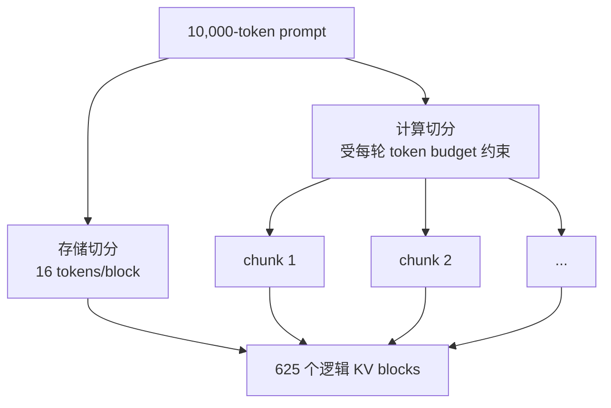
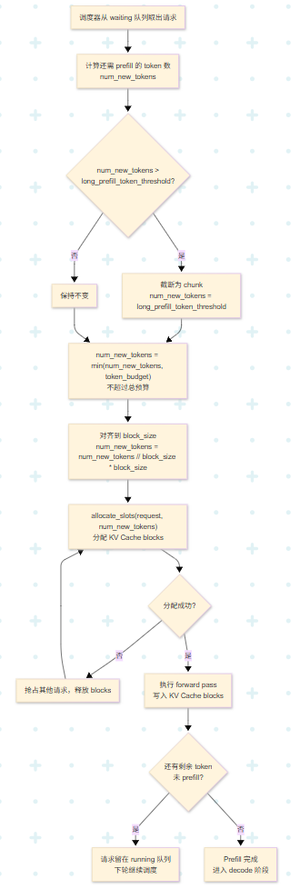
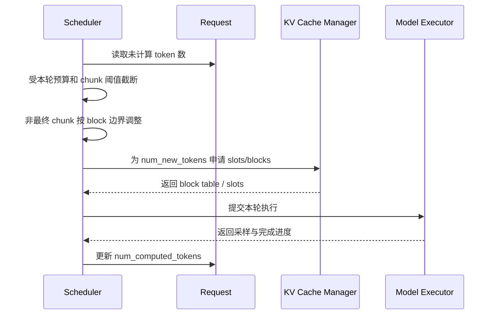

# vLLM Chunked Prefill 与 Block Size 学习文档

本文回答一个很常见、也很容易绕晕的问题：

> 长 prompt 已经按 block 存进 KV Cache，为什么 Prefill 还要再切 chunk？

最短答案是：**block 是存储与寻址粒度，chunk 是计算与调度粒度。** 它们会在边界对齐上发生关系，但解决的是两类不同问题。

本文是第三方资料整理型学习资料，不是 vLLM 当前版本的源码审计。原文给出的默认值和函数路径可能随 V1 演进变化，使用时要回到目标版本配置定义确认。

## 0. 阅读基线与范围

| 项目 | 内容 |
| --- | --- |
| 原文标题 | 《深入理解vLLM核心概念Chunked Prefill 与 Block Size：一个长 prompt 已经切分成很多 block 了，为什么 prefill 还要再 chunk？》 |
| 原文链接 | https://mp.weixin.qq.com/s/5hcw--cKbztk7LAQvkoedQ |
| 作者/机构 | 一研 |
| 发布时间 | 2026-07-01 |
| 读取时间 | 2026-07-25 |
| 资料类型 | 技术图文 |
| 整理范围 | vLLM 中 KV block 与 prefill chunk 的正交关系、对齐、预算和调参 |
| 不展开内容 | SGLang Chunked Prefill、vLLM 全量 scheduler 源码、特定混合模型状态缓存 |
| 验证边界 | 基于原文整理并修正部分过度绝对化表述；未对目标版本运行实验 |

### 术语速查

| 术语 | 人话解释 | 归属 |
| --- | --- | --- |
| `block_size` | 一个 KV block 可容纳的 token 数 | 存储 |
| Physical block | GPU KV 池中的固定大小块 | 存储 |
| Block table | 请求逻辑 block 到物理 block 的索引表 | 寻址 |
| Chunk | 某次调度允许一个长 prefill 推进的 token 片段 | 计算 |
| `max_num_batched_tokens` | 一轮所有请求合计可推进的 token 预算 | 调度 |
| Partial prefill | prompt 尚未全部计算完的请求 | 生命周期 |
| Prefix cache | 复用已经完整计算并可稳定标识的 KV 前缀 | 缓存策略 |

## 1. 先建立整体地图

### 1.1 两把不同的尺子

假设 prompt 有 10,000 tokens，`block_size=16`：

- **存储视角**：最终大约需要 625 个 KV blocks。
- **计算视角**：可以一次 prefill 10,000 tokens，也可以分成 2,048、2,048、2,048、2,048、1,808 等多个 chunk。

block 数量并没有决定一次 forward 的 token 数。



### 1.2 原图中的调度关系



**图意解读：** 图的控制权在 Scheduler：它先看请求还有多少未计算 token，再用本轮预算截断 `num_new_tokens`，随后由 KV Cache Manager 为这部分 token 分配 slots/blocks。block table 是执行输入的一部分，不会反过来自动决定 chunk 大小。图中参数名是文章读取时的版本示意，不能视为所有版本固定接口。

## 2. Block Size：解决“算完放哪里”

### 2.1 为什么要固定大小 block

如果每个请求按最大上下文预留连续 KV：

- 提前结束会留下巨大内部浪费；
- 请求进出造成物理空洞；
- 扩展长序列需要连续空间；
- 小片段难以独立共享或回收。

固定 block 后，请求可以按需拿块：

```text
逻辑顺序: block 0 -> block 1 -> block 2
物理位置:   #17    ->   #3    ->   #42
```

Attention 通过 block table 恢复逻辑顺序，所以物理位置不必相邻。

### 2.2 block 不是算子批量

`block_size=16` 不表示 GPU 每次只能算 16 tokens。一次 Prefill 可以处理许多 block，一次 Decode 也可以只为每个请求推进一个 token。

可以把 block 类比为磁盘页：文件按页存储，不代表应用每次只能读取一页。

## 3. Chunked Prefill：解决“一次算多少”

### 3.1 不切 chunk 的阻塞

一个超长 prefill forward 在结束前通常不能被 Scheduler 中断。在此期间：

- 已运行请求的下一次 decode 要等待；
- 新到达短请求无法立即组成下一批；
- 激活峰值可能很高；
- TTFT/ITL 尾延迟出现毛刺。

### 3.2 切 chunk 后发生什么

```text
无 chunk:
  [Prefill 10K................................][Decode]

chunk=2K:
  [P 2K][重新调度][P 2K][重新调度]...[P 2K][Decode]
```

“重新调度”给了引擎三种机会：

1. 把 decode token 放进下一轮预算；
2. 接纳刚到达的短 prompt；
3. 依据当前 KV 容量改变 admission。

具体版本是否以及如何混合 prefill/decode，要看调度策略；chunk 只创造边界，不保证固定交替顺序。

### 3.3 chunk 的代价

| chunk 变小 | chunk 变大 |
| --- | --- |
| 单次阻塞短，尾延迟通常更稳 | 单次算得多，调度/launch 次数少 |
| 更多轮调度和 kernel launch | 激活峰值和单次占用更大 |
| 长 prompt 完成时间可能增加 | decode 更容易被长 prefill 干扰 |

所以 Chunked Prefill 是延迟和吞吐之间的时间片选择，不是免费优化。

## 4. 两者在哪里发生关系：边界对齐

### 4.1 为什么中间 chunk 偏好完整 block

如果一个非最终 chunk 停在半个 block：

- 这个 block 的后半部分尚未计算；
- 其内容 hash 还不稳定，不适合作为完整前缀缓存单元；
- 下一轮需要保留“部分填充”元数据；
- 回收和共享逻辑更复杂。

因此，调度器通常会让**非最终 chunk**在 block 边界结束。

### 4.2 不要把它说成“任何 chunk 都必须整除”

原文把“不对齐会产生脏数据、无法管理”写得较绝对。更准确的理解是：

- 中间 chunk 往往向下对齐到完整 block。
- prompt 的最后一段可以不足一个 block；有效 token 数会被单独记录。
- 最后一个部分 block 是合法存储状态，只是通常不能当作稳定的完整 block 前缀共享。

也就是说，对齐是为了简化缓存、抢占和后续调度，不是因为 GPU 绝对无法写半块。

### 4.3 一个修正后的例子

假设：

```text
prompt = 5,000 tokens
block_size = 16
每轮最多给该请求 2,048 tokens
```

| 轮次 | 调度 token | 累计完成 | 是否 block 对齐 |
| --- | ---: | ---: | --- |
| 1 | 2,048 | 2,048 | 是 |
| 2 | 2,048 | 4,096 | 是 |
| 3 | 904 | 5,000 | 最终 chunk，可含部分尾块 |

最终共需要 `ceil(5000 / 16) = 313` 个逻辑 block；最后一块只有 8 个有效 token。没有必要为了对齐虚构额外 prompt token。

## 5. 三种预算不要混为一谈

### 5.1 KV 容量预算

它回答：

> GPU 还能为多少 live tokens 保留 KV？

近似由可用 block 数决定。一个请求即使本轮只算小 chunk，它已经完成的前缀 KV 仍然要保留。

### 5.2 本轮 batch token 预算

它回答：

> 这一轮所有请求总共最多推进多少 token？

可以抽象为：

```text
sum(每个 decode 请求的新 token
  + 每个 prefill 请求本轮 chunk token)
<= max_num_batched_tokens
```

### 5.3 部分 Prefill 并发预算

它回答：

> 同时允许多少个长 prompt 处于“做了一部分、还没做完”的状态？

部分 prefill 越多：

- 公平性和短请求穿插空间可能变好；
- 但更多请求长期占据 KV blocks；
- 状态管理和调度搜索更复杂。

相关配置名称在不同版本中可能包括 `max_num_partial_prefills`、`max_long_partial_prefills` 等，必须查目标版本。

## 6. Scheduler 与 KV Manager 如何配合

### 6.1 控制流



### 6.2 两者的契约

Scheduler 保证：

- 不把超过本轮预算的 token 交给执行器；
- 提供与计算范围一致的 KV 写入位置；
- 只把已经完成的部分标为 computed。

KV Manager 保证：

- 分配的 block 在本轮执行期间有效；
- block table 能映射所有历史与新增 token；
- 引用中的共享 block 不被错误回收。

## 7. 与 Prefix Cache 的交互

### 7.1 命中会减少本轮要算的 token

假设 5,000-token prompt 中前 3,200 tokens 已命中 APC：

```text
num_computed_tokens = 3,200
num_uncached_tokens  = 1,800
```

Chunked Prefill 只需要切 1,800 个未计算 token，而不是重切整个 prompt。

### 7.2 命中通常按完整 block 计算

如果 `block_size=16`，稳定可复用前缀常落在完整 block 边界。最后不足一块的 8 tokens 即使内容相同，也可能不计为 APC block hit，需要在本请求中重新计算。

因此：

```text
文本共同前缀长度
!= token 共同前缀长度
!= 可复用完整 block 长度
```

APC 的链式 hash 细节见 [vLLM APC 链式哈希学习文档](vLLM%20APC%20链式哈希学习文档.md)。

## 8. 调参方法

### 8.1 先固定目标

| 目标 | 倾向 |
| --- | --- |
| 降低长 prompt 对 ITL 的干扰 | 减小单轮长 prefill 额度 |
| 提高离线长 prompt 吞吐 | 增大 batch token/chunk，减少轮次 |
| 降低 Prefill 激活 OOM | 减小 chunk |
| 提高并发 | 先确认 KV block 容量，不只增大请求上限 |

### 8.2 一次只改一组参数

建议顺序：

1. 固定模型、量化、GPU 和请求长度分布。
2. 记录 block 使用率、preemption、TTFT/ITL 和吞吐。
3. 调整总 batch token 预算。
4. 再调整长 prefill 阈值/单请求 chunk。
5. 最后调整 partial prefill 并发。

若同时改四个参数，即使性能变好也难以知道原因。

### 8.3 观察 Pareto，而不是单个 TPS

对每个配置同时记录：

```text
output throughput
TTFT P50/P95/P99
ITL P50/P95/P99
preemption / recompute 次数
KV block 使用率峰值
GPU utilization
```

chunk 增大带来的 TPS 提升，如果伴随 ITL P99 超标，对在线服务就不是有效收益。

## 9. 常见误解

### 误解一：prompt 已经切 block，所以不会阻塞

block 只改变存储布局。一次 forward 仍可把所有 prompt token 一起计算，仍会长时间占用 GPU。

### 误解二：chunk 大小就是 block 大小

chunk 通常包含很多 blocks。二者相等会造成极多调度轮次，通常不是合理默认。

### 误解三：所有 chunk 都必须是 block 的整数倍

中间 chunk 倾向对齐；最终 chunk 可以包含部分尾块。有效长度由元数据维护。

### 误解四：chunk 越小越低延迟

单次阻塞会降低，但更多调度、launch 和状态切换可能增加总时延。最佳点取决于 workload。

### 误解五：开启 Chunked Prefill 就不会抢占

长请求完成的每个 chunk 都会留下 KV。累计 live tokens 仍可能耗尽 block pool。

## 10. 排障地图

| 现象 | 先看什么 | 可能原因 |
| --- | --- | --- |
| 长 prompt TTFT 很高 | 每轮 prefill token、排队时间 | chunk 过大或等待队列很深 |
| Decode ITL 周期性尖峰 | 尖峰是否与 prefill chunk 同步 | 大 chunk 干扰 decode |
| GPU 利用率不高、轮次很多 | chunk 大小、CPU 调度、kernel launch | chunk 过小 |
| KV 很快满 | live tokens、partial prefill 数、APC 保留 | 部分请求长期占块 |
| APC 命中少一小截 | tokenization、完整 block 边界 | 尾部不足完整 block |
| 配置项不存在 | vLLM tag 与文档版本 | 原文参数已重命名或迁移 |

## 11. 一句话总结

Block 把“已经算出的 KV”切成可分配、可寻址的存储单元；Chunk 把“尚未完成的 Prefill”切成可重新调度的计算时间片。中间 chunk 常与 block 对齐，但两者绝不是同一个维度。

## 12. 参考与延伸

- 《深入理解vLLM核心概念Chunked Prefill 与 Block Size：一个长 prompt 已经切分成很多 block 了，为什么 prefill 还要再 chunk？》：https://mp.weixin.qq.com/s/5hcw--cKbztk7LAQvkoedQ
- [vLLM 从连续批处理到 PagedAttention 的引擎工作流学习文档](vLLM%20从连续批处理到%20PagedAttention%20的引擎工作流学习文档.md)

本文基于原文整理，没有对文中默认参数做当前版本源码复核。最终 chunk、混合调度和配置名称以目标 vLLM 版本为准。
