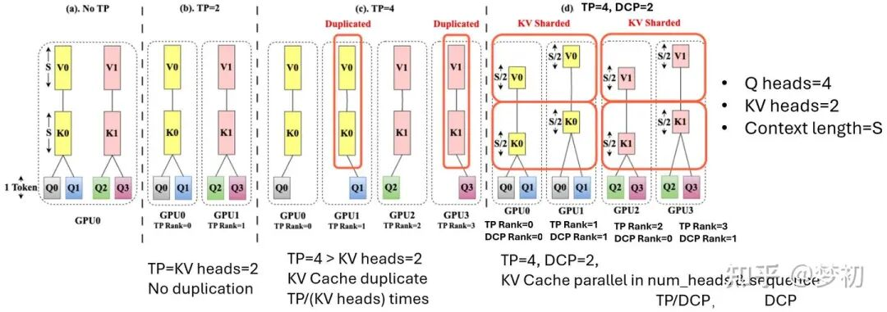
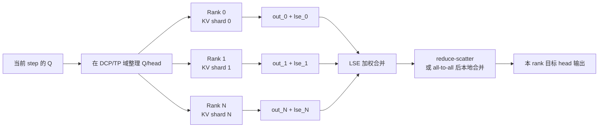
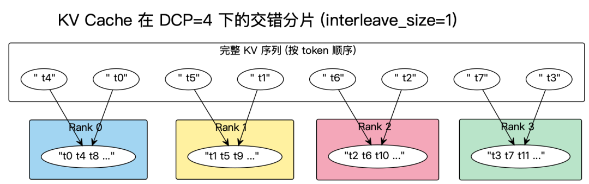
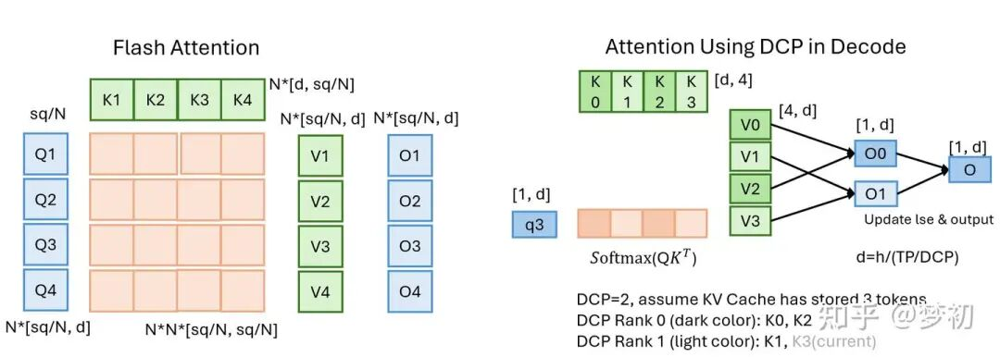
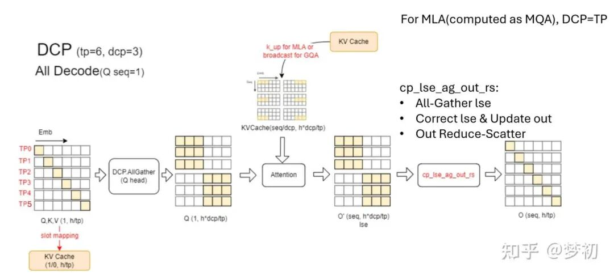
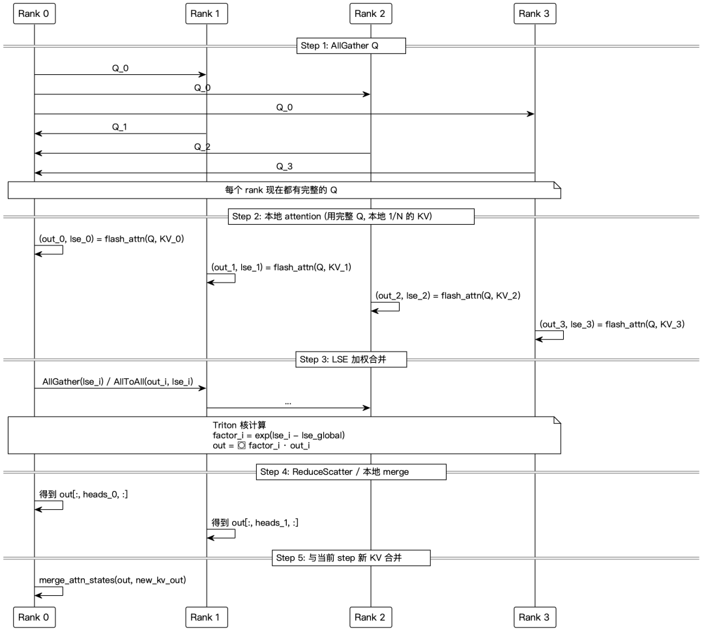
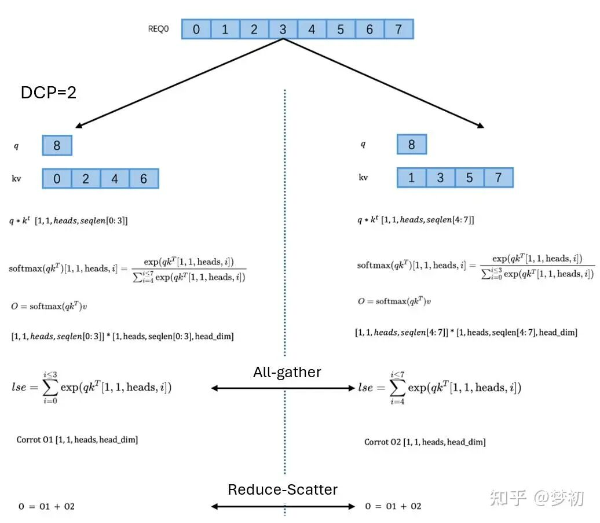
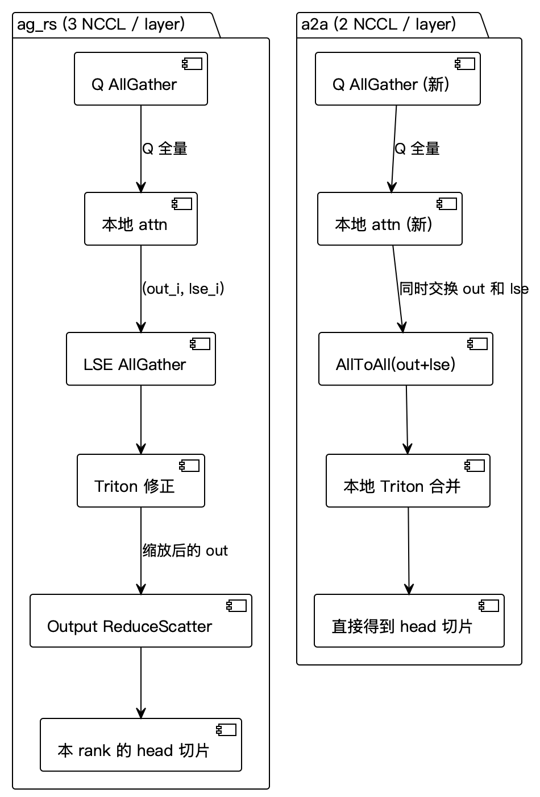
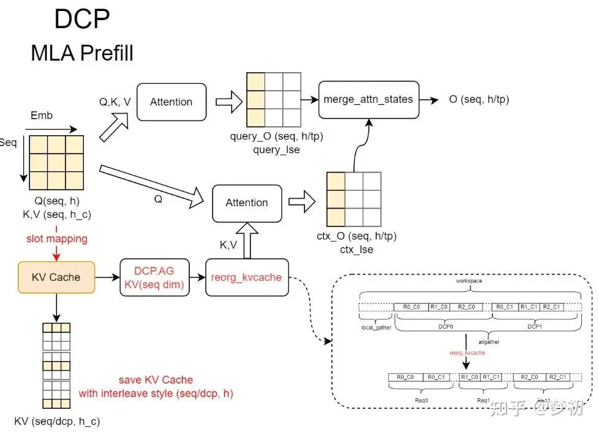
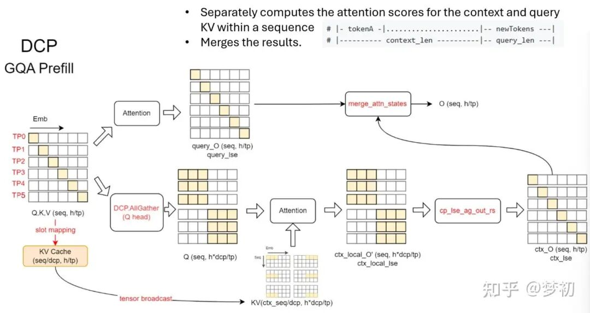

# vLLM DCP KV Cache 去重与 LSE 合并学习文档

本文面向第一次接触 vLLM Decode Context Parallel 的同学，重点解释：

- TP 为什么会复制 KV Cache；
- DCP 怎样在不额外增加 GPU 的前提下切分历史 KV；
- 每个 rank 只看局部 KV 后，怎样用 LSE 合并成全局 attention；
- DCP 为什么也会参与 prefill，而不是只在 decode 才“突然出现”。

本文是多篇第三方资料的整理，不是当前 vLLM 源码审计。文章中的参数、函数名、通信后端和兼容性结论具有版本边界；本文讲的是机制，不承诺当前版本仍使用完全相同的接口。

## 0. 阅读基线与范围

### 资料基线

| 资料 | 作者 | 发布时间 | 在本文中的作用 |
| --- | --- | --- | --- |
| [vllm并行策略之DCP(Decode Context Parallel)](https://zhuanlan.zhihu.com/p/2020086868914499979) | 梦初 | 页面发布时间未稳定取得 | DCP 的 TP/KV 布局、decode 与 prefill 数据流 |
| [vllm并行策略之DCP(Decode Context Parallel)](https://mp.weixin.qq.com/s/K-V4mAhb8Vl-7b36tcUEQg) | 梦初 | 2026-06-08 | 上一篇内容的图文转载入口 |
| [LLM推理优化-vLLM CP并行](https://mp.weixin.qq.com/s/qZj8ni7rvydTW7joVYdMFw) | elrond-g | 2026-04-21 | `_forward_with_dcp` 心智模型、交错分片、`ag_rs`/`a2a` |
| [vLLM DCP深度拆解：不加GPU消除KV Cache 8倍复制，LSE数学保证零精度损失](https://mp.weixin.qq.com/s/816U5H3XkMLx3CW_NYRe9Q) | 2021年鹅厂员工 | 2026-05-26 | DCP 的简化讲解和 LSE 直觉 |

| 项目 | 内容 |
| --- | --- |
| 读取时间 | 2026-07-27 |
| 整理范围 | vLLM DCP 的动机、分组、KV 布局、decode/prefill attention 与 LSE 合并 |
| 不展开内容 | PCP 的完整负载均衡、底层 NCCL/Triton kernel 源码、训练 CP |
| 验证边界 | 未核对当前 vLLM 分支，未运行 DCP benchmark，也未验证文章中的“8 倍”等标题数字 |

### 怎么读本文

先把 DCP 看成一个交易：

> 用少量 collective 和结果合并，换掉每个 TP rank 对完整历史 KV 的重复存储与重复读取。

是否值得做，取决于节省的 HBM 访存是否大于新增通信。

### 术语速查

| 术语 | 人话解释 | 本文中的角色 |
| --- | --- | --- |
| DCP | 在 TP 域内沿历史序列切 KV | 让每个 rank 只保存 `1/DCP` 左右的序列分片 |
| TP | 沿权重/head 维切模型 | DCP 复用的 GPU 和通信域 |
| KV head | 产生 key/value 的 attention head | 数量少于 TP 时容易发生复制 |
| interleave | 按 token 或 block 轮转分配到 rank | 让连续请求的 KV 均匀落盘 |
| local attention | query 只和本 rank 的 KV 分片计算 | 产生局部 `out_i` 和 `lse_i` |
| LSE | `log(sum(exp(score)))` 的稳定表示 | 合并局部 softmax 的权重 |
| `ag_rs` | all-gather + 修正 + reduce-scatter 路线 | 资料中的一种通信实现 |
| `a2a` | all-to-all 交换局部输出与 LSE | 资料中的另一种通信实现 |
| MLA | Multi-head Latent Attention | KV head 少、DCP 收益明显的模型结构之一 |
| GQA | Grouped Query Attention | Q head 多于 KV head，TP 下可能复制 KV |

---

## 1. 先建立整体地图

### 人话版

假设模型只有 2 个 KV head，却开了 `TP=4`：

- TP rank 0、1、2、3 都要参与计算；
- KV head 不够继续独立切给 4 个 rank；
- 一种朴素做法是复制 KV，让多个 TP rank 拿到相同历史；
- TP 越大，复制越严重。

DCP 不再要求每个 rank 持有完整历史，而是把序列也切开。于是并行维从“只切 head”变成“head × sequence”的二维布局。



**图意解读**

- `(a)` 没有 TP，两个 KV head 都在一张卡上。
- `(b)` `TP=2` 恰好等于 KV head 数，每个 rank 可独占一个 KV head，没有复制。
- `(c)` `TP=4` 大于 KV head 数，同一个 K/V head 被多个 rank 复制。
- `(d)` 在 `TP=4` 内启用 `DCP=2`，每个 KV head 再沿序列切两份，四个 rank 都有独立工作。
- DCP 的控制边界仍在 TP group 内；它没有额外再申请 4 张 GPU。

### 总览图



### DCP 的三个阶段

| 阶段 | 做什么 | 主要开销 |
| --- | --- | --- |
| 数据布局 | 把 KV 按序列/block 分到 DCP rank | slot mapping、interleave |
| 局部计算 | 完整或所需 Q 对本地 KV 做 attention | HBM 读取、attention kernel |
| 全局合并 | 交换 LSE/局部输出并恢复全局结果 | collective、Triton/融合合并 |

---

## 2. DCP 为什么复用 TP，而不是增加新 GPU

### 人话版

TP 已经把一层计算分到多张卡。DCP 的目标是让这些卡在 KV 维度也各有不同工作，所以它把 TP group 再划分，而不是再乘一个新的独立 world size。

资料给出的典型约束是：

```text
tensor_parallel_size % decode_context_parallel_size == 0
```

例如：

```text
TP = 8
DCP = 4
```

可以理解为：

- 仍然只有 8 个 TP worker；
- DCP size 为 4；
- 每个 DCP rank 只负责一部分序列 KV；
- attention 的 head 并行度会相应从纯 TP 布局调整为 `TP / DCP` 一类的局部布局。

具体分组方式随模型和实现而异，不能只用除法推导每个张量的真实形状。

### 分组示意


**图意解读**

- 每个 PP stage 里各自建立 TP group。
- DCP 子组完全位于一个 TP group 内，不跨 PP stage 混合 KV。
- 图中 `TP=4, DCP=2`，每两个相邻 rank 组成一个 DCP 子组。
- 多个 PP stage 会分别为自己负责的模型层保存 KV；DCP 只改变每个 stage 内的序列分工。

### 参数心智模型

资料中使用的参数名是：

```bash
--tensor-parallel-size 8
--decode-context-parallel-size 4
```

使用前应在目标版本中检查：

1. 参数是否仍叫这个名字；
2. 模型 attention backend 是否支持；
3. `TP % DCP == 0` 是否仍是完整约束；
4. prefix cache、chunked prefill、speculative decoding 是否有组合限制；
5. 当前后端使用 `ag_rs` 还是 `a2a`。

---

## 3. KV 怎样按序列交错分片

### 连续分片与交错分片

最容易想到的方式是连续切：

```text
rank 0: token 0,1,2,3
rank 1: token 4,5,6,7
```

资料中的 DCP 更强调交错布局：

```text
rank 0: token 0,2,4,6
rank 1: token 1,3,5,7
```



**图意解读**

- 顶部是逻辑 token 顺序，底部是每个 rank 的物理 KV 槽位。
- `DCP=4, interleave_size=1` 时，token 位置对 4 取模决定落到哪个 rank。
- 每个 rank 的本地 KV 在物理上仍可连续增长，例如 rank 0 保存 `t0,t4,t8...`。
- 调度器和 slot mapping 必须知道“逻辑位置”和“本地物理槽位”的转换；attention 不能把本地连续槽位误当作逻辑连续 token。

### 为什么要交错

交错布局可以：

- 让任意长度前缀在多个 rank 上较均匀分布；
- 避免长请求前半段只压在少数 rank；
- 让连续 decode token 轮流写到不同 rank；
- 降低某个 rank 的 KV 容量先耗尽的风险。

### block 级 interleave

实际实现不一定逐 token 轮转，也可能按一个小 block/page 轮转：

```text
interleave_size = B
owner(block_id) = block_id % DCP
```

选择 `B` 时要权衡：

- B 小：分布更均衡，映射和通信更碎；
- B 大：内存连续性更好，但短请求可能分布不均；
- prefix cache 的 block size 可能要求对齐；
- CUDA Graph 和 kernel 常希望固定或分桶后的形状。

---

## 4. Decode 一步到底怎么跑

### 4.1 第一步：准备 Q

纯 TP 下，每个 rank 可能只持有一部分 Q head。DCP 又把 KV 沿序列切开，因此本地 KV 分片需要看到它负责计算所需的 Q。

资料把第一步概括为 `AllGather Q`：

- 先在 DCP group 中整理或收集 Q；
- 每个 rank 得到本地 attention 所需的 query/head；
- 对 MLA、GQA，不同 backend 的广播/收集形态可能不同。

### 4.2 第二步：本地 attention



**图意解读**

- 左侧回顾标准 FlashAttention 的 Q/K/V 与输出形状。
- 右侧表示 DCP rank 只持有历史 K/V 的一部分。
- 同一个 query 分别和各 rank 的局部 KV 计算，得到局部 `O0`、`O1` 等。
- 每个局部 softmax 的归一化分母不同，因此不能直接把局部输出做普通平均或求和。



**图意解读**

- 左侧 Q/K/V 线性层仍按 TP 产生 head 分片，随后 DCP all-gather 整理本地 attention 所需的 Q。
- 中间 KV Cache 已沿序列维分片，每个 rank 只读取自己的 `1/DCP` 历史。
- 本地 attention 输出 `O'` 和 LSE；`cp_lse_ag_out_rs` 再收集 LSE、修正局部输出并 reduce-scatter。
- 最右侧恢复成目标 TP head 分片，供后续输出投影使用。
- 图中 `DCP=TP` 的 MLA 注释是一个特定例子，不代表 DCP size 必须始终等于 TP size。

对第 `i` 个 DCP rank：

```text
(out_i, lse_i) = attention(Q, K_i, V_i)
```

其中：

- `out_i` 是只看局部 KV 后的归一化输出；
- `lse_i` 是该局部 softmax 分母的对数统计。

### 4.3 第三步：交换局部结果

资料中的完整执行图如下：



**图意解读**

- Step 1 收集 Q，让各 rank 具备本地 attention 所需 query。
- Step 2 每个 rank 只读取自己的 KV 分片，产生 `out_i` 和 `lse_i`。
- Step 3 交换 LSE 和局部输出，计算全局权重。
- Step 4 把结果 reduce-scatter 或留在目标 head rank。
- Step 5 再把当前 step 新产生的 KV/attention 状态合入最终输出。
- 数据面是 Q、out、LSE；控制面是 rank/head/slot 的映射和 collective 顺序。

### 4.4 第四步：与当前新 KV 合并

decode 的新 token 也会产生当前 step 的 K/V。某些实现会把：

- 历史 context attention；
- 当前 query/new-KV attention；

先分开计算，再通过同样的 LSE 机制合并。这样可以让历史 KV 继续保持 DCP 分片，而当前小块走更适合的本地路径。

---

## 5. LSE 为什么能把局部 softmax 拼回去

### 5.1 先看错误做法

假设历史被切成两半：

```text
scores = [scores_0, scores_1]
```

分别做 softmax 后得到 `out_0`、`out_1`。直接：

```text
out = out_0 + out_1
```

是错的，因为两个局部 softmax 各自把概率归一化到 1，相当于用了两个不同分母。

### 5.2 LSE 的含义

对局部分片 `i`：

```text
lse_i = log(sum(exp(scores_i)))
```

全局 LSE 为：

```text
lse_global = log(sum_i(exp(lse_i)))
```

局部输出的全局权重是：

```text
weight_i = exp(lse_i - lse_global)
```

最终：

```text
out_global = sum_i(weight_i * out_i)
```

这正好恢复了使用所有 KV 一次做 softmax 的归一化关系。

### 5.3 数值稳定版

实际内核通常不会直接算巨大指数，而会使用 max-shift：

```text
m = max_i(lse_i)
denom = sum_i(exp(lse_i - m))
weight_i = exp(lse_i - m) / denom
```

这样能避免溢出。



**图意解读**

- 左右两侧分别持有偶数和奇数位置 KV，并对相同 query 计算局部结果。
- 中间通过 all-gather 交换归一化统计，再修正局部输出权重。
- 底部 reduce-scatter 把全局结果送回各目标 head rank。
- 原图公式是讲解性示意；严谨实现应以 `logsumexp` 和稳定 max-shift 公式理解。

### 5.4 “零精度损失”应怎样理解

资料标题使用了“零精度损失”。更严谨的说法是：

- 在精确算术中，LSE 合并与一次完整 softmax 数学等价；
- 浮点数中仍可能因归约顺序、数据类型、融合内核而产生正常舍入差异；
- 不能保证不同 kernel、不同 GPU 上逐 bit 相同；
- 正确性验证应比较允许误差范围内的 logits/output，而不是只看最终文本。

---

## 6. `ag_rs` 与 `a2a` 两条通信路线



**图意解读**

- 左侧 `ag_rs`：Q all-gather 后做本地 attention，再 all-gather LSE、修正输出，最后 reduce-scatter。
- 右侧 `a2a`：本地 attention 后一次 all-to-all 同时交换输出与 LSE，再本地合并。
- 图中标注的 “3 NCCL/layer” 与 “2 NCCL/layer” 是原文对特定实现的概括，不等于所有 backend 的固定通信次数。
- `a2a` collective 次数更少，不代表必然更快；消息形状、网络拓扑、内核融合和实现质量同样重要。

### 对比

| 路线 | 主要步骤 | 潜在优势 | 潜在风险 |
| --- | --- | --- | --- |
| `ag_rs` | Q AG -> LSE AG -> output RS | 语义直观，复用常见 collective | collective 次数较多 |
| `a2a` | Q AG -> out/LSE A2A -> 本地合并 | 可少一次 collective，目标分片直接到位 | all-to-all 对拓扑和实现更敏感 |

### 怎么判断瓶颈

观察 profiler 时应把一层拆成：

```text
Q 收集时间
+ 本地 attention 时间
+ LSE/out 交换时间
+ 合并 kernel 时间
+ 等待最慢 rank 时间
```

只看总 NCCL 次数不够。一个大 all-to-all 可能比两个小 collective 更慢，也可能因融合而更快。

---

## 7. DCP 为什么也参与 Prefill

### 人话版

DCP 的主要性能收益在 decode，但 KV Cache 是在 prefill 阶段创建的。要让 decode 每个 rank 只保存 `1/DCP` 的历史，prefill 写 KV 时就必须按照 DCP 的 owner/layout 放好。

这就是为什么：

> DCP 不是等到 decode 才打开的临时算法，它从 KV 的创建阶段就影响数据布局。

### 7.1 MLA prefill



**图意解读**

- 左下角 KV Cache 按 DCP 的序列维交错写入。
- context attention 需要时，先在 DCP group 内收集或重组 KV。
- query 部分和 context 部分可以分开计算，各自产生 output/LSE，再由 `merge_attn_states` 合并。
- 图中 workspace 展示“本地 gather -> DCP all-gather -> 按请求重排”的过程，说明难点不只是通信，还包括 ragged request 的布局恢复。

### 7.2 GQA prefill



**图意解读**

- query/new-token 部分可以按常规 TP 路径计算。
- 历史 context KV 按 DCP 分片，需要 DCP all-gather Q/head 或广播所需张量。
- 局部 context 输出通过 LSE 合并，再和 query 部分结果合并。
- GQA 中 Q head 与 KV head 数不同，所以 TP head 分片和 DCP 序列分片必须同时考虑。

### 7.3 与 PCP 的关系

PCP 负责“这条 prompt 的哪段 query 由谁算”，DCP 负责“历史 KV 的哪段由谁存、谁读”。

因此 prefill 中可能同时出现：

```text
PCP: Q 按序列空间并行
DCP: KV 按序列长期分片
```

更完整的对比见 [Context Parallel、PCP 与 DCP 总体学习文档](../llm-inference/Context%20Parallel、PCP%20与%20DCP%20总体学习文档.md)。

---

## 8. 与 prefix cache、chunked prefill 的关系

### Prefix cache

prefix cache 命中后，一条请求可能由两部分组成：

- 已缓存的历史 context；
- 本轮新到的 query token。

DCP 必须知道命中 KV 在各 rank 的 owner 和本地槽位。常见风险是：

- 全局 block id 与本地 slot id 混淆；
- 命中长度没有按 block/interleave 对齐；
- 某个 rank 认为 block 存在，另一个 rank 缺失；
- 只更新了调度 metadata，没有完成实际 KV 可见性。

### Chunked prefill

chunked prefill 会多次追加 KV。DCP 需要保证：

1. 每个 chunk 使用同一 owner 规则；
2. 前一 chunk 的 KV 对后一 chunk 可见；
3. padding token 不写入有效 KV；
4. block 跨 chunk 边界时不重复或漏写；
5. 每个 rank 的本地 token 数满足 attention backend 形状要求。

### 资料中的兼容性结论

原文认为 DCP 可与 chunked prefill、prefix cache 配合。本文没有在当前版本上复核，因此部署时仍应：

- 查目标版本的参数检查；
- 跑 prefix hit/miss 两组正确性测试；
- 跑跨 block、跨 chunk、不同长度 batch；
- 检查每个 DCP rank 的 KV 使用量是否符合预期。

---

## 9. 性能边界

### DCP 更可能有收益

- TP size 明显大于 KV head 数；
- 上下文很长；
- decode 受 HBM 带宽限制；
- rank 间有高速互联；
- attention backend 有成熟 DCP kernel；
- batch 足够大，collective 能形成有效带宽。

### DCP 可能不划算

- 上下文短，局部 KV 本来就很小；
- TP 不造成 KV 复制；
- 网络慢，collective 时间高；
- local attention 分片后矩阵太小；
- rank 负载不均，最慢 rank 拖尾；
- 重排 workspace 造成额外显存和 copy。

### 标题中的“8 倍复制”边界

“8 倍”只可能在某种 `TP=8`、KV 并行度不足且每个 rank 复制完整 KV 的布局下成立。真实复制倍数取决于：

```text
TP size
KV head 数
模型类型（MLA/MQA/GQA/MHA）
head 到 rank 的映射
DCP size
backend 的物理缓存布局
```

不要把标题数字直接用于容量规划。

---

## 10. 小白排障地图

| 现象 | 可能原因 | 优先检查 |
| --- | --- | --- |
| 开 DCP 后显存没下降 | 实际 KV 仍复制，或 DCP backend 未生效 | 每 rank KV block 数、启动日志 |
| 输出和不开 DCP 差异很大 | LSE 合并或 mask/position 错 | `out_i/lse_i`、causal 边界 |
| 只有某些长度出错 | interleave/block/chunk 边界 | owner 公式、尾 block padding |
| prefix hit 后出错，miss 正常 | 命中 block 的本地 slot 不一致 | block table、rank owner |
| decode 变慢 | collective 大于节省的 KV 读取 | NCCL 时间、本地 attention 时间 |
| 某 rank OOM | KV 分布不均或 workspace 过大 | 每 rank token 数、重排 buffer |
| `TP % DCP` 校验失败 | 分组不能整除 | TP/DCP 配置 |
| MLA 正常、GQA 异常 | Q/KV head 映射路径不同 | head gather/broadcast、backend 支持 |

### 最小正确性测试

建议按顺序增加复杂度：

1. 单请求、短 prompt、无 prefix hit；
2. 单请求、跨多个 KV block；
3. chunked prefill；
4. prefix miss/hit；
5. 多请求变长 batch；
6. 长 context 性能；
7. 与基线 logits 做容差比较。

---

## 11. 一句话总结

**vLLM DCP 的核心不是“把 decode 分给更多卡”，而是在已有 TP rank 内把历史 KV 沿序列切开：各 rank 计算局部 attention，再用 LSE 恢复全局 softmax；它的布局从 prefill 写 KV 时就已经开始生效。**

## 12. 参考与延伸

- [vllm并行策略之DCP(Decode Context Parallel)](https://zhuanlan.zhihu.com/p/2020086868914499979)
- [vllm并行策略之DCP(Decode Context Parallel) 图文转载](https://mp.weixin.qq.com/s/K-V4mAhb8Vl-7b36tcUEQg)
- [LLM推理优化-vLLM CP并行](https://mp.weixin.qq.com/s/qZj8ni7rvydTW7joVYdMFw)
- [vLLM DCP深度拆解](https://mp.weixin.qq.com/s/816U5H3XkMLx3CW_NYRe9Q)
- [Context Parallel、PCP 与 DCP 总体学习文档](../llm-inference/Context%20Parallel、PCP%20与%20DCP%20总体学习文档.md)
- [PCP 长上下文 Prefill 并行学习文档](../llm-inference/PCP%20长上下文%20Prefill%20并行学习文档.md)

本文基于上述资料整理，未对当前 vLLM 源码、默认参数和通信实现做逐行复核。
