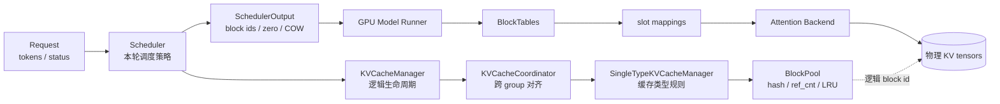
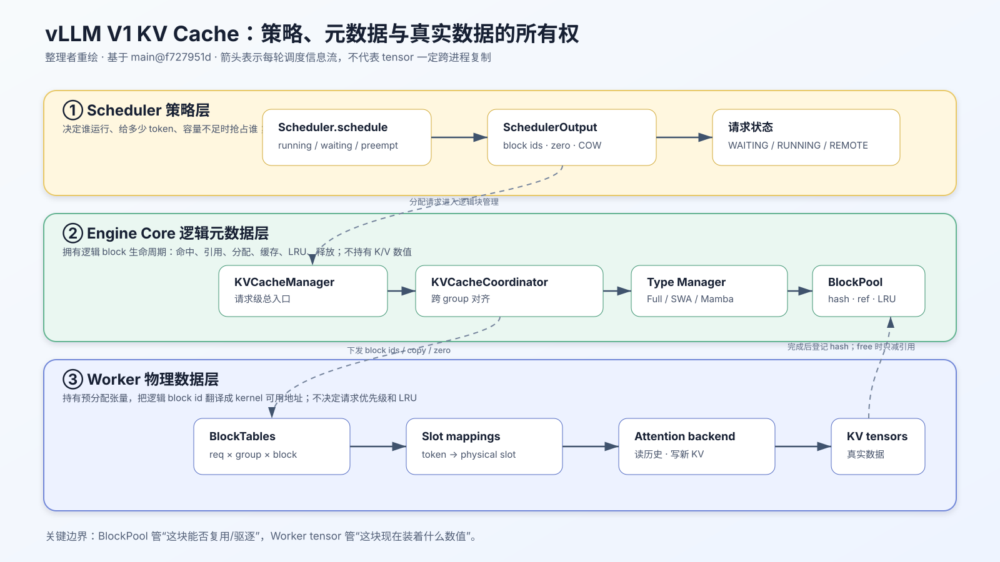
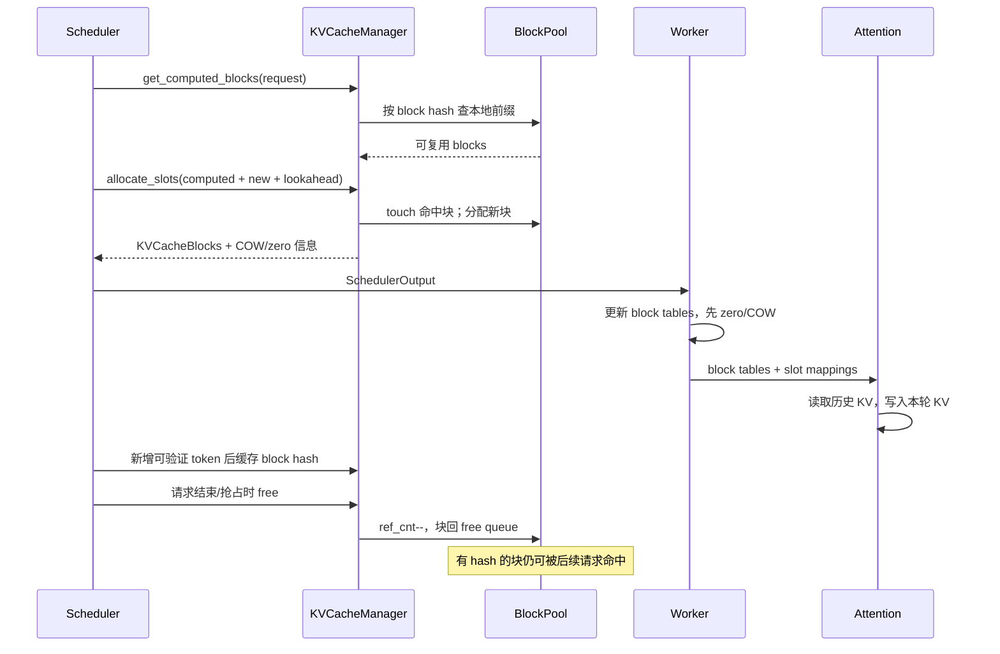
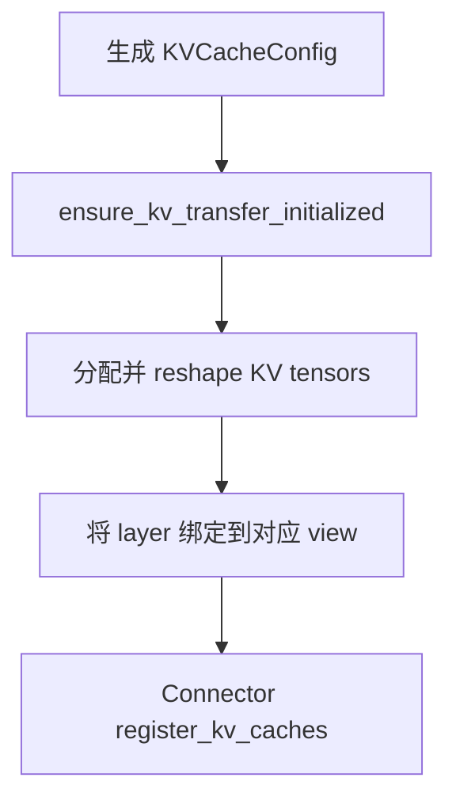
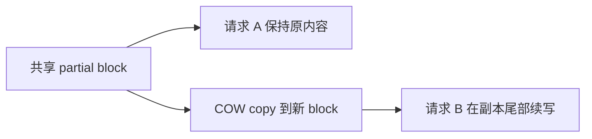
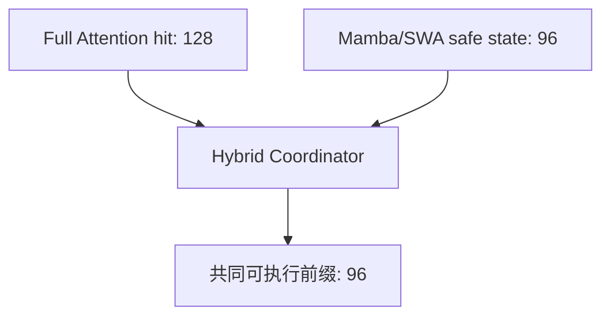
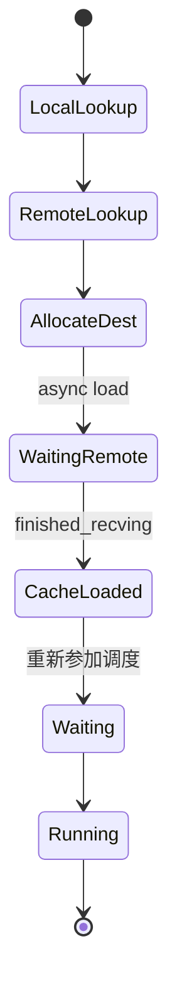

# vLLM V1 KV Cache 管理全生命周期源码学习文档

本文面向第一次阅读 vLLM V1 KV Cache 源码的同学，沿着“一块 KV 空间如何被规划、分配、命中、写入、复用、抢占和释放”这条主线，解释调度器中的逻辑块管理与 Worker 中的物理张量如何配合。

KV Connector 如何把 KV 扩展到远端、CPU 或其他实例，见配套文档：[vLLM V1 KV Connector 架构与实现地图源码学习文档](./vLLM%20V1%20KV%20Connector%20架构与实现地图源码学习文档.md)。

> 阅读边界：本文是对指定 commit 的静态源码梳理，没有运行单测、模型推理或性能实验。文中的“源码事实”来自当前代码；“可以理解为”“设计上”等措辞表示整理者归纳。

## 0. 阅读基线与范围

### 0.1 源码基线

| 项目 | 内容 |
| --- | --- |
| 源码目录 | `/Users/mac/Documents/Documents/工作/vllm` |
| 分支 | `main` |
| commit | `f727951d3f0dbeb9acdb8a2f7ebfecaeb67090b3` |
| commit 主题 | `[Bugfix] Re-land MiniMax M3 default video processor (#50305)` |
| 读取时间 | `2026-07-31` |
| 工作区状态 | `main...origin/main`，无已修改或未跟踪文件 |
| 操作边界 | 只读源码分析；未修改 vLLM 源码，未执行测试、推理和 benchmark |

### 0.2 本文讲什么

本文重点覆盖：

- 启动时如何估算 KV 可用显存、生成 `KVCacheSpec`、分组并确定块数；
- Scheduler 如何通过 `KVCacheManager`、Coordinator、单类型 Manager 和 `BlockPool` 管理逻辑块；
- prefix cache 如何计算链式哈希、命中、固定、进入 LRU 和被驱逐；
- partial-tail cache、Copy-on-Write、block zeroing 等当前主线上的细节；
- Full Attention、Sliding Window、Chunked Local、Mamba、Cross Attention 等缓存类型的差异；
- block table 和 slot mapping 如何把调度结果翻译成 Attention Kernel 能使用的地址；
- 容量不足、抢占、请求结束、异步 KV 传输时的资源生命周期；
- 事件、指标、排障入口和静态测试地图。

本文不展开：

- 各 Attention Backend 内核如何读写 K/V；
- V0 engine 的 block manager；
- 每种量化格式的张量编码；
- Connector 的具体传输协议与后台线程实现。

### 0.3 术语速查

| 术语 | 人话解释 | 主要源码 |
| --- | --- | --- |
| KV Cache | Attention 为历史 token 保存的 Key/Value；后续 token 不必重算整段历史 | `vllm/v1/kv_cache_interface.py` |
| KV block | 固定 token 容量的缓存分配单位；Scheduler 管逻辑 block id，Worker 持有实际张量 | `vllm/v1/core/block_pool.py` |
| block table | 某请求、某 KV group 当前使用哪些 block id 的有序表 | `vllm/v1/worker/block_table.py` |
| slot mapping | 将本轮每个 token 映射到 KV 张量中的具体写入 slot | `vllm/v1/worker/gpu/attn_utils.py::build_slot_mappings_by_layer` |
| prefix cache / APC | 用 token 前缀的哈希复用已算好的 KV block | `vllm/v1/core/kv_cache_manager.py` |
| partial tail | 一个逻辑块尾部只缓存了部分 token；当前 commit 已有专门的命中与固定机制 | `vllm/v1/core/block_pool.py` |
| COW | 两条序列共享部分块，但其中一条要续写时，复制尾块再写，避免覆盖另一条序列 | `vllm/v1/core/single_type_kv_cache_manager.py` |
| KV cache group | 生命周期和 block table 一起管理的一组层 | `vllm/v1/kv_cache_interface.py::KVCacheGroupSpec` |
| Coordinator | 协调多个 KV group，使混合 Attention 模型获得一致可用的前缀 | `vllm/v1/core/kv_cache_coordinator.py` |
| ref count | block 被活跃请求引用的数量；降到 0 只表示可驱逐，不等于立即擦除缓存 | `vllm/v1/core/kv_cache_block.py` |
| null block | 表示“不需要真实存储”的占位块，例如滑窗之外的历史位置 | `vllm/v1/core/block_pool.py` |
| DCP / PCP | Decode Context Parallel / Prefill Context Parallel；会改变 block 对全局 token 的覆盖关系 | `vllm/config/parallel.py` |
| HMA | Hybrid Memory Allocator；面向混合 KV 类型的统一分组与内存布局 | `vllm/config/cache.py` |

## 1. 先建立整体地图

### 1.1 人话版：同一份 KV 有三种视角

理解 vLLM KV Cache 最重要的一步，是不要把“缓存”当成一个对象：

1. **Scheduler 的策略视角**：现在要给哪个请求多少块，哪些块命中过，容量不足时抢占谁。
2. **Engine Core 的逻辑元数据视角**：每个 block id 的引用计数、哈希、LRU 位置，请求的 block table。
3. **Worker 的数据视角**：真正占 GPU/CPU 内存的张量、block id 到地址的映射、Attention Kernel 的读写。

Scheduler 不搬运 K/V tensor；Worker 也不决定请求优先级。两者通过 `SchedulerOutput` 中的 block ids、zero/copy 指令和 Connector metadata 对齐。



### 1.2 核心所有权



> 整理者重绘：这张图用于突出三层所有权及信息流。它把同进程函数调用与跨进程消息统一画成逻辑箭头，不表示每条箭头都会复制 KV tensor；真实 K/V 始终由 Worker 数据面持有。

| 对象 | 谁创建/持有 | 它负责什么 | 它不负责什么 |
| --- | --- | --- | --- |
| `KVCacheConfig` | Engine Core 启动阶段 | 描述每个 Worker 的张量大小、group 和 block 数 | 不记录某个请求占了哪些块 |
| `KVCacheManager` | Scheduler | 请求级分配、命中、缓存、释放入口 | 不直接持有 K/V tensor |
| `KVCacheCoordinator` | `KVCacheManager` | 协调多个 group、构造各类型 Manager | 不执行 kernel |
| `SingleTypeKVCacheManager` | Coordinator | 某一种 KV 语义下的 block table 与命中规则 | 不单独拥有物理内存池 |
| `BlockPool` | Coordinator 共享 | block id、hash、ref count、free queue | 不知道 token 的 K/V 数值 |
| Worker block table | Model Runner | 把 Scheduler 下发的 block id 保存在 device 可用结构中 | 不决定分配或驱逐 |
| KV tensor | Worker | 存储真实 K/V 或状态 | 不拥有请求调度策略 |

### 1.3 一条请求的鸟瞰图



## 2. 启动阶段：先决定“有多少空间、长什么样”

### 2.1 总入口

源码主线从 `vllm/v1/engine/core.py::EngineCore._initialize_kv_caches` 开始：

1. 注册模型与平台支持的 KV cache spec；
2. 向所有 Worker 查询每层的 `KVCacheSpec`；
3. profile 可用于 KV 的内存；
4. 按 group 和并行 rank 生成 `KVCacheConfig`；
5. 将所有 rank 的有效 block 数收敛到共同下限；
6. Worker 按配置分配 tensor，并完成编译/热身。

如果存在 non-causal spec，Engine Core 会关闭 chunked prefill 和 prefix caching。这里是硬兼容边界，不是 Scheduler 运行时“试试看再降级”。

### 2.2 显存预算不是 `总显存 × utilization`

`vllm/v1/worker/gpu_worker.py::GPUWorker.determine_available_memory` 的主逻辑可以理解为：

```text
KV 可用字节
≈ gpu_memory_utilization 对应预算
 - 模型常驻、临时张量等 non-KV 峰值
 - 应用后的 CUDA Graph 内存估计
```

Worker 会用 dummy run/profile 获取非 KV 峰值，并对 CUDA Graph 另做估算。若显式设置 `kv_cache_memory_bytes`，该值直接成为 KV 预算，`gpu_memory_utilization` 对 KV 容量不再生效；但 profile/compile 仍可能执行，因为它还有编译和图捕获准备作用。

源码锚点：

- `vllm/v1/worker/gpu_worker.py::determine_available_memory`
- `vllm/v1/worker/gpu_worker.py::initialize_from_config`
- `vllm/v1/engine/core.py::_initialize_kv_caches`

### 2.3 从每层 spec 到 group

`vllm/v1/worker/gpu/attn_utils.py::get_kv_cache_spec` 向各 Attention 层和状态层询问自身需求，跳过：

- 不需要 KV cache 的模块；
- 与其他层共享 cache tensor 的别名层。

`vllm/v1/kv_cache_interface.py` 定义了主要 spec：

| spec 家族 | 缓存的是什么 | 生命周期重点 |
| --- | --- | --- |
| `FullAttentionSpec` / MLA / TQ | 完整历史 K/V | 连续前缀、APC、尾块 |
| `SlidingWindowSpec` | 最近窗口的 K/V | 窗口外 block 可变成 null |
| `ChunkedLocalAttentionSpec` | 局部分块历史 | 旧 chunk 可跳过 |
| `RSWASpec` | 递归/滚动窗口状态 | prompt 尾部与 decode 窗口间可释放 |
| `MambaSpec` | SSM/卷积状态 | 不是普通逐 token K/V，命中与对齐规则不同 |
| `CrossAttentionSpec` | Encoder 侧静态缓存 | 按 encoder 输入分配 |
| `EncoderOnlyAttentionSpec` | 仅 encoder 使用 | 不走普通 decoder APC |
| `HiddenStateCacheSpec` | 中间 hidden states | 服务于特定模型/Connector 路径 |

一层 spec 同时包含两种不要混淆的尺度：

- `block_size`：Scheduler 眼中的逻辑 token 数；
- `page_size_bytes`：Worker 实际分配一个 manager block 所需的字节。

Attention page 会计入 K/V（或 MLA 的联合表示）、cache dtype、head/head size、per-token-head scale 和布局 padding。某些 MLA compression 路径的 `storage_block_size` 还可以不同于逻辑 `block_size`。DCP 下，Full Attention 的单 rank 最大内存预算按上下文并行分片计算。

`vllm/v1/core/kv_cache_utils.py::get_kv_cache_groups` 再把兼容的层组成 group。常见路径包括：

- 全部层相同：统一分组；
- 单一缓存类型但层尺寸不同：按 `UniformTypeKVCacheSpecs` 管理；
- 混合 Attention：统一 page size 后按兼容规则分组；
- 特殊混合模型：走专门 group 规则；
- 无 Attention：使用最小占位配置。

group 是“共同接受同一组逻辑 block table 的层集合”。它不等于一个 tensor；一个配置可有多个 tensor，一个 tensor 也可在 packed/cross-layer 布局下被多个 layer view 共享。

SWA/Chunked Local 的启动预算还会计算 `max_admission_blocks_per_request`，并显式计入 `max_in_flight_tokens`。它解决的不是“理论最大序列能否放下”，而是避免请求按首个 chunk 被准入后，在运行中途再也拿不到完成当前有效窗口所需的块。SWA 会额外考虑窗口跨 block 的边界。

常规 hybrid 物理布局通常建立 `group_size` 个 pool tensor：不同 group 中相同层位置可以 alias 同一个 tensor 的不同逻辑使用区间。全局 `BlockPool` 保证同一 block id 同一时刻只有一条有效 group/request 引用链，group id 又进入缓存 key，因此这种物理复用不会让不同 group 的 prefix hash 串线。

DeepSeek-V4 等特殊路径还可使用 packed slab：多个 group 的页面在一个大 slab 内按 offset/stride 排列。这是物理布局优化，不表示不同 group 共享同一份 KV 内容。

### 2.4 多 Worker 为什么最后取最小 block 数

`vllm/v1/core/kv_cache_utils.py::get_kv_cache_configs` 会：

1. 合并各 Worker 的 spec；
2. 生成全局 group；
3. 投影为每个 PP rank 实际拥有的层；
4. 按各 rank 可用内存算 tensor size 和 block 数；
5. 将所有 rank 的 `num_blocks` 收敛到最小值，并缩小多出来的 tensor。

原因很直接：一次分布式请求不能在 rank 0 认为 block 120 可用、在 rank 1 却没有对应空间。统一逻辑 block id 空间必须由最紧张的 rank 决定。

`generate_scheduler_kv_cache_config` 还会把 Worker 侧便于分配的 uniform 描述，转回 Scheduler 所需的代表性单层 spec。两边配置目的不同：

- Worker 配置面向“怎么切物理 tensor”；
- Scheduler 配置面向“一个逻辑块覆盖多少 token、遵循什么缓存语义”。

### 2.5 Worker 的物理分配

当前 GPU V2 路径集中在：

- `vllm/v1/worker/gpu/model_runner.py::GPUModelRunner.initialize_kv_cache`
- `vllm/v1/worker/gpu/attn_utils.py::init_kv_cache`
- `vllm/v1/worker/gpu/attn_utils.py::_allocate_kv_cache`
- `vllm/v1/worker/gpu/attn_utils.py::_reshape_kv_cache`
- `vllm/v1/worker/gpu/attn_utils.py::bind_kv_cache`

分配时先用 `torch.zeros` 创建 int8 raw backing storage，再按 dtype、shape 和 layout 建 view。这样 packed tensor 和 cross-layer tensor 可以共享底层存储，而不必复制。首次分配为零不代表后续复用无需 zeroing：从 free queue 重新取得的页可能还残留旧请求内容。

初始化顺序有一个容易忽略的约束：



Connector 对内存布局可能有要求，因此它要在 tensor 初始化前完成实例化；但只有 tensor 真正存在后，才能注册可传输内存。配套 Connector 文档会展开这一点。

## 3. 运行时对象：一层一层看职责

### 3.1 `KVCacheManager`：Scheduler 的总入口

`vllm/v1/core/kv_cache_manager.py::KVCacheManager` 对 Scheduler 提供的核心能力是：

- 查询本地已计算前缀；
- 为本轮 token 和 lookahead 分配 slots；
- 将新完成的 token 注册进 prefix cache；
- 释放、延迟释放、reset；
- 输出 COW、zeroing、partial-tail offload 和事件信息；
- 与 Connector 的远端命中数量对齐。

返回值 `KVCacheBlocks` 的外层按 group 组织。即使普通 Transformer 只有一个 group，接口仍保持多 group 形态。

### 3.2 `KVCacheCoordinator`：混合模型的协调层

`vllm/v1/core/kv_cache_coordinator.py` 会在共享 `BlockPool` 之上创建每个 group 对应的 `SingleTypeKVCacheManager`。

常见 Coordinator：

- no-prefix-caching：不查 hash，只做分配；
- unitary：单 group 或同构 group；
- hybrid：让 Full Attention、Sliding Window、Mamba 等不同语义获得一个共同可执行的前缀边界。

“共享 BlockPool”很关键。多个 group 的 block id 来自同一逻辑 id 空间，能保持 Worker 多组 block table 对齐；每种 Manager 再决定同一个逻辑位置是否真的需要物理数据、能否用 null block。

### 3.3 `SingleTypeKVCacheManager`：把缓存语义封装起来

`vllm/v1/core/single_type_kv_cache_manager.py` 维护：

- `req_to_blocks`：请求到有序 block table；
- `num_cached_block`：请求已固定为缓存的范围；
- 本类型需要多少新 block；
- 哪些旧 block 可跳过/释放；
- 命中、partial tail、COW 和共同前缀规则。

这里的 “single type” 是行为语义相同，不一定只有一层。

### 3.4 `BlockPool`：hash、引用计数和 LRU 的交汇点

每个 `KVCacheBlock` 主要包含：

- `block_id`；
- `ref_cnt`；
- primary/alternate hash；
- null 标志；
- intrusive free queue 指针。

`BlockHashToBlockMap` 允许一个 hash 对应多个物理 block。vLLM 不强制把内容相同的活跃 block 合并成唯一实体，因为请求 block table 保持 append-only 更简单，且可以避免运行中重写大量引用。

初始化时 block 0 会被取出作为 `null_block`。它不走普通 ref count、cache 和 free 生命周期，供 SWA/Mamba 等在 block table 中表示 skipped hole；初始物理 backing 为零，Attention mask/类型语义再决定是否真正读取它。

## 4. Scheduler 每一轮怎样分配 KV

### 4.1 第一步：查询本地已计算前缀

`KVCacheManager.get_computed_blocks` 沿请求 token 的 block hash 查找本地缓存。

普通解码请求即使整段都命中，通常也至少重算最后一个 token，因为模型需要通过这一步得到 logits。于是本地可复用上限通常是：

```text
request.num_tokens - 1
```

对于稀疏保留或特殊共同前缀逻辑，Manager 还可能返回一个更保守的共享边界。

### 4.2 第二步：若有 Connector，再查远端

`get_computed_blocks_for_connector` 会把本地前缀信息交给 Connector 查询远端。混合 Full Attention/Mamba 模型尤其需要区分：

- Connector 对 Full Attention 看到的本地连续前缀；
- Mamba 状态是否真的能覆盖同样范围；
- 没有远端增量时，最终仍必须回到本地各 group 的共同边界。

Connector 只报告“远端还有多少 token 可用”并产生传输 metadata；目标 GPU block 仍由 `KVCacheManager` 分配。

### 4.3 第三步：`allocate_slots`

`vllm/v1/core/kv_cache_manager.py::KVCacheManager.allocate_slots` 的核心顺序如下：

1. 计算本地、远端已完成 token 数；
2. 根据请求状态应用 watermark/准入保护；
3. 回收滑窗或局部 Attention 已不需要的逻辑位置；
4. 计算外部加载目标块、新 token 和 lookahead 所需块；
5. 把本地命中块 `touch` 成活跃引用；
6. 为远端命中分配本地落点；
7. 分配新块；
8. 生成 COW/zero 等 Worker 指令；
9. 对已最终确认的 token 注册 cache hash。

“最终确认”意味着不会把尚未验证的 speculative draft token 当作稳定前缀缓存。

### 4.4 watermark 与 reserve

watermark 用来避免一个新进入或刚被抢占的请求吃光最后的 block，让系统完全没有周转余地。异步 Connector load 还会 reserve in-flight prefill blocks：这些 block 逻辑上已经承诺给正在加载的请求，不能被其他新分配越过。

watermark 不是所有状态一刀切。当前实现重点约束 WAITING/PREEMPTED 的新准入；已经运行的请求则需要尽量向前推进，否则系统容易因过度保守而停滞。

可选的 `scheduler_reserve_full_isl` 会启用 `full_sequence_must_fit` 准入门槛，要求完整输入序列在考虑局部窗口回收后可完成。running 请求分配失败时 Scheduler 可继续抢占；waiting 请求分配失败时则不会为了它继续连锁抢占，而是停止/跳过当前 waiting 扫描。

### 4.5 为什么命中块要先 `touch`

命中的 cached block 往往 `ref_cnt == 0`，仍挂在 free queue 中。`touch` 会：

- 从 free queue 移除；
- 增加引用计数；
- 保护它不被本轮其他分配驱逐。

多 group 情况下，代码会先固定所有本地命中，再为外部命中分配新块。否则 group A 为远端数据取空闲块时，可能驱逐 group B 尚未来得及 touch 的本地命中。

`allocate_slots` 还会把“命中但当前可驱逐的块”算进净容量需求：这些块一旦被 `touch`，就会从 free queue 消失。只用“新 token 需要几块”估算会高估可用空间。

### 4.6 分配结果如何到 Worker

Scheduler 把以下信息写入 `SchedulerOutput`：

- 每个请求各 group 新增的 block ids；
- 需要 zero 的新 block ids；
- `kv_cache_block_copies`；
- partial-tail offload；
- Connector metadata。

Worker 侧 `GPUModelRunner.add_requests` / `update_requests` 更新常驻 block table；在 forward 前先执行 zero 和 COW copy，再由 `prepare_attn` 收集 device block tables 并构造 slot mappings。

## 5. Prefix Cache：命中不是“看 token 是否相同”这么简单

### 5.1 链式 block hash

`vllm/v1/core/kv_cache_utils.py` 为块计算链式哈希。一个块的身份不仅取决于当前 token，还包含前序 block hash，避免相同局部 token 出现在不同上下文时被错误复用。

hash 的附加因素还可能包括：

- multimodal 输入；
- LoRA 标识；
- prompt embeds；
- cache salt；
- 其他会改变模型计算结果的请求上下文。

可理解为：

```text
block_hash_i =
hash(parent_hash, current_tokens, model-affecting-extra-keys)
```

只要任何会改变 KV 数值的输入没有进入 key，就会产生错误命中；因此扩展请求语义时必须同时审视 block hash。

多 group 场景还会在内部 key 中加入 group id，避免相同 token hash 让不同缓存语义的 group 串用页面。若使用非 SHA 的进程内 hash 且没有固定 `PYTHONHASHSEED`，跨进程/重启的 hash 可复现性也不是默认保证，源码会给出 warning。

### 5.2 hash block size 与 KV group block size

当前代码允许 hash 粒度与某些 group 的物理 block 粒度不同，并通过 `resolve_kv_cache_block_sizes` 协调。这对混合 KV 类型和 partial-tail 支持很重要：

- 物理 block 决定怎样分配 tensor；
- hash block 决定以多细的 token 前缀复用；
- 两者不能随意混同。

### 5.3 缓存登记

当一段 token 已真实计算且结果稳定，Manager 为对应 block 设置 hash，并放入 hash map。

当前 commit 还支持 eligible Manager 的 partial-tail 条目：

- `BlockPool.cache_partial_block` 可记录未填满整块的稳定尾部；
- partial hash 可有更细粒度；
- 命中时需要固定尾块，避免在续写前被驱逐；
- 尾部只命中一部分、却还要继续写同一逻辑块时，可能触发 COW。

这与仓库内基于较早资料整理的 APC 文档存在版本差异。阅读当前源码时，不应再把“只有完整 block 才可能缓存”当作无条件结论。

延伸阅读：[vLLM APC 链式哈希学习文档](./vLLM%20APC%20链式哈希学习文档.md)。

### 5.4 LRU 与引用计数共同决定可驱逐性

`BlockPool` 的 free queue 同时承担空闲池和 LRU：

- 新块从队首弹出；
- `touch` 把命中块从 free queue 移走；
- `free_blocks` 令 `ref_cnt--`；
- 降到 0 的无 hash 块放到队首，优先复用；
- 降到 0 的有 hash 块放到队尾，尽量保留给 APC 命中。

因此：

```text
ref_cnt == 0  ≠  数据已删除
ref_cnt == 0  =  当前无活跃请求引用，可作为驱逐候选
```

真正复用某个 cached block id 时，`get_new_blocks` 会先清除它旧的 hash 映射，再交给新请求。

同一请求释放时通常按逆序回收，使较靠后的块在相同时间戳下更早被驱逐；完整的老前缀更容易留在缓存中。

一个容易误读的指标是 `usage`：它按“不在 free queue 的活跃引用块”计算。带 hash、`ref_cnt == 0`、仍保留在 APC LRU 中的页面属于可驱逐 free capacity，不算活跃 usage；所以它不是“所有保存了哈希内容的页面比例”。

### 5.5 Copy-on-Write

假设请求 A 和 B 共享一个只填了部分 token 的尾块，B 想在尾部继续写：



若直接原地写，A 看到的缓存会被 B 污染。`SingleTypeKVCacheManager._apply_cow` 生成源/目标 block 对，并保持 copy 端点被引用；Worker 在 Attention forward 前完成复制。

### 5.6 reset 的硬条件

`BlockPool.reset_prefix_cache` 只在没有活跃普通 block 时成功；null block 是例外。reset 不是“无视引用强行擦除”，否则正在 forward 的请求会读到已复用的地址。

## 6. 不同 KV 类型为什么不能套同一条规则

### 6.1 行为对照

| Manager / spec | 需要保存的历史 | prefix 命中特征 | 可释放/跳过内容 | 重要限制 |
| --- | --- | --- | --- | --- |
| Full Attention | 全部历史 K/V | 连续前缀；支持完整块及当前实现中的 partial tail | 请求结束或被抢占后进入可驱逐 | 需要保留可供所有后续 token 访问的历史 |
| Sliding Window | 最近窗口 | 命中必须满足当前窗口的连续可用性 | 窗口外位置可用 null block | common prefix blocks 通常不能按 Full Attention 方式计算；DCP/PCP 有限制 |
| Chunked Local | 当前局部 chunk | 按局部 chunk 边界判断 | 旧 chunk 可视为不再需要 | 不支持普通 cascade 语义 |
| R-SWA | prompt 尾部 + 当前滚动窗口 | 依赖两个有效区间 | 两个区间之间的 gap 可释放 | block 表可能存在逻辑空洞 |
| Mamba | SSM/conv 状态 | 状态对齐，不能把普通 K/V 前缀规则照搬 | recycle 旧状态 block | 同 step 新状态不能提前当作稳定命中；DCP/PCP 受限 |
| Cross Attention | encoder 结果 | 由 encoder 输入决定 | encoder 生命周期结束后释放 | 与 decoder 自回归 APC 不同 |
| Encoder Only | encoder 内部缓存 | 不走普通 decoder prefix cache | 随 encoder 生命周期 | 通常不参与 APC |

### 6.2 null block 不是“一块全零 KV”

null block 是逻辑占位：告诉 block table 某个历史位置对当前 Attention 语义不需要真实缓存。它的价值是保持不同 group 的逻辑索引对齐，而不是表示 Attention 一定会从一块全零 tensor 读取。

### 6.3 Hybrid Coordinator 的共同边界

混合模型中，Full Attention 也许命中了 128 token，Sliding Window 或 Mamba 却只能安全从 96 token 状态继续。Coordinator 必须选择能让所有相关 group 一起执行的边界，而不是简单取某个 group 的最大命中。



一些类型会在早期位置填 null block，表面 block table 长度仍对齐，但“有 block id”不等于“该 group 保存了真实历史数据”。

### 6.4 Mamba 三种 cache mode

Mamba 缓存的是 recurrent state，而不是普通逐 token K/V。当前 spec 主要有：

| mode | 人话解释 | 容量与复用特点 |
| --- | --- | --- |
| `none` | 每请求只留当前状态 | 基本不做历史状态 APC；关闭 APC 时使用 |
| `all` | 在各 block 边界保存状态 | 能按历史边界做 prefix reuse，但占更多 state pages |
| `align` | 保留运行态和迁移/快照态 | 常驻少量状态页，配合 partial-tail/COW 对齐 |

开启 APC 且模型支持时可选择 `all`，否则常见为 `align`；关闭 APC 会强制 `none`。speculative decode 还需要额外 state page，不能只按普通 decode 的一个状态页预算。

### 6.5 DCP、PCP 与 Scheduler 对齐粒度

DCP 会让一个 Scheduler block 覆盖多个 rank 的全局 token，因此：

- Attention Manager 的有效 block size 乘 DCP world size；
- Worker slot mapping 只把本 rank token 映射到本地 kernel slot，其余位置使用 padding；
- partial fine-grained hit 在 DCP 下禁用；
- SWA/Chunked Local 明确不支持 DCP；
- Hybrid + DCP 当前只接受受支持的 Full Attention + Mamba 组合。

PCP 不应直接理解成 core `KVCacheManager` 的 block size 再乘一次。当前 Scheduler 构造 Manager 时传入的 PCP world size 仍为 1，PCP runtime 由 Model Runner V2 的 `PCPManager` 处理，并有 MLA、PP、encoder-decoder、multimodal、LoRA、spec decode 等边界。

多 group 的 Scheduler 对齐单位是各有效 group block size 的 LCM；默认 hash 匹配粒度则按兼容 GCD 解析，也可由 `prefix_match_unit` 覆盖，但必须整除所有相关 group 粒度。

### 6.6 Speculative decode

Scheduler 会为 EAGLE、draft、DFlash、DSpark 等路径分配 lookahead slots，但只把 `request.num_tokens` 以内已验证的 token 注册进 cache。被拒绝的 draft 不会进入稳定 hash。

EAGLE/MTP 为保证生成点之前的 hidden state 被正确重算，命中后还可能主动少用一个 cache/hash unit；DeepSeek-V4 对最后一个 MTP group 有专门处理。Mamba spec 还会单独预算 speculative state blocks。

## 7. 从逻辑 block id 到 Attention 地址

### 7.1 Worker block table

Scheduler 返回每组 block id 后，Worker 将它们追加或更新到常驻 `BlockTables`。这些表支持：

- 只增量传递新 block ids；
- 在 device 侧形成 batch 所需的紧凑 block table；
- 按请求和 group 收集；
- 为 Attention metadata 提供物理页索引。

Mamba group 是特殊情况：它使用 `SlotMappingMode.NONE`，block-table row 表示 recurrent-state block indices，而不是普通 token → K/V slot。不能用 Full Attention 的线性 slot 公式解释 Mamba 状态。

源码锚点：

- `vllm/v1/worker/block_table.py`
- `vllm/v1/worker/gpu/model_runner.py::add_requests`
- `vllm/v1/worker/gpu/model_runner.py::update_requests`
- `vllm/v1/worker/gpu/model_runner.py::prepare_attn`

### 7.2 slot mapping

一个 block 能容纳多个 token，因此只有 block id 还不够。slot mapping 通常表达：

```text
slot = physical_block_id × block_size + offset_in_block
```

DCP、不同 backend 的 block-stride、packed layout 和特殊 spec 会改变具体映射，统一入口在 `vllm/v1/worker/gpu/attn_utils.py::build_slot_mappings_by_layer`。

### 7.3 读与写

Attention Backend 使用：

- block table 找到历史页；
- query token 的位置和 context length 决定读哪些页；
- slot mapping 决定本轮新 K/V 写到哪里。

所以“Scheduler 分到一块”只是逻辑承诺，只有 Worker 完成必要的 zero/COW/remote load，并执行 Attention 后，块里的数值才成为可复用 KV。

## 8. 容量不足、抢占与释放

### 8.1 分配失败时的主路径是 recompute

当前 V1 Scheduler 先为 running requests 分配。当容量不足时，会抢占低优先级/靠后请求：

1. 将被抢占请求从 running 移出；
2. 释放其 KV block 引用；
3. 将状态设为 PREEMPTED、`num_computed_tokens` 清零并丢弃旧 draft；
4. 以后重新进入 waiting；
5. 从仍可命中的 prefix cache 边界继续，否则 recompute。

主路径不是把整个请求 GPU KV 同步 swap 到 CPU 再原样恢复。CPU/分层 offloading 是 Connector 提供的独立机制。

源码锚点：`vllm/v1/core/sched/scheduler.py::Scheduler.schedule`。

### 8.2 请求结束时为什么可能延迟 free

普通情况下：

```text
request finished
→ KVCacheManager.free
→ ref_cnt--
→ block 进入 free queue
```

但 Consumer Connector 或多并发 batch 下，远端加载/发送可能仍在使用这些地址。Scheduler 会等待 Worker 报告 transfer completion，再真正释放，以避免：

- block id 已分给新请求；
- 后台 DMA 仍向旧请求地址写数据；
- 新请求 KV 被异步传输污染。

### 8.3 `pop_blocks_for_free`

`KVCacheManager.pop_blocks_for_free` 支持先把请求的 block table 从正常调度路径摘出，再由外部生命周期在安全时刻完成 free。它服务于“请求逻辑已结束，但物理地址还有异步使用者”的情况。

### 8.4 preemption 与 Connector delivery

Producer Connector 默认需要把已生成 KV 可靠交付。若请求被抢占，先前计划发送的 block 可能已释放或内容不再有效，因此 Connector 的 `handle_preemptions` 要取消/修正旧任务；Scheduler 必须按 recompute 后的新 block table 重新建立交付。

## 9. 异步远端加载如何进入本地生命周期

完整协议在 Connector 文档中展开。站在 KV Manager 侧，关键步骤是：



异步 load 时：

- Manager 先为远端 KV 分配本地目标 block；
- 这些 block 暂不登记为本地 prefix cache；
- loaded 区间不能被 zeroing 覆盖；
- 请求进入 `WAITING_FOR_REMOTE_KVS`，本轮不做 forward；
- Worker 报告 `finished_recving` 后，Scheduler 才把有效范围登记成已缓存；
- load 失败时，根据策略缩短有效前缀并 recompute，或直接 fail。

partial local tail 与远端前缀还要仲裁：只有远端命中严格越过按块对齐的本地前缀时，才值得放弃本地 partial tail 并加载远端；否则保留本地尾块通常更安全、更省传输。

## 10. Block zeroing、无效加载与数据安全

### 10.1 为什么新块要 zero

从 free queue 取得的 block 可能仍含旧请求数据。即使正常 Attention 会覆盖所有需要写的 slot，复杂布局、局部 Attention、Connector 或失败恢复可能让部分位置保持未写。`KVCacheConfig.needs_kv_cache_zeroing` 在存在 Mamba 或混合精度时启用 zeroing 管线，Scheduler 通过 `new_block_ids_to_zero` 记录需要清理的新块。

精确实现边界是：当前逐步收集/清零的是 `FullAttentionSpec`、TQ、MLA、HiddenState 这一类物理 backing block ids；`KVBlockZeroer` 显式跳过 Mamba segment。Mamba tensor 的首次分配由 `torch.zeros` 保证，运行态则遵循自己的状态迁移/COW 语义。若混合布局共享 backing，清理 Full Attention segment 是否覆盖其他 view 要按实际 alias 关系判断，不能笼统说“每次新 Mamba block 都由 zeroer 清零”。

### 10.2 哪些块不能清零

正在接收远端 KV 的目标范围不能被本轮通用 zero 操作覆盖。Scheduler 在构造输出时要区分：

- 真正新分配、等待本地 forward 写入的块；
- 已由远端 load 填充或正在填充的块；
- COW 的目标块。

### 10.3 invalid block ids

Worker Connector 若发现 load 部分失败，会通过 `KVConnectorOutput.invalid_block_ids` 返回。Scheduler：

1. 聚合所有 Worker 的无效 block；
2. 从本地缓存映射中驱逐对应条目；
3. 将请求的可复用前缀缩到第一个不可靠位置之前；
4. 按 `kv_load_failure_policy` recompute 或 fail。

这条链路保证“某个 Worker 传输失败”不会留下一个看似命中、实际数据不完整的全局缓存项。

## 11. 观测：容量、命中和驱逐分别看

### 11.1 Scheduler 统计

`Scheduler.make_stats` 会汇总：

- KV cache usage；
- prefix cache query/hit 统计；
- eviction 事件；
- Connector 统计。

usage 高不必然代表命中率高；命中率高也不代表没有排队。排障时需要把容量、调度等待和传输延迟拆开。

### 11.2 KV cache events

核心事件包括：

- `BlockStored`；
- `BlockRemoved`；
- `AllBlocksCleared`。

Manager 会补充 group kind、window 等信息，使消费者能区分 Full Attention、SWA 等缓存语义。Connector 也可以上报自己的外部缓存事件；两者可能描述不同存储层，不要把 GPU eviction 当成远端缓存也同步删除。

`kv_cache_report_mode=full` 时，复用命中也会再次发 `BlockStored` 报告，但不改变 cache 状态；partial entry 的事件使用精确 token boundary。用于驻留分析的 metrics 还会跟踪 birth、access、reuse gap、idle 和 lifetime，在物理块真正被重新分配/驱逐时形成 eviction 样本。

### 11.3 一个实用指标拆分

```text
端到端首 token 延迟
= 排队/准入
+ 本地 prefix lookup
+ 远端 lookup/load（如有）
+ 未命中部分 prefill
+ 首次 decode
```

看到 APC hit rate 下降时，应继续检查：

- hash key 是否因 LoRA、multimodal、salt 等变化；
- block/hash 粒度是否造成尾部浪费；
- cache 是否频繁被活跃请求挤出；
- hybrid group 是否被较短安全边界限制；
- Connector 的远端命中是否因失败回退而失效。

## 12. 三个完整例子

### 12.1 例一：普通 Full Attention 前缀命中

假设 block size 为 16，请求有 70 个 prompt token，本地命中前 48 个：

1. hash lookup 找到 3 个完整块；
2. `touch` 这 3 块；
3. 为 token 48～69 和本轮输出分配新块；
4. Worker 更新 block table；
5. 只计算未命中段；
6. 填满且稳定的新范围被写入 prefix cache；
7. 请求结束后 ref count 归零，但带 hash 的块留在 LRU 尾部等待复用。

### 12.2 例二：共享 partial tail 后分叉

两个请求共享前 37 个 token，block size 为 16：

- 前 32 token 是完整块；
- 第三个块只有 5 个稳定 token；
- A、B 都命中该 partial tail；
- B 继续写入不同 token 时触发 COW；
- A 继续引用原尾块，B 在副本上写。

此时“命中 37 token”不等于三个完整物理块都可无条件共享写入。

### 12.3 例三：容量不足导致抢占

运行中的 A 需要 4 个新块，但 pool 只剩 2 个可驱逐块：

1. Scheduler 尝试分配失败；
2. 选中较低优先级的 B 抢占；
3. B 的活跃引用释放，有 hash 的完整前缀可能仍留在 free queue；
4. A 得到足够 block 并继续；
5. B 再次调度时重新 lookup：能命中的部分复用，其余 recompute。

因此抢占并不必然让 B 的所有已算 KV 立即消失，但 Scheduler 不能假设它们一定还在。

## 13. 硬约束与常见误区

### 13.1 硬约束

| 约束 | 原因 | 源码入口 |
| --- | --- | --- |
| 所有并行 Worker 使用共同最小 `num_blocks` | 维持全局 block id 一致 | `get_kv_cache_configs` |
| non-causal spec 关闭普通 APC/chunked prefill | 因果前缀假设不成立 | `EngineCore._initialize_kv_caches` |
| reset 不能覆盖活跃引用 | 防止 in-flight forward 读到复用地址 | `BlockPool.reset_prefix_cache` |
| speculative draft 不能提前缓存 | draft 可能被拒绝 | `KVCacheManager.allocate_slots` |
| mixed group 的命中要协调 | 单一 group 的最大 hit 未必可执行 | `kv_cache_coordinator.py` |
| remote load 完成前不能视为本地 cache hit | 目标块尚无可靠数据 | Scheduler + Connector completion |

### 13.2 常见误区

| 误区 | 正确理解 |
| --- | --- |
| “释放请求就是删掉 KV” | 先减引用；带 hash 的块可作为零引用缓存继续存在 |
| “free block 里面没有数据” | free 表示可驱逐，可能仍保存可命中的缓存数据 |
| “block table 就是 KV tensor” | 前者是逻辑页表，后者是物理数据 |
| “命中多少由 Connector 决定” | Connector 报远端可用量；本地/混合 group/目标块由 KV Manager 协调 |
| “每层都有独立 block pool” | group 共享逻辑 block id 空间，tensor/view 布局另行决定 |
| “APC 永远只能命中完整块” | 当前 commit 对 eligible 路径已有 partial-tail primitives |
| “滑窗只需把老 block free 掉” | 还要保持跨 group block table 对齐，常用 null block 表示跳过 |

## 14. 小白排障地图

| 现象 | 先看什么 | 关键对象/源码 |
| --- | --- | --- |
| 启动时报 KV 空间不足 | 各 rank profile、显式 bytes、graph 估算、最小 block 数 | `determine_available_memory`、`get_kv_cache_configs` |
| APC 几乎无命中 | prefix caching 开关、hash extra keys、请求是否至少留一 token 重算 | `get_computed_blocks`、`hash_block_tokens` |
| 命中长度比预期短 | hybrid group 共同边界、partial tail、Mamba/SWA | `kv_cache_coordinator.py` |
| cache usage 很高仍频繁 preempt | 活跃引用过多、watermark、每请求 block 需求 | `allocate_slots`、Scheduler |
| 请求结束后显存 usage 不降 | 预分配 tensor 本来就常驻；变化的是逻辑使用率，不是 CUDA allocation | Worker KV tensor + `BlockPool` |
| 远端加载后结果错误/回退 | invalid block ids、zero 覆盖、完成聚合、failure policy | `KVOutputAggregator`、Scheduler |
| 多 PP rank block 数不一致 | 是否经过最小值收敛、配置是否被外部覆盖 | `get_kv_cache_configs` |
| COW 后性能抖动 | partial-tail 分叉数量、copy 对、block 粒度 | `_apply_cow`、`kv_cache_block_copies` |
| reset 返回失败 | 是否仍有 active/ref-counted block 或 in-flight transfer | `reset_prefix_cache` |

## 15. 源码阅读路线

### 15.1 第一遍：只看主干

1. `vllm/v1/engine/core.py::EngineCore._initialize_kv_caches`
2. `vllm/v1/core/kv_cache_utils.py::get_kv_cache_configs`
3. `vllm/v1/core/kv_cache_manager.py::KVCacheManager`
4. `vllm/v1/core/block_pool.py::BlockPool`
5. `vllm/v1/core/sched/scheduler.py::Scheduler.schedule`
6. `vllm/v1/worker/gpu/model_runner.py::GPUModelRunner.initialize_kv_cache`
7. `vllm/v1/worker/gpu/model_runner.py::prepare_attn`

### 15.2 第二遍：理解混合类型

1. `vllm/v1/kv_cache_interface.py`
2. `vllm/v1/core/kv_cache_coordinator.py`
3. `vllm/v1/core/single_type_kv_cache_manager.py`
4. 搜索 `FullAttentionManager`、`SlidingWindow`、`ChunkedLocal`、`Mamba`、`CrossAttention`。

### 15.3 第三遍：理解边界条件

1. partial prefix primitives；
2. COW 与 block zeroing；
3. preemption/free；
4. Connector async load 和 invalid blocks；
5. KV events 与 metrics。

## 16. 静态测试地图

本次没有执行测试。下面只是把源码机制映射到现有测试，方便后续验证：

| 机制 | 测试入口 |
| --- | --- |
| KV 配置、分组、容量 | `tests/v1/core/test_kv_cache_utils.py` |
| 单类型 Manager | `tests/v1/core/test_single_type_kv_cache_manager.py` |
| Scheduler 分配/抢占 | `tests/v1/core/test_scheduler.py`、`test_scheduler_e2e.py` |
| prefix cache 主流程 | `tests/v1/core/test_prefix_caching.py` |
| partial prefix primitives/hits | `tests/v1/core/prefix_cache/test_partial_prefix_cache_primitives.py`、`test_partial_prefix_cache_hits.py` |
| reset | `tests/v1/core/test_reset_prefix_cache_e2e.py` |
| metrics | `tests/v1/core/test_kv_cache_metrics.py` |
| Mamba prefix cache | `tests/v1/e2e/general/test_mamba_prefix_cache.py` |
| KV events | `tests/distributed/test_kv_cache_events.py` |
| Connector load failure 对本地 cache 的影响 | `tests/v1/kv_connector/unit/test_invalid_blocks_correctness.py`、`test_kv_load_failure_recovery.py` |
| SWA in-flight 安全窗口 | `tests/v1/core/test_swa_inflight_window_free.py` |
| deferred free / COW fence | `tests/v1/core/test_deferred_block_free.py` |
| Worker 多 group block table | `tests/v1/worker/test_gpu_block_table.py` |
| Mamba state block table | `tests/v1/attention/test_mamba_update_block_table.py` |
| hybrid chunked prefill | `tests/v1/e2e/test_hybrid_chunked_prefill.py` |

## 17. 一句话总结

vLLM V1 的 KV Cache 管理可以概括为：

> 启动时把模型的多种缓存需求压成跨 Worker 一致的 block 空间；运行时由 Scheduler 和 `KVCacheManager` 掌握逻辑所有权与生命周期，由共享 `BlockPool` 用 hash、引用计数和 LRU 复用页面，再由 Worker 把 block table 翻译为 Attention 可读写的物理地址。

如果只记住一个边界，请记住：**Scheduler 拥有分配与生命周期策略，Worker 拥有真实 KV 数据；Connector 可以搬数据，但不能越过 KV Manager 擅自决定本地 block 的生死。**
