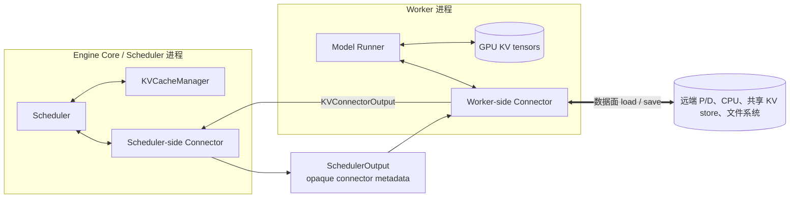
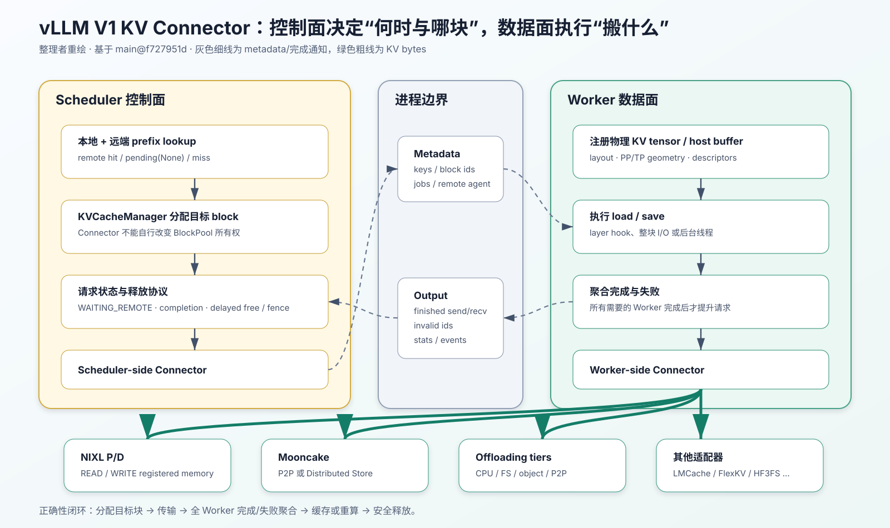
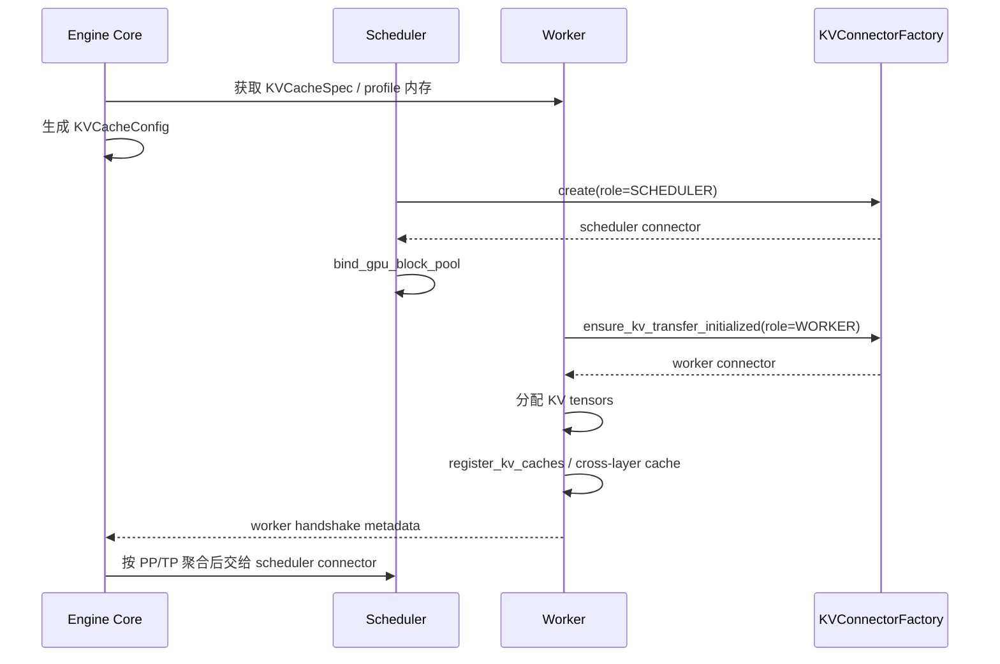
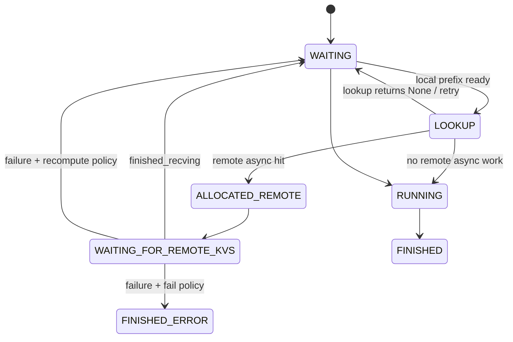
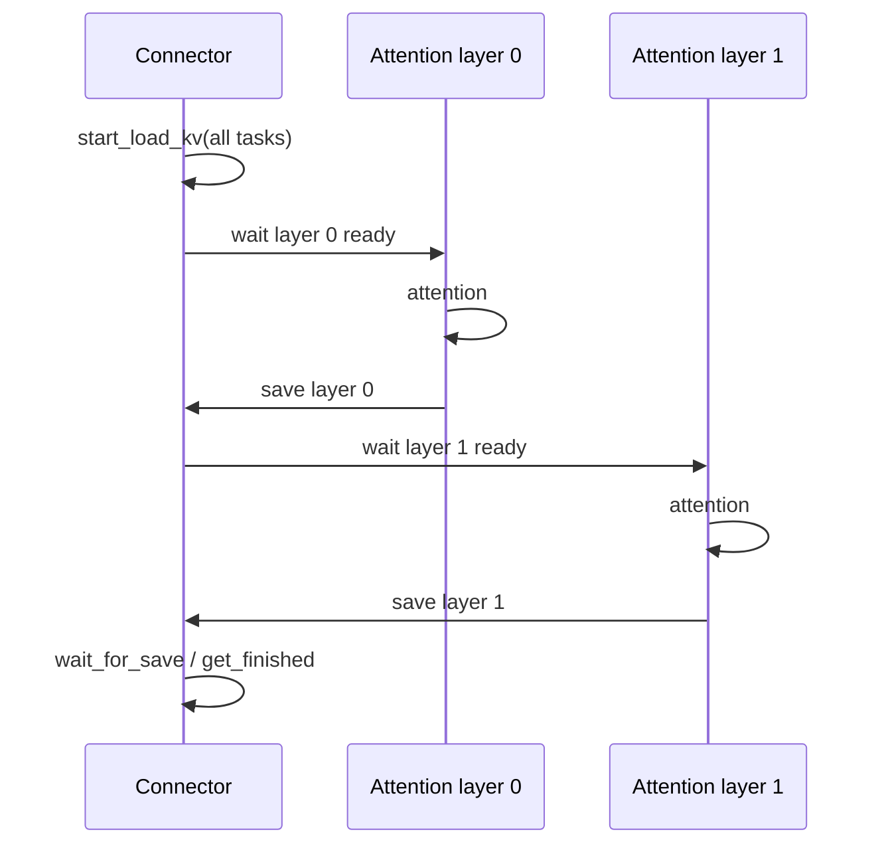
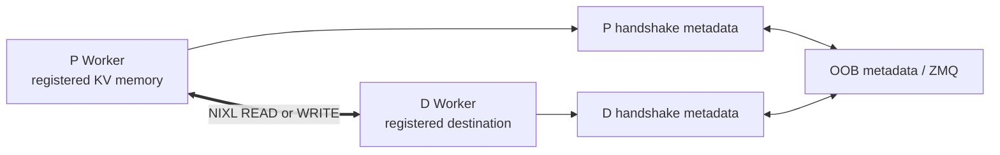
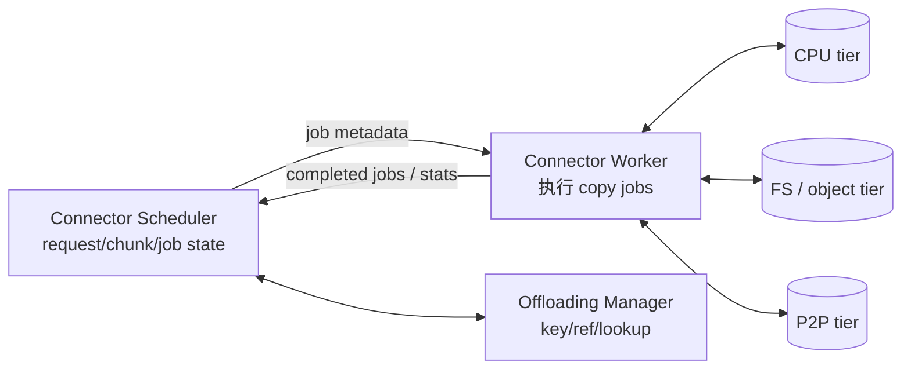

# vLLM V1 KV Connector 架构与实现地图源码学习文档

本文面向第一次阅读 vLLM V1 KV Connector 的同学，先解释公共框架如何把 Scheduler 控制面与 Worker 数据面连接起来，再深入 NIXL、Mooncake 和 Offloading 三条实现主线，最后给出当前仓库全部内置 Connector 的能力地图。

本文默认读者已知道逻辑 KV block 的基本概念。KV Cache 的内存规划、prefix cache、引用计数、LRU、COW 和抢占见配套文档：[vLLM V1 KV Cache 管理全生命周期源码学习文档](./vLLM%20V1%20KV%20Cache%20管理全生命周期源码学习文档.md)。

> 阅读边界：本文是对指定 commit 的静态源码梳理，没有安装 Connector 的外部依赖，也没有运行单测、P/D 服务、传输实验或 benchmark。本文所说的“支持”表示源码存在相应路径，不等于已经在当前机器验证可用。

## 0. 阅读基线与范围

### 0.1 源码基线

| 项目 | 内容 |
| --- | --- |
| 源码目录 | `/Users/mac/Documents/Documents/工作/vllm` |
| 分支 | `main` |
| commit | `f727951d3f0dbeb9acdb8a2f7ebfecaeb67090b3` |
| commit 主题 | `[Bugfix] Re-land MiniMax M3 default video processor (#50305)` |
| 读取时间 | `2026-07-31` |
| 工作区状态 | `main...origin/main`，无已修改或未跟踪文件 |
| 操作边界 | 只读源码分析；未修改 vLLM 源码，未执行测试、推理和传输实验 |

### 0.2 分析深度

本文按三档处理：

- **公共框架：深入**。配置、Factory、双角色对象、metadata 往返、异步完成、失败恢复、生命周期。
- **NIXL、Mooncake、Offloading：深入**。讲清控制流、数据流、后台工作和主要边界。
- **其他内置实现：完整地图**。覆盖 Factory 中每个注册名，列出用途、存储/传输形态、生命周期特征、HMA 声明和源码入口，但不逐行展开第三方 SDK。

### 0.3 术语速查

| 术语 | 人话解释 | 主要源码 |
| --- | --- | --- |
| Connector | vLLM 与外部 KV 存储、其他实例或数据通道之间的适配层 | `vllm/distributed/kv_transfer/kv_connector/v1/base.py` |
| P / D | Prefill 实例 / Decode 实例 | NIXL、Mooncake 等 |
| producer / consumer | 产生并交付 KV 的引擎 / 接收并使用 KV 的引擎 | `vllm/config/kv_transfer.py` |
| scheduler role | 运行在 Scheduler 进程，做 lookup、metadata 和生命周期协调 | `KVConnectorRole.SCHEDULER` |
| worker role | 运行在每个 Worker，注册 tensor 并真正 load/save | `KVConnectorRole.WORKER` |
| connector metadata | Scheduler 本轮给 Worker 的传输任务描述 | `KVConnectorMetadata` |
| worker metadata | Worker 汇报给 Scheduler 的完成、统计和实现状态 | `KVConnectorWorkerMetadata` |
| handshake metadata | Worker 间建立 OOB 通道、内存注册和拓扑所需信息 | `KVConnectorHandshakeMetadata` |
| HMA | Hybrid Memory Allocator；多个 KV group/类型共同工作 | `SupportsHMA` |
| cross-layer blocks | 一个传输块按层维度打包，减少逐层描述符与操作数 | `prefer_cross_layer_blocks` |
| layer-wise hook | 每层 Attention 前等 load、后触发 save 的钩子 | `maybe_transfer_kv_layer` |
| push / pull | P 主动写入 D / D 主动从 P 读取 | NIXL Push / Pull |
| remote prefill | D 不做完整 prompt prefill，而从 P/缓存拿到已算 KV | Scheduler connector path |
| delayed free | 请求结束后暂不归还 GPU block，等异步传输完成 | `request_finished` |

## 1. 先建立整体地图

### 1.1 人话版：Connector 有两半

Connector 不是一个在 Scheduler 里直接搬 GPU tensor 的对象。Factory 会为同一个配置创建两类实例：

- **Scheduler 半边**知道请求、token hash、block ids 和调度状态，决定是否查远端、是否等待、何时可以 free；
- **Worker 半边**知道本 rank 的 tensor、设备地址和传输 SDK，执行 load/save 并汇报完成。

中间用 metadata 传任务，而不是把 Python Connector 对象跨进程共享。



### 1.2 四条不同的流



> 整理者重绘：图中灰色细线表示 lookup、metadata、完成与失败通知，绿色粗线表示真正的 KV bytes。外部介质可以不同，但“KV Manager 分配目标页、Worker 执行 I/O、完成后再改变请求状态”这一闭环不变。

| 流 | 典型内容 | 方向 | 不要混淆 |
| --- | --- | --- | --- |
| 调度控制流 | remote hit 数、请求状态、是否延迟 free | Scheduler 内部 | 不是 K/V 数据 |
| 本轮 metadata | src/dst block ids、keys、remote engine、job ids | Scheduler → Worker | 通常是小对象 |
| Worker 回报 | finished send/recv、invalid ids、stats、events | Worker → Scheduler | 完成回报不等于 token 输出 |
| KV 数据流 | GPU/CPU/网络/共享存储中的 K/V bytes | Worker ↔ 外部介质 | Scheduler 不直接搬数据 |

### 1.3 Connector 与 KV Manager 的边界

Connector 可以：

- 告诉 Scheduler 远端命中多少 token；
- 保存外部 key 与传输状态；
- 生成 Worker 可执行的任务；
- 要求延迟释放本地 block；
- 报告 load 失败和外部 cache events。

Connector 不可以绕过 `KVCacheManager`：

- 自行把任意 GPU block id 宣告为某请求所有；
- 自行改变 `BlockPool.ref_cnt`；
- 忽略 hybrid group 的共同可执行边界；
- 在 transfer 未完成时把目标块当成本地已计算缓存。

## 2. 配置、Factory 与初始化时序

### 2.1 `KVTransferConfig`

`vllm/config/kv_transfer.py::KVTransferConfig` 的关键配置维度包括：

| 配置 | 作用 |
| --- | --- |
| `kv_connector` | Factory 注册名或外部模块中的类名 |
| `kv_connector_module_path` | 外部 Connector 模块；存在时优先于内置 registry |
| `engine_id` | 标识当前传输端 |
| `kv_role` | `kv_producer`、`kv_consumer` 或 `kv_both` |
| `kv_buffer_device` / `kv_buffer_size` | Connector staging buffer 位置与大小 |
| `kv_rank` / `kv_parallel_size` | Connector 自己的并行拓扑 |
| `kv_ip` / `kv_port` | 控制面/数据面端点 |
| `kv_connector_extra_config` | 实现特有参数 |
| `kv_load_failure_policy` | load 失败后 `recompute` 或 `fail` |

顶层 native offloading / LMCache 便捷配置会在 `VllmConfig` 后处理阶段映射为具体 Connector，并将 role 设为 `kv_both`。因此排查“明明没手写 `kv_transfer_config` 却创建了 Connector”时，要看配置归一化后的最终值。

### 2.2 Factory 是惰性 registry

`vllm/distributed/kv_transfer/kv_connector/factory.py::KVConnectorFactory` 只在选中某个 Connector 时 import 对应模块，避免所有可选第三方依赖都成为 vLLM 启动依赖。

外部 Connector 的规则：

1. `kv_connector_module_path` 非空时优先；
2. 模块中必须存在与 `kv_connector` 同名的类；
3. V1 外部类必须接受 `(vllm_config, role, kv_cache_config)` 三参数构造；
4. 不支持旧的两参数构造签名。

### 2.3 Scheduler 与 Worker 分开创建



顺序背后的原因：

- Connector 可能通过 `get_required_kvcache_layout` 影响张量 layout，所以 Worker Connector 要在物理分配前建立；
- NIXL 等要注册实际内存，所以注册动作只能在 tensor 分配后执行；
- Scheduler Connector 要绑定 `BlockPool`，才能在 lookup、finish 和 external cache 生命周期中引用逻辑 block。

### 2.4 PP/TP handshake 聚合

每个 Worker 可产生 handshake metadata。Engine Core 按 `(pp_rank, tp_rank)` 收集，再通过 PP-aware setter 交给 Scheduler Connector。这个设计避免 Scheduler 假设“只有一个 Worker 地址”。

但“框架能聚合 PP/TP metadata”不代表每个实现都支持任意 PP/TP 拓扑。具体 Connector 还必须正确解释：

- remote TP 与 local TP 的 shard 对应；
- MLA replicated / Full Attention sharded 的差异；
- PP rank 拥有哪些层；
- 一次请求的完成要等多少 Worker。

## 3. 公共接口：按生命周期读，而不是按函数清单背

### 3.1 Scheduler-side 接口

| 阶段 | 接口 | 契约 |
| --- | --- | --- |
| 新请求 | `on_new_request` | 可建立请求级状态，但不能假设已经分配 GPU block |
| 远端查询 | `get_num_new_matched_tokens` | 返回本地前缀之后新增的远端 token 数；可返回 `None` 表示稍后重试 |
| 分配后 | `update_state_after_alloc` | 现在才能记录由 KV Manager 分配的目标 block ids |
| 本轮下发 | `build_connector_meta` | 构造 Scheduler → Worker 的不透明 metadata |
| Worker 回报 | `update_connector_output` | 消化完成、invalid、统计、实现 metadata |
| 请求结束 | `request_finished` | 返回是否延迟 free，并可附带交付参数 |
| HMA 结束 | `request_finished_all_groups` | 一次接收所有 group block ids |
| 事件/状态 | `take_events`、`has_pending_push_work`、`reset_cache` | 驱动无请求后台任务、事件和 reset |

`get_num_new_matched_tokens` 可能对同一请求调用多次，因此契约要求它尽量 side-effect free。一次性资源占用应放在 allocation 之后，而不是 lookup 阶段。

### 3.2 Worker-side 接口

| 阶段 | 接口 | 契约 |
| --- | --- | --- |
| 初始化 | `register_kv_caches` / `register_cross_layers_kv_cache` | 注册真实物理 tensor |
| host staging | `set_host_xfer_buffer_ops` | 提供设备特有的 H2D/D2H block copy |
| forward 前 | `bind_connector_metadata`、`handle_preemptions`、`start_load_kv` | 绑定本轮任务，先处理会被覆盖的旧块 |
| 每层前 | `wait_for_layer_load` | 确保该层需要的远端数据可读 |
| 每层后 | `save_kv_layer` | 发起该层数据保存 |
| forward 后 | `wait_for_save`、`get_finished` | 等同步要求，收割异步完成 |
| 本轮结束 | `clear_connector_metadata` | 防止下轮误用旧任务 |
| 回报 | worker meta / stats / events / invalid ids | 由 output aggregator 汇总 |

并非每个 Connector 都真正逐层搬数据。整块异步实现会让 layer-wise hook 成为 no-op，把工作放到 `start_load_kv` 或 `get_finished`。

### 3.3 `requires_kv_delivery`

默认 producer 返回 true，表示请求完成时的 KV 是必须可靠交付的 hand-off。如果传输尚未完成就发生 preemption，旧 block 可能已释放，Scheduler 需要重新计算，而不能把旧地址继续交给下游。

best-effort cache 型 Connector 可以覆盖为 false：保存丢失只意味着未来 miss，不应阻止当前请求完成。

### 3.4 HMA 是接口能力声明，不是自动正确

实现 `SupportsHMA` 表示 Connector 能在 finish 时接收所有 group 的 block ids。Factory 在 HMA 开启时会拒绝没有该标记的 Connector；`MultiConnector` 则要求每个 child 都支持。

这是一道启动期能力门槛，不是完整正确性证明。实现仍需分别处理 Full Attention、SWA、Mamba 的 block 裁剪、状态对齐和失败恢复。

## 4. 一次 remote hit 的完整状态机

### 4.1 同步与异步返回

`get_num_new_matched_tokens` 的结果包含：

- 新增远端命中 token 数；
- 是否异步加载。

同步路径可直接把外部结果纳入本轮计算；异步路径必须先分配目标 block，再让请求离开普通 forward 队列。



### 4.2 Scheduler 主线

1. `KVCacheManager` 查询本地前缀；
2. Scheduler Connector 查询远端增量；
3. KV Manager 为远端数据分配本地目标 block；
4. `update_state_after_alloc` 记录目标地址；
5. `build_connector_meta` 下发任务；
6. 异步请求标记 `WAITING_FOR_REMOTE_KVS`，本轮不 forward；
7. Worker 完成 load，回报 `finished_recving`；
8. Scheduler 将有效目标块登记为本地已计算 cache；
9. 请求回 waiting，再次参加调度；
10. 至少重算生成 logits 所需的最后 token。

### 4.3 为什么不能先缓存目标块再传

在传输完成前，目标 block 可能是：

- 尚未写入；
- 只写了一部分层；
- 某个 TP rank 成功、另一个失败；
- 已被 timeout 取消。

若提前放入本地 hash map，其他请求可命中不完整数据。因此异步 load 使用 `delay_cache_blocks`，只在完成聚合后登记。

### 4.4 partial local tail 与 remote prefix 的仲裁

假设本地命中到一个 partial tail，远端只比完整块边界多一点点。若直接改用远端：

- 本地 partial block 引用要放弃；
- 远端目标块要重新分配；
- 传输成本可能大于重算；
- 两端粒度不同容易出现覆盖边界。

当前 Scheduler 只有在远端严格扩展 block-aligned local prefix 时才让远端胜出；否则保留本地 partial tail。

## 5. Worker 数据面如何嵌入 forward

### 5.1 V2 GPU model runner 的三个阶段

`vllm/v1/worker/gpu/kv_connector.py` 将 Connector 生命周期放在：

- `pre_forward`：处理 preemption、绑定 metadata、发起 load；
- Attention layer decorator：逐层 wait/load 与 save；
- `post_forward`：等待必要 save、收割完成/失败/统计、清 metadata。

即使本轮没有模型 forward，`no_forward` 仍会驱动 Connector。否则 push/offload 的后台完成依赖“恰好还有新请求”才能被收割，系统可能永久卡住。

### 5.2 layer-wise pipeline

`maybe_transfer_kv_layer` 的理想流水：



NIXL、Mooncake Direct 等整块路径可能不依赖逐层 hook；LMCache 类适配器则更容易利用逐层 pipeline。读实现时先确认工作到底在 hook、background thread 还是 `get_finished`，不要只凭接口名判断。

## 6. 完成聚合、延迟释放与失败恢复

### 6.1 多 Worker 完成不能用“任一成功”

`vllm/distributed/kv_transfer/kv_connector/utils.py::KVOutputAggregator` 聚合所有 Worker 的 `KVConnectorOutput`：

- `finished_sending` / `finished_recving` 按请求计数；
- 只有达到 `expected_finished_count` 才向 Scheduler 宣告完成；
- stats、worker metadata、events、invalid block ids 一并聚合。

这避免 TP/PP 中只有一个 rank 完成，就让请求提前使用全局 KV。

### 6.2 `request_finished` 是所有权交接点

Scheduler 在请求结束时把最终 block ids 交给 Connector。返回：

- `False`：Connector 不再需要这些地址，KV Manager 可立即 free；
- `True`：Connector 接管临时释放责任，等 `get_finished` 返回 request id 后再 free。

这里的“Connector 接管”是对**释放时机**负责，不是获得 `BlockPool` 的任意分配权。

### 6.3 invalid block 与 failure policy

Worker 返回无效 block ids 后，Scheduler 会：

1. 找到受影响请求；
2. 驱逐这些 block 的本地 cache hash；
3. 截短可复用前缀；
4. `recompute` 或按策略失败。

实现若吞掉传输错误、只打印日志却不返回 invalid/completion，Scheduler 可能让请求永远停留在 `WAITING_FOR_REMOTE_KVS`。后面会看到，NIXL Push 当前就有需要特别注意的失败闭环边界。

## 7. NIXL：直接 P/D 内存传输

### 7.1 三个注册名

| 名称 | 实际方向 | 说明 |
| --- | --- | --- |
| `NixlConnector` | Pull | 向后兼容别名 |
| `NixlPullConnector` | Pull | D 主动从 P 注册内存读取 |
| `NixlPushConnector` | Push | D 先发布目标地址，P 主动写入 |

公共 facade 在 `vllm/distributed/kv_transfer/kv_connector/v1/nixl/connector.py`，具体 Scheduler/Worker 分为 `pull_*`、`push_*` 和 `base_*` 文件。

### 7.2 内存注册与 handshake

NIXL 不只需要“对方 IP”：

- Worker 注册 KV tensor 或 host staging buffer；
- 生成 agent/内存 descriptor；
- Engine Core 聚合 TP/PP worker metadata；
- Scheduler 通过 out-of-band ZMQ 控制面交换 remote agent、拓扑、layout 和兼容性信息；
- 真正 READ/WRITE 使用 NIXL 数据面。

当前 wire metadata version 为 5。握手除 agent/region 外，还带模型、dtype、head geometry、层数、Attention backend、cache dtype、HMA/cross-layer 属性、兼容 hash，以及两侧 `perf_counter` 的时钟偏差估计。兼容 hash 有意不直接包含 TP、block size 和 layout，因为这些项目要在运行时做异构映射/校验，而不是简单要求字节完全相同。



### 7.3 Pull：D 发起 READ

典型 remote prefill：

1. D Scheduler 从请求的 `kv_transfer_params` 判断 `do_remote_prefill`；
2. 得到 P engine/agent 和远端 block 描述；
3. D KV Manager 分配本地目标 block；
4. D Worker 建立或复用 remote NIXL agent；
5. 将逻辑 block id 映射为本 rank 的 kernel/physical block；
6. 发起异步 READ；
7. completion/notification 后回报 `finished_recving`；
8. P 侧 lease/heartbeat 解除对源 block 的保护。

Pull 还存在 bidirectional “turn 2” 路径，可按请求参数从另一侧读回后续 KV；它不是把 Connector 角色简单永久固定成单向。

即使 D 已经 full-local-hit、不需要实际 READ，协议也必须发空任务/completion notification，才能让 P 的 lease 正常结束。

### 7.4 Push：D 注册，P 发起 WRITE

Push 路径把“读请求”变成“目标注册”：

1. D 分配目标 block；
2. D 通过 NIXL notification 告诉 P：请求/目标 descriptor 已准备；
3. P 将完成的源 block 与 D registration 匹配；
4. 后台 writer 发起 P → D WRITE；
5. P/D 分别处理数据完成和通知；
6. D 收到完整完成后让请求离开 `WAITING_FOR_REMOTE_KVS`。

`has_pending_push_work` 让 Engine 即使没有普通请求，也继续 step 以驱动后台注册与完成。

后台 writer 的价值是避免 Engine 主线程被 WRITE submission/completion 阻塞，但它也引入 registration deadline、watchdog、lease 和关闭顺序等额外状态。

### 7.5 TP、MLA、SSM 与 layout

NIXL 的 block 映射不能假设“remote block id 等于 local block id”。实现会处理：

- local/remote TP 相同或不同；
- Full Attention 的 shard；
- MLA 的 replicated 语义；
- hybrid SSM；
- kernel block 与逻辑 block 的换算；
- HND layout；
- 某些 Attention backend 下可选的 cross-layer blocks。

`prefer_cross_layer_blocks` 只在没有 Mamba、backend/layout 兼容且显式条件满足时生效。它改变物理打包和描述符数量，不改变 Scheduler 的 block 所有权。

精确条件还包括：backend 位于当前支持集合（FLASH_ATTN、FLASHINFER、TRITON）、采用 HND layout，且不能同时使用不兼容的 permute/HMA 组合。

### 7.6 主要拓扑校验

| 维度 | 当前源码边界 |
| --- | --- |
| TP | 远近 TP 必须具有可整除映射；GQA、MLA 和部分异构 TP 有专门映射 |
| block size | 本地 block size 必须是远端 block size 的整数倍 |
| layout | 默认要求兼容；可选 HND → NHD 本地 permute |
| host buffer + 异构 block size | 不支持 |
| 异构 backend CPU 路径 | 实验性，且不支持 HMA |
| Push 的 D 端 PP>1 | 明确拒绝 |
| Push 的 P 端 PP>1 | 非 HMA 路径存在 PP region slice 支持 |
| PP>1 + HMA | 明确拒绝 |
| `kv_both` | NIXL 中已标为 deprecated，应按明确 P/D role 配置 |

### 7.7 lease 与 heartbeat

P 的源 block 在 D 排队或传输期间可能被正常调度释放。NIXL 用 lease/heartbeat 让 P 暂时保留这些 block：

- heartbeat 证明 D 仍活着且仍需要数据；
- 完成通知释放 lease；
- expiry/safety margin 防止对端失联后永久泄漏。

这是一种分布式引用保护，但它不取代本地 `BlockPool.ref_cnt`；它通过 Connector 的 delayed-free 语义与本地生命周期接轨。

### 7.8 当前 commit 的三个重要风险边界

以下是源码事实与据此得到的风险判断，不能只看“NIXL 实现了 `SupportsHMA`”就忽略：

1. **load failure recovery 还不是 HMA-safe**

    `nixl/base_worker.py::_handle_failed_transfer` 在 HMA 场景暂不报告 `invalid_block_ids`，代码留有 TODO；Scheduler 的 `_update_requests_with_invalid_blocks` 又按单 group 解包。

    因此：正常 HMA 传输路径存在，但“部分 load 失败后的精确隔离/重算”当前只对单 group 闭环。

2. **Push 的若干失败分支缺少 D 侧终态闭环**

    registration watchdog 到期主要删除 deadline/registration 并 warning，但请求仍保留在待接收集合；registration notification、P→D handshake 或 WRITE submission 失败也更依赖 P lease/外层超时。当前 `send_notif` 对某个 agent 抛异常时只 log，循环后仍会记录已发送，和设计文档所述的失败处理存在偏差。

    整理者推断：若上层没有额外 timeout/retry，D 请求存在继续停在 `WAITING_FOR_REMOTE_KVS` 的风险。排障不能只查数据面错误，还要查 registration/completion 控制面。

3. **P 侧 PP>1 的明确实现/测试主线是 Push**

    Pull 的参数/handshake 默认 remote PP size 为 1，integration 脚本也提示 P PP>1 使用 `NixlPushConnector`；源码没有在配置期主动拒绝 Pull + P PP>1。

    整理者推断：这是一种可能静默误配的组合，应在部署校验中主动禁止或改用 Push。

## 8. Mooncake：Direct P/D 与共享 Store 是两套架构

### 8.1 不要把两个类当成一个模式

| 实现 | 数据形态 | 典型拓扑 |
| --- | --- | --- |
| `MooncakeConnector` | P 与 D 之间直接传输 | disaggregated prefill |
| `MooncakeStoreConnector` | 以 key 读写共享 Mooncake Store | 多实例共享、分层缓存 |

两者都使用 Mooncake 生态，但请求状态、key、完成线程和容量压力处理不同。

### 8.2 `MooncakeConnector` Direct

Scheduler metadata 主要组织：

- 按 remote engine 分组的 `reqs_to_recv`；
- `reqs_to_send`；
- `reqs_not_processed`；
- bootstrap address / transfer id；
- 每个请求的源/目标 block 信息。

D 走异步 remote prefill，P 在请求完成时保留并发送 block。Worker 注册内存并通过 bootstrap/control plane 建立传输。

需要精确描述方向：这是 **D 侧拉取请求驱动、P 侧实际发起 RDMA/TCP write** 的协议。D 把目标 block id、注册区基址、TP/PP/group/layer 布局发给 P，P 等本地计算完成后调用批量 write 写入 D GPU。

它的“命中”也不是 hash lookup。Scheduler 读取 router 注入的 `do_remote_prefill`、remote engine/bootstrap/transfer id；router 声明 P 已承担 prefill 后，D 才把 prompt KV 当作异步可获取。

实现的 group 特殊处理：

- 非 MLA 通常要求 HND layout；
- Sliding Window 只传仍有效的窗口 block；
- Mamba 远端命中计数和 prompt 截断会保留最后一步由 D 重算，以满足状态/输出边界；
- layer hooks 主要是 no-op，整块异步工作由 `start_load_kv` / `get_finished` 推进。

并行拓扑方面，Direct 实现会为异构 TP 拆分源/目标 shard transfer plan。bootstrap 记录 `DP → TP → PP → worker address`；P/D PP size 一致时，D 选择对应 PP rank，不一致时会连接远端 TP 下的全部 PP stages。只有全部 TP/PP 子任务成功、计数归零，D 才报告 receive 完成。

统计有一个易误读点：Direct 写动作由 P 发起，传输 success 指标主要在 P 侧观察；D 没看到同名 success 不必然表示没收到。

释放协议还处理两个易泄漏分支：

- D 即使 full-local-hit，也会构造空 block 请求通知 P 结束 lease；
- D 在真正调度前 abort，也会构造空 receive 通知。

P 等不到 D 时可通过 `VLLM_MOONCAKE_ABORT_REQUEST_TIMEOUT` 过期释放。正常 remote-decode 主要在长度上限完成时延迟释放；异常 abort 不继续等待传输。

当前风险边界：Direct Connector 没有像 Store/NIXL 那样上报 load-error block ids；D 侧直接传输错误主要记为 failed receive，却不一定进入 `finished_recving`。因此它没有完整接入全局 `kv_load_failure_policy` 的 block 级 recompute/fail 闭环，部署层的取消、timeout 和 router 重试很重要。

### 8.3 `MooncakeStoreConnector`

Store 版把 token/block hash 转为共享存储 key：

```text
Scheduler lookup key
→ Store 是否存在
→ 分配本地目标 block
→ Worker recv thread 拉取
→ completion / invalid ids
```

保存则反向：

```text
稳定 KV chunk
→ store key + source blocks
→ send thread
→ Mooncake Store
→ stats/events/pressure accounting
```

它支持：

- 异步 send/recv；
- store pressure；
- partial-tail offload；
- load error invalid block ids；
- KV events、stats、reset；
- 可选 cross-layer blocks；
- HMA 接口。

key namespace 不只有 token hash，还包括 cache prefix、model、TP/PCP/DCP/PP rank、group id 和 chunk hash。Worker lookup 会检查恢复该 group 所必需的所有并行 namespace，再由 coordinator 求各 group 的安全共同前缀。

默认 `load_async=True`、`lookup_async=False`；启用异步 lookup 后，第一次可返回 `None`，让 Scheduler 后续重试。

但源码明确拒绝或限制：

- `CrossAttention`；
- Mamba 非 align 模式；
- hybrid PCP/DCP 组合。

其 layer-wise load/save hooks 也是 no-op，主要在 `get_finished` 发起或收割工作，从而与模型执行重叠。

Store 压力下，Mooncake 返回 `NO_AVAILABLE_HANDLE` 会把当前请求放入 pressure gate，暂跳后续 store，且不推进 high-water mark；后续一次 put 成功后解除 gate，使缺失区间仍可重试。load 失败则把对应本地 block ids 作为 invalid 上报，能接入全局 recompute/fail。

`reset_cache` 会先 drain send queue，再调用共享 store 的强制清理；源码要求调用者先 pause generation。它不是只清 Scheduler 本地字典。

### 8.4 直连与 Store 的选择思路

| 问题 | Direct 更匹配 | Store 更匹配 |
| --- | --- | --- |
| KV 的主要消费者是否已知 | 是，明确 P→D | 否，多个实例按 key 查 |
| 是否希望跨请求/实例长期复用 | 次要 | 核心目标 |
| 控制面 | P/D bootstrap 和 transfer id | 共享 key/目录与存储容量 |
| 完成所有权 | P/D 请求配对 | store job |
| 主要故障 | 对端/直传/请求配对 | lookup、store pressure、共享存储 |

这不是性能结论；实际选择仍取决于部署拓扑和外部 Mooncake 配置。

## 9. Offloading：把外部层级纳入同一生命周期

### 9.1 两个 CPU offload 实现

当前 registry 同时存在：

- `OffloadingConnector`：通用分层 offloading 框架，可接 CPU、文件系统、对象层、P2P 等 manager/tier；
- `SimpleCPUOffloadConnector`：更轻量的 CPU 缓存路径。

二者都不是 Scheduler 主路径里的“抢占 swap”。它们作为 Connector 查询外部 KV、异步 load/store，并用 delayed free 与 GPU block 生命周期协调。

### 9.2 `OffloadingConnector` 的分层



Scheduler 侧为每个请求、每个 KV group 维护：

- offload keys；
- GPU block ids；
- hit chunk 数；
- 下一个可 store chunk；
- transfer jobs；
- finish 是否已通知 manager。

Worker 侧消费 `TransferJob`，执行 load/store 并通过 `OffloadingWorkerMetadata` 汇报完成 job ids 和方向统计。

底层 manager lookup 不是简单 bool，而有 `HIT`、`HIT_PENDING`、`RETRY`、`MISS` 状态。后端查询或同一 chunk 传输尚未完成时，Connector 可让 Scheduler 延后重试，而不是阻塞主线程。

默认 `CPUOffloadingSpec` 使用 pinned host memory，可选 mmap/shared region、LRU/ARC/自定义淘汰策略；`TieringOffloadingSpec` 则以 CPU 为 gateway，再接 example、filesystem、P2P 或 object secondary backend。抽象层把介质区分为 CPU / STORAGE，并携带 locality。

### 9.3 为什么按 chunk，而不是直接照搬 GPU block

不同 KV group 可能有不同 block size，外部 tier 的最佳对象粒度也未必等于 GPU page。`SchedulerOffloadConfig` 计算：

- `tokens_per_chunk`；
- 每 group 的 `blocks_per_chunk`；
- `hashes_per_chunk`；
- group 的事件描述。

这样同一个 offload key 对应稳定、完整的外部 chunk，而 Worker 再把它映射到若干 GPU blocks。

### 9.4 lookup 可能返回 `None`

分层 manager 的 lookup 可能异步进行。Scheduler Connector 返回 `None` 让请求留在 waiting 并在后续 step 重试，而不是阻塞整个 Scheduler。

命中后：

1. manager `touch` 外部 key；
2. KV Manager 分配 GPU 目标块；
3. 建 load job；
4. Worker 完成后 manager `complete_load`；
5. 请求进入本地执行。

### 9.5 store 与 preemption

store job 可在请求完成或有新稳定 chunk 时建立。由于 source GPU blocks 可能在异步保存期间被抢占/覆盖：

- `handle_preemptions` 必须先于 overwrite；
- Scheduler 维护 block id → pending jobs；
- `request_finished` 本身固定不要求延迟 free，GPU block 可以先回到 `BlockPool`；
- 当这些 block 真正要被 preemption/reallocation 覆盖时，Scheduler 把关联 store job 放入 `jobs_to_flush`；
- Worker 先 submit 并 wait 这些 job，完成后才允许新计算覆盖原地址。

`requires_kv_delivery` 在通用 Offloading 中被覆盖为 false：它是 best-effort cache，丢一次 store 等价于以后 miss，不要求为了交付而重算当前请求。

所以 Offloading 的安全边界不是“始终等 store 完成后 free”，而是“逻辑上可 free，物理覆写前必须过 fence”。这正体现了逻辑 block 可驱逐与底层数据仍被后台读取之间的区别。

当前 step 产生的 store 也会推迟到下一 step 的 `start_kv_transfers` 提交。这样 forward 完成与后台 copy 可以形成流水，但 no-forward 路径必须继续驱动它。

### 9.6 HMA、SWA、Mamba 和 cross-layer

`OffloadingConnector` 声明 HMA，并优先 cross-layer blocks。配置会为不同 group 建对应 chunk geometry：

- Full Attention 走最大前缀 key；
- SWA lookup/store 只覆盖有效窗口；
- Mamba 依赖单状态边界；
- 完成事件带 group spec，避免外部事件消费者把不同语义混在一起。

cross-layer 优化仍受统一层、backend 和物理配置约束。

### 9.7 事件与指标

Offloading 自带：

- lookup/store/load 延迟和 bytes；
- job/size histogram；
- raw manager events；
- 可选 self-describing KV events。

self-describing 模式会在 store 时快照 token/hash/group metadata，直到 matching eviction 才释放。这样外部 tier 的 `BlockStored/Removed` 能带足够上下文，但也增加 metadata 生命周期。

当前容错边界：store allocation 失败按 best-effort 处理，未来变成 miss；lookup pending/retry 也能恢复。但 Worker 对真实数据传输的 `transfer_result.success` 仍使用 assert，传输失败尚没有类似 invalid block ids 的恢复闭环。

### 9.8 `SimpleCPUOffloadConnector`

轻量版同样支持 HMA，load/store 主要延迟到 `get_finished` 驱动：

- `start_load_kv`、layer wait/save hooks 不直接做工作；
- scheduler manager 做 CPU key lookup 和请求状态；
- worker handler 异步 copy；
- finish/event/reset 通过 facade 暴露。

它更容易理解和部署，但不等同于通用 tiering 框架的所有能力。

### 9.9 三条深入主线的关键对照

| 维度 | Mooncake Direct | Mooncake Store | Native Offloading |
| --- | --- | --- | --- |
| 谁判断“命中” | router 声明 remote prefill | Distributed Store hash lookup | vLLM offload manager |
| 谁拥有外部 cache policy | 无共享 hash cache policy | Mooncake Store | vLLM manager/tier |
| 数据路径 | P GPU → D GPU | GPU ↔ shared store | GPU ↔ CPU ↔ secondary |
| 释放安全 | P/D 通知 + timeout | store queue completion | block-reuse fence |
| load 失败重算闭环 | 不完整 | invalid block ids | 真实 transfer failure 当前 assert |
| KV events | 无 | `BlockStored` | `BlockStored` / `BlockRemoved` |
| 核心用途 | 一次 P/D 请求交接 | 跨请求/实例共享前缀 | 本机或分层容量扩展 |

## 10. 全部内置 Connector 能力地图

以下名称来自当前 commit 的 `KVConnectorFactory` registry。`HMA` 列表示类级接口声明；“外部依赖”表示真实能力还受对应 SDK/服务版本影响。

| 注册名 | 主要用途/外部介质 | 数据工作方式 | HMA 声明 | 重点源码 |
| --- | --- | --- | --- | --- |
| `ExampleConnector` | 教学示例；共享目录中的 safetensors | 按 token hash 查文件，layer-wise 同步 load/save | 否 | `v1/example_connector.py` |
| `ExampleHiddenStatesConnector` | spec decode hidden state 导出 | GPU→CPU event 后线程池写文件；不是 KV 恢复 cache | 是，NHD | `v1/example_hidden_states_connector.py` |
| `LMCacheConnectorV1` | 对接 LMCache | 由 LMCache adapter 逐层或按配置 load/store | 否 | `v1/lmcache_connector.py`、`lmcache_integration/` |
| `LMCacheMPConnector` | LMCache 多进程隔离路径 | upstream/downstream IPC 与 LMCache worker | 否 | `v1/lmcache_mp_connector.py` |
| `NixlConnector` | NIXL Pull 兼容名 | D 异步 READ | 是 | `v1/nixl/connector.py` |
| `NixlPullConnector` | NIXL P/D Pull | D 异步 READ、lease/heartbeat | 是 | `v1/nixl/pull_scheduler.py`、`pull_worker.py` |
| `NixlPushConnector` | NIXL P/D Push | D registration，P 后台 WRITE | 是 | `v1/nixl/push_scheduler.py`、`push_worker.py` |
| `MultiConnector` | 组合多个 child Connector | load 依序选首个命中，save 广播，聚合异步 child | 条件式：全部 child 支持且 layout 兼容 | `v1/multi_connector.py` |
| `MoRIIOConnector` | MoRI RDMA/XGMI 路由式 P/D 传输 | consumer READ 或 producer WRITE，proxy/ack/retry | 否 | `v1/moriio/` |
| `OffloadingConnector` | 通用 CPU/FS/object/P2P 分层缓存 | chunk job、异步 load/store、复用前 fence | 是，cross-layer，HND | `v1/offloading_connector.py`、`v1/offloading/` |
| `DecodeBenchConnector` | Decode 侧调度/传输基准模拟 | 可控 metadata/完成，用于 benchmark | 是 | `v1/decode_bench_connector.py` |
| `MooncakeConnector` | Mooncake 直连 P/D | D 请求、P→D 整块 write、整体异步完成 | 是，非 MLA 为 HND | `v1/mooncake/mooncake_connector.py` |
| `MooncakeStoreConnector` | Mooncake 共享 KV Store | 多并行 namespace key lookup、后台 send/recv | 是，单 group 可选 cross-layer | `v1/mooncake/store/` |
| `FlexKVConnectorV1` | 对接 FlexKV 外部缓存 | FlexKV client load/save | 否 | `v1/flexkv_connector.py` |
| `SimpleCPUOffloadConnector` | 轻量 per-rank CPU LRU KV 缓存 | 在 `get_finished` 驱动异步 H2D/D2H，best effort | 是 | `v1/simple_cpu_offload_connector.py` |
| `HF3FSKVConnector` | 以 HF3FS 为 KV 介质 | 文件/元数据服务读写、统计 | 否 | `v1/hf3fs/` |

### 10.1 怎么读这张表

- “HMA 否”不等于完全不能用于普通 Transformer；表示 HMA 开启时 Factory 会拒绝。
- “HMA 是”不等于所有混合类型和失败分支都完整，NIXL 的 invalid-block 边界就是反例。
- `MultiConnector` 的能力取交集：任一 child 不支持 HMA，整个组合就不支持。
- Example/DecodeBench 是理解或测量路径，不应自动等同生产存储方案。
- LMCache、FlexKV、Mooncake、NIXL、HF3FS、MoRI IO 的真实部署还需要外部包和服务。

### 10.2 指标与事件地图

| Connector 家族 | stats / Prometheus | KV cache events |
| --- | --- | --- |
| Example / Hidden / DecodeBench | 无 | 无 |
| LMCache V1 | wrapper 无统一 connector stats | 可聚合 Worker `BlockStored` |
| LMCache MP | 当前 builtin 无 stats | `take_events` 当前为空 |
| NIXL | stats + Prometheus | 无 |
| MultiConnector | 聚合/delegate child stats | 拼接 child scheduler events；worker event 聚合仍有 TODO |
| MoRI IO | 无 connector stats | 无 |
| Offloading | 丰富 stats + Prometheus | `BlockStored` / `BlockRemoved` |
| Mooncake Direct | stats；暂无专属 Prometheus | 无 |
| Mooncake Store | stats + Prometheus | `BlockStored` |
| FlexKV | 委托外部 adapter | 委托外部 adapter |
| Simple CPU | 当前无 connector stats | 有 |
| HF3FS | stats + Prometheus | 无 |

## 11. 公共兼容性与硬约束

### 11.1 启动期约束

| 约束 | 行为 |
| --- | --- |
| HMA 开启但 Connector 不支持 | Factory 抛错，要求禁用 hybrid manager 或换 Connector |
| `MultiConnector` 子项有一个不支持 HMA | 整体判定不支持 |
| `PYTORCH_CUDA_ALLOC_CONF=expandable_segments:True` | 普通 Connector 路径不兼容；特定 CuMem allocator 例外 |
| routed experts | 配置检查判定与 KV transfer 不兼容 |
| encoder-decoder + Connector | Scheduler 当前有不支持断言 |
| layer-wise Connector 与 cudagraph | 某些实现要求 PIECEWISE 模式 |
| Connector 指定 layout | 必须在物理 KV tensor 初始化前生效 |

### 11.2 PP/TP 不只是通信参数

部署前至少确认：

- 每个 PP stage 的 layer 是否都产生 handshake metadata；
- 完成计数是否包含所有需要的 Worker；
- remote TP 与 local TP 的 KV shard geometry；
- MLA 是 replicated 还是 sharded；
- Connector 的 block 描述使用逻辑 block、kernel block 还是 byte range；
- role 是 producer/consumer/both，是否与流量方向一致。

### 11.3 `kv_both` 不等于任意双向协议

`kv_both` 表示同一引擎既可生产又可消费，具体某个请求是否 push、pull、load、save，仍由 Connector metadata 和请求 `kv_transfer_params` 决定。它不会自动让一个只实现单向协议的 Connector 获得完整双向能力。

## 12. 排障地图

| 现象 | 优先检查 | 源码入口 |
| --- | --- | --- |
| 请求卡在 `WAITING_FOR_REMOTE_KVS` | Worker 是否回报 finished/invalid；Aggregator expected count；控制面注册是否丢失 | Scheduler、`KVOutputAggregator` |
| D 分配了块但没有网络流量 | `update_state_after_alloc` 是否生成 metadata；remote agent/descriptor 是否就绪 | Connector scheduler/worker |
| 某些 TP rank 成功、整体不完成 | worker metadata 是否都上报，expected count 是否正确 | `vllm/v1/outputs.py` |
| 远端 load 后又 recompute | invalid block ids、failure policy、partial-tail 仲裁 | Scheduler invalid-block path |
| 请求结束但 GPU block 不释放 | `request_finished` 是否返回 delayed free；pending push/store job | Connector finish path |
| P block 被提前复用 | lease/heartbeat、preemption handler、pending job → block 映射 | NIXL / Offloading |
| HMA 正常路径能跑，失败时异常 | 实现是否能按 group 返回 invalid blocks | NIXL base worker + Scheduler TODO |
| NIXL Push D 永久等待 | registration watchdog、P handshake、WRITE completion/notification | `nixl/push_scheduler.py`、`push_worker.py` |
| Mooncake 指标只在一侧有 success | Direct write 发起侧主要是 P | Mooncake worker stats |
| Mooncake Direct 传输报错后不提升 | 该路径缺少 invalid block 闭环；查 router/timeout/abort | `mooncake_connector.py` |
| Offloading lookup 长时间 `None` | tier async lookup、manager pressure、后台完成是否被 no-forward 驱动 | offloading scheduler/manager |
| Offloading 数据 copy 失败进程异常 | 当前真实 transfer failure 使用 assert，非可恢复 miss | `offloading/worker.py` |
| 配置时报 HMA 不支持 | Connector 类是否继承 `SupportsHMA`；Multi children | `KVConnectorFactory.supports_hma_config` |
| KV layout 不匹配 | `get_required_kvcache_layout`、backend、cross-layer 条件 | Connector class + attn utils |

## 13. 扩展一个新 Connector 的检查单

### 13.1 最小实现

1. 三参数构造并把 `kv_cache_config` 传给 base；
2. 严格区分 `SCHEDULER` 与 `WORKER` role；
3. Scheduler lookup 不产生不可回滚副作用；
4. allocation 后记录目标 block；
5. metadata 可序列化；
6. Worker 注册正确 tensor/layout；
7. load/save hook 或后台工作至少有一条真实执行路径；
8. `get_finished` 能闭合异步请求；
9. finish 时明确立即 free 还是 delayed free；
10. 错误要么返回 invalid ids，要么明确结束请求，不能只 log。

### 13.2 进入生产前

- TP、PP、DCP、PCP；
- Full Attention、SWA、Mamba、MLA；
- preemption 发生在 transfer 前、中、后；
- 某一个 Worker 失败；
- remote lookup 返回 None、miss、partial hit、full hit；
- 请求取消与 Engine shutdown；
- no-forward 时是否仍推进后台任务；
- reset 与 in-flight job；
- cache events 是否描述正确存储层；
- stats 的统计端和方向。

## 14. 源码阅读路线

### 14.1 公共框架

1. `vllm/config/kv_transfer.py`
2. `vllm/distributed/kv_transfer/kv_connector/factory.py`
3. `vllm/distributed/kv_transfer/kv_connector/v1/base.py`
4. `vllm/v1/core/sched/scheduler.py`
5. `vllm/v1/core/sched/output.py`
6. `vllm/v1/outputs.py::KVConnectorOutput` / `KVOutputAggregator`
7. `vllm/v1/worker/gpu/kv_connector.py`
8. Attention 的 `maybe_transfer_kv_layer`

### 14.2 NIXL

1. `v1/nixl/connector.py`
2. `v1/nixl/base_scheduler.py`
3. `v1/nixl/base_worker.py`
4. `v1/nixl/pull_scheduler.py`、`pull_worker.py`
5. `v1/nixl/push_scheduler.py`、`push_worker.py`
6. `v1/nixl/metadata.py`、`parallel.py`

### 14.3 Mooncake

1. `v1/mooncake/mooncake_connector.py`
2. `v1/mooncake/store/connector.py`
3. `v1/mooncake/store/scheduler.py`
4. `v1/mooncake/store/worker.py`
5. `v1/mooncake/store/data.py`

### 14.4 Offloading

1. `v1/offloading_connector.py`
2. `v1/offloading/config.py`
3. `v1/offloading/scheduler.py`
4. `v1/offloading/worker.py`
5. `vllm/v1/kv_offload/` 下的 manager/tiering 实现

## 15. 静态测试地图

本次没有执行测试。下面是机制与现有测试文件的映射：

| 机制 | 测试入口 |
| --- | --- |
| Connector 生命周期 | `tests/v1/kv_connector/unit/test_kv_connector_lifecycle.py` |
| remote prefill/decode 生命周期 | `test_remote_prefill_lifecycle.py`、`test_remote_decode_lifecycle.py` |
| output 聚合 | `test_output_aggregator.py` |
| load failure / invalid blocks | `test_kv_load_failure_recovery.py`、`test_invalid_blocks_correctness.py` |
| HMA 自动配置 | `test_hma_auto_config.py` |
| PP handshake | `test_handshake_pp_aggregation.py` |
| layout / TP mapping | `test_kv_cache_layout.py`、`test_tp_mapping.py`、`test_transfer_topology_sharded.py` |
| NIXL Pull/Push | `test_nixl_connector.py`、`test_nixl_push_connector.py` |
| NIXL lease/heartbeat | `test_nixl_heartbeat.py` |
| NIXL HMA | `test_nixl_connector_hma.py` |
| Mooncake Direct | `test_mooncake_connector.py`、`test_mooncake_connector_hma.py`、`test_mooncake_connector_hybrid_mamba.py`、`test_mooncake_stats.py` |
| Mooncake Store | `test_mooncake_store_scheduler.py`、`test_mooncake_store_worker.py`、`test_mooncake_store_coordinator.py` |
| Offloading | `test_offloading_connector.py`、`offloading_connector/test_scheduler.py`、`test_worker.py`、`test_events.py`、`test_metrics.py` |
| Simple CPU offload | `tests/v1/simple_kv_offload/` |
| MultiConnector | `test_multi_connector.py`、NIXL integration multi scripts |
| 其他实现 | `test_lmcache_connector.py`、`test_flexkv_connector.py`、`test_hf3fs_connector.py`、`test_moriio_connector.py`、`test_decode_bench_connector.py` |

`tests/v1/kv_connector/*_integration/` 下还包含 P/D accuracy、spec decode、Mamba、TPU/XPU 和配置 sweep 脚本；它们是后续实验入口，不构成本次已验证证据。

当前测试地图仍有三个值得补的空白：

- NIXL Push 丢 registration/WRITE/notification 后，D 自动退出 `WAITING_FOR_REMOTE_KVS` 的活性；
- Pull + P PP>1 的启动拒绝或正确传输；
- NIXL + HMA 真正传输失败后的多 group invalid/recompute 闭环。

## 16. 一句话总结

vLLM V1 KV Connector 的核心不是某个 RDMA SDK，而是一套双角色生命周期协议：

> Scheduler 半边把远端命中纳入请求状态和本地 block 所有权，Worker 半边把 metadata 变成真实 load/save，完成聚合与 delayed free 再把异步数据面闭合回调度器。

NIXL 解决直接 P/D 内存传输，Mooncake 同时提供直连与共享 Store 两种拓扑，Offloading 把 CPU/文件/对象/P2P tier 纳入 cache 生命周期。无论使用哪种实现，正确性的底线都是：**目标 block 由 KV Manager 分配，传输完成前不能宣告命中，失败必须回报，后台仍使用的 block 不能提前复用。**
