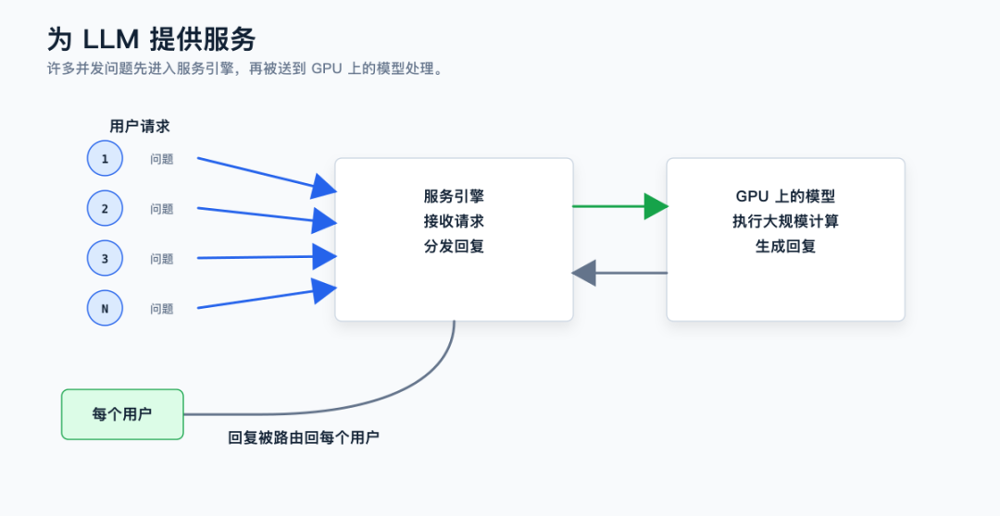
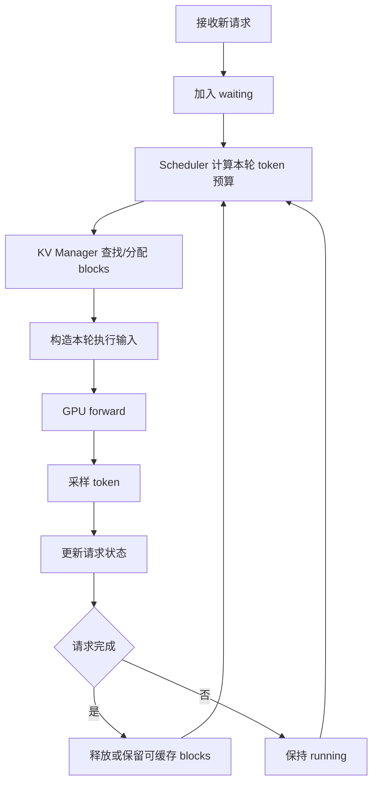
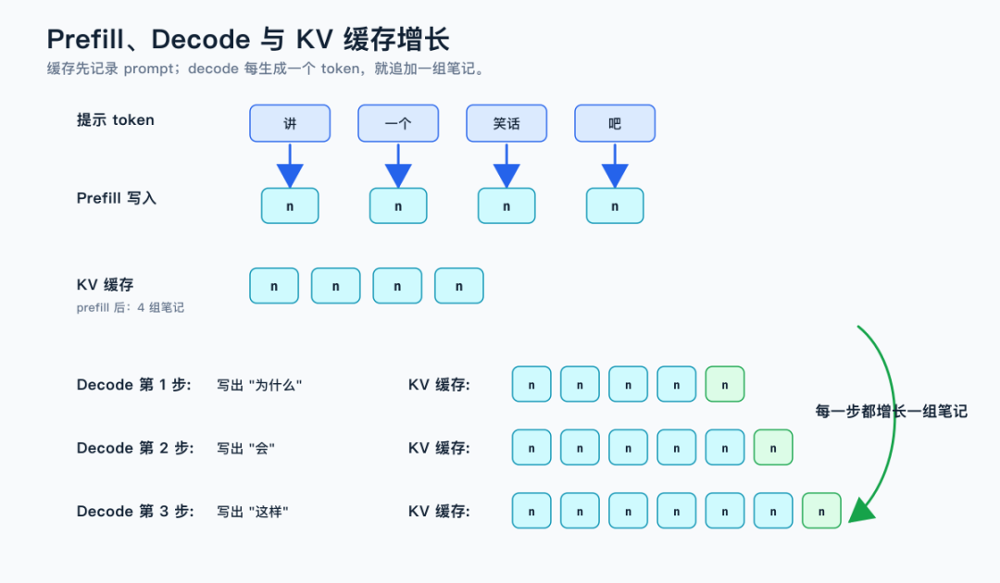
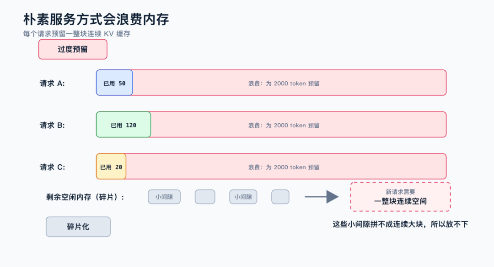
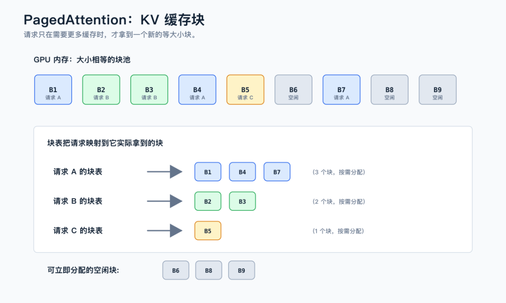
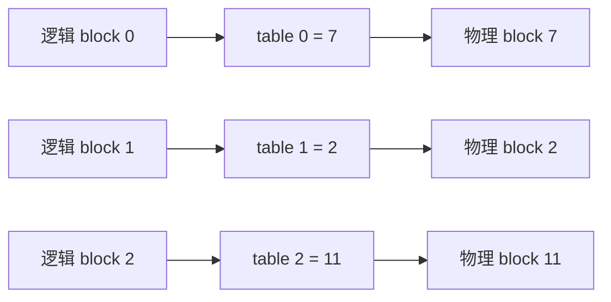
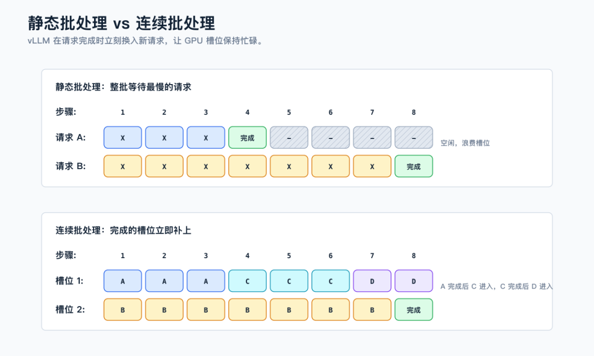
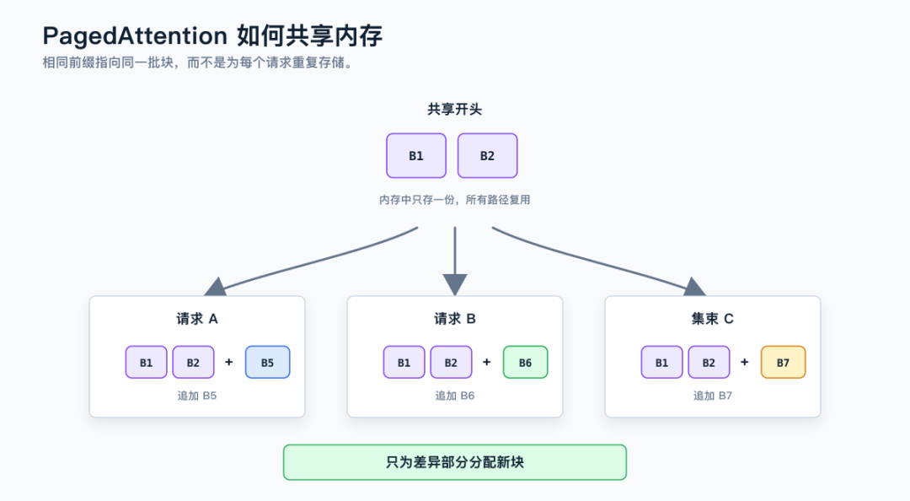
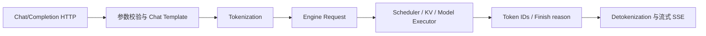

# vLLM 从连续批处理到 PagedAttention 的引擎工作流学习文档

本文面向第一次理解 vLLM 的同学，从一条请求如何进入引擎开始，串起 Prefill、Decode、KV Cache、PagedAttention 与 Continuous Batching。目标不是记住某个版本的函数名，而是看懂“显存块”和“调度迭代”为什么必须一起设计。

本文是第三方资料整理型学习资料，不是 vLLM 当前源码审计。原文中的代码示例横跨早期 vLLM V0 与概念性示意；具体类名、默认参数和调度顺序应以目标版本为准。

## 0. 阅读基线与范围

| 项目 | 内容 |
| --- | --- |
| 原文一 | 《深入拆解连续批处理：LLM推理吞吐量提升23倍的调度革命》 |
| 链接 | https://mp.weixin.qq.com/s/o4jHNE1PWjsXu5tYaNoDxA |
| 作者/机构 | 因吹斯听-路路 |
| 发布时间 | 2026-07-24 |
| 原文二 | 《（译）vLLM 是如何工作的？》 |
| 链接 | https://mp.weixin.qq.com/s/vHjH8Htg58Zh7XzxRWo1Sg |
| 作者/机构 | 做点有意义的事 |
| 发布时间 | 2026-07-02 |
| 读取时间 | 2026-07-25 |
| 整理范围 | 单实例生成式 Serving 的主流程、KV 物理管理、连续批处理与基础抢占 |
| 不展开内容 | vLLM V1 的逐行源码、分布式执行器、PD 分离、特定模型 kernel |
| 验证边界 | 基于两篇图文做机制重组；原文性能数字未复现，历史代码不能直接套用到新版本 |

### 怎么读本文

1. 第 1、2 节先建立请求生命周期。
2. 第 3、4 节理解 PagedAttention 管的是“存在哪里”。
3. 第 5、6 节理解 Continuous Batching 管的是“下一轮算谁”。
4. 第 7 节专门纠正“有 block 就自动共享前缀”的误解。

### 术语速查

| 术语 | 人话解释 | 本文重点 |
| --- | --- | --- |
| Engine | 接住请求并持续驱动模型迭代的运行时 | 不等于一次模型调用 |
| Request | 一次输入与生成任务 | 有等待、运行、完成等状态 |
| Sequence | 请求当前已经拥有的 token 序列 | 其 KV 随生成增长 |
| Prefill | 为输入 prompt 批量计算 KV | 产生首个可采样位置 |
| Decode | 每轮扩展一个或少量 token | 持续申请新 KV 空间 |
| KV Cache | 各层 Attention 复用的 K/V 状态 | 决定主要并发容量 |
| Physical block | GPU 中固定大小的 KV 存储块 | 可离散分配 |
| Block table | 请求逻辑 block 到物理 block 的映射 | Attention 的寻址依据 |
| PagedAttention | 按 block table 访问分页 KV 的 Attention | 物理内存机制 |
| Continuous Batching | 在迭代边界动态换入换出请求 | 调度机制 |
| Preemption | 资源不足时暂停并移出部分请求 | 后续可恢复或重算 |

## 1. 先建立整体地图

### 1.1 人话版

vLLM 引擎可以先理解成两个协同的管理器：

- KV 管理器把 GPU 显存切成 block，记录每个请求拿了哪些块。
- Scheduler 在每一轮选择请求，并决定每个请求本轮要处理多少 token。

Scheduler 不能只看“还有几个请求槽位”，因为真正稀缺的是 KV block；KV 管理器也不能独自决定何时分配，因为只有 Scheduler 知道下一轮哪些请求会运行。



**图意解读：** 图中的上层请求入口属于控制面，负责排队和组织 batch；下层模型执行器属于数据面，实际运行 tensor 计算。KV Cache 连接两边：Scheduler 决定哪些逻辑位置需要空间，执行器按映射读写物理块。图是教学总览，不代表某个 vLLM 版本的精确进程边界。

### 1.2 主循环



一次循环只推进系统一个“迭代”。Prefill 请求可能一次推进很多 token，Decode 请求通常推进一个 token，Chunked Prefill 则只推进长 prompt 的一部分。

## 2. Prefill、Decode 与不断增长的 KV

### 2.1 两阶段不是两套模型

同一个 Transformer 在两个阶段执行不同形状的工作：

| 阶段 | 输入形状直觉 | KV 行为 | 常见瓶颈 |
| --- | --- | --- | --- |
| Prefill | 一次输入 prompt 的许多 token | 为所有输入位置写入 KV | 大矩阵计算、激活 |
| Decode | 每轮每请求一个新 token | 读取历史 KV，再追加一个位置 | HBM 读取、launch |



**图意解读：** Prefill 一次建立输入序列的“历史笔记”，Decode 每轮必须读这些历史笔记并追加一条。控制权在 Scheduler：它决定当前轮放入多少 prefill token 和多少 decode token；图中的 KV 增长是数据结果，不会自行决定请求何时运行。

### 2.2 为什么 KV 决定并发

权重在所有请求之间共享，而每个请求的 KV 会随 live tokens 增长。粗略看：

```text
请求 KV 字节数
≈ live_tokens
  × 模型层数
  × 每层 KV heads
  × (K 维度 + V 维度)
  × dtype 字节数
```

因此两个都标注“并发 100”的测试，如果平均 live tokens 分别为 1K 和 32K，压力完全不同。

## 3. 朴素连续分配为什么浪费显存

### 3.1 最大长度预留的问题

如果一个请求进入时就按 `max_model_len` 预留连续 KV：

- 大多数请求提前结束，尾部预留从未使用，形成内部碎片。
- 请求长度不一、反复进出，空洞难以拼成大连续区，形成外部碎片。
- 为避免中途扩容失败，系统必须过度保守地 admission。



**图意解读：** 图里的空白不是“GPU 真的没有数据”，而是已被某个请求预订却从未写入的空间。它说明的是连续最大长度预留的浪费，不应解读为现代 vLLM 的实际布局。

### 3.2 分页思路

PagedAttention 借鉴虚拟内存：

1. 把可用 KV 空间切成固定大小的物理 block。
2. 请求只在真正需要时申请 block。
3. 逻辑相邻的 token 可以落在不相邻的物理 block。
4. block table 负责恢复逻辑顺序。

其关键收益不是“KV 变小”，而是**分配粒度变小、连续性要求消失**。

## 4. PagedAttention 的三层关系

### 4.1 逻辑序列、块表与物理 KV



**图意解读：** 上方逻辑块属于某个请求的顺序视图；中间 block table 是寻址元数据；下方物理块来自全局 GPU KV 池。Attention kernel 通过表项找到 K/V，而不是要求请求的 KV 在物理上连续。表只表达“在哪里”，不自动表达“为什么两个请求可以共享”。



### 4.2 按需增长

假设 `block_size=16`：

```text
prompt 30 tokens:
  需要 2 个 block，第二个 block 只有部分位置有效

再 decode 2 tokens:
  填满第二个 block

再 decode 1 token:
  才申请第三个 block
```

固定 block 仍可能在最后一块产生少量内部碎片，但上限通常小于一个 block，而不是整个最大上下文。

### 4.3 回收

请求完成后，物理 block 的去向取决于是否仍被引用或作为 prefix cache 保留：

- 无其他引用且不保留：回到 free block pool。
- 被其他序列共享：引用计数未归零，不能释放。
- 被 APC 留作前缀缓存：从活跃请求所有权转为可淘汰缓存。

这说明“请求结束”和“物理 KV 立即消失”不是同一个事件。

## 5. Continuous Batching 的真正含义

### 5.1 静态 batch 的木桶效应

假设 A、B、C 同批，输出长度分别为 100、10、20。静态批处理中，B 和 C 完成后留下的槽位要等 A 结束才能重用。

连续批处理在每个 step 后重组：

```text
step 1..10: [A, B, C]
B 完成
step 11:    [A, D, C]
C 完成
step 21:    [A, D, E]
```



**图意解读：** 图的核心不是颜色，而是 admission 边界：静态模式只在整个 batch 完成后接纳新请求；连续模式每个迭代都能填补空槽。真实引擎还受 KV block、token budget、模型类型和优先级限制，不是“有空位就一定加入”。

### 5.2 调度单位是 token budget，不只是请求数

一轮可能同时包含：

- 多个 decode 请求，各需要 1 个 token；
- 一个新短 prompt，需要几百个 prefill token；
- 一个长 prompt 的 chunk，需要几千个 prefill token。

Scheduler 应同时检查：

```text
本轮可调度 token 数
KV block 是否够
sequence/request 槽位是否够
模型/LoRA/多模态约束是否兼容
优先级与抢占策略
```

因此，连续批处理不是简单的 `waiting_queue.pop()`。

### 5.3 一个迭代例子

假设：

- 本轮 token 预算为 8；
- running 中有 A、B、C 三个 decode 请求，各需 1；
- waiting 中 D 还有 10 个 prompt token 未 prefill。

一种可行决策是：

```text
先给 A/B/C 各 1 token：占 3
剩余预算 5：给 D prefill 5 token
下一轮再继续 D
```

这就是 decode 与 chunked prefill 可以共享同一轮预算的直觉。具体优先级和混合方式随版本及配置变化。

## 6. Admission、完成与抢占

### 6.1 Admission 不是“队列不空就加入”

新请求进入运行集合前，至少要保证：

1. 能为本轮新 token 分配物理 block。
2. 能为未来推进留出框架要求的安全余量。
3. 不超过 batch token、sequence 和并发约束。
4. 必要的前缀块已经可用。

### 6.2 资源不足时怎么办

抽象上常见两条恢复路径：

| 路径 | 做法 | 代价 |
| --- | --- | --- |
| Recompute | 丢弃被抢占请求的部分 KV，恢复后重新 prefill | 多计算，少 CPU 交换依赖 |
| Swap | 把 KV 换到 CPU，恢复时换回 | 消耗 PCIe/Host 内存和 I/O 时延 |

不同版本可能对不同 sequence group、并行模式采用不同策略。不要只看到“支持 swap”就假设线上默认会高效使用。

### 6.3 为什么要监控抢占

频繁 preemption/recompute 通常意味着：

- `max_num_seqs` 或到达率超过 KV 实际容量；
- 输出长度尾部比预估长；
- `max_num_batched_tokens` 与 chunk 策略不合适；
- prefix cache 保留过多冷块；
- 模型或 KV dtype 与容量估计不一致。

吞吐看似仍高时，TTFT P99 可能已经被恢复与重算拉坏。

## 7. Block sharing 与 Prefix Cache 的边界



**图意解读：** 图展示的是“共享后的物理结果”：两个块表可以指向同一个只读物理块。但仅有 PagedAttention 的寻址能力还不够，系统还要用 APC/hash 识别相同前缀、增加引用计数、处理写时分离并决定淘汰。把共享完全归因于 PagedAttention，是适合入门的简化说法，不是完整控制机制。

### 7.1 三个必要条件

跨请求共享至少需要：

1. **识别相同内容**：例如链式 block hash。
2. **共享所有权**：多个请求能引用同一物理块，引用期间不可回收。
3. **可变尾部分离**：共享前缀后，各请求的新 token 写入自己的后续 block。

### 7.2 为什么完整 block 边界重要

一个 block 尚未填满时，其后续 token 可能改变整个 block 的内容标识，通常不适合当作稳定共享单元。APC 因而更容易在完整 block 上建立可复用 hash。

链式哈希和二分命中过程见 [vLLM APC 链式哈希学习文档](vLLM%20APC%20链式哈希学习文档.md)。

## 8. 原文性能数字应该怎样读

第一篇原文引用了连续批处理相对静态/朴素实现的多组大幅提升，包括“约 23 倍”等结果。这些数字表达了**消除 batch 木桶效应可能带来数量级收益**，但不能直接当作现代框架之间的差距。

必须绑定：

- 比较基线是否支持动态 batching；
- 模型与 GPU；
- 输入/输出长度分布；
- 并发和到达率；
- latency SLO；
- vLLM 版本及所有 scheduler 参数。

原文还引用了早期 vLLM `v0.2.x` 的 `_schedule()` 代码帮助理解。它适合说明 waiting/running/swapped 的概念，不能用作 vLLM V1 的当前代码导航。

## 9. API 服务层与 Engine 的边界

vLLM 对外可提供 OpenAI-compatible API，但协议兼容层与本篇讨论的 Engine 主循环不是一件事：



API 层负责协议、认证/限流（若部署提供）、chat template、流式连接与错误返回；Engine 负责 token 级调度和 GPU 资源。出现“HTTP 很慢”时要拆分：

- 请求是否卡在前端排队/tokenization；
- Engine queue time 是否高；
- TTFT 是否来自 Prefill；
- 流式网络是否有 backpressure；
- detokenization/JSON 序列化是否成为 CPU 瓶颈。

把 endpoint 改成兼容格式不会自动改变 PagedAttention 或 Continuous Batching；反过来，Engine 吞吐高也不保证 API P99 一定低。

## 10. 小白排障地图

| 现象 | 优先检查 | 机制解释 |
| --- | --- | --- |
| GPU 显存还有一些，但新请求进不来 | 可用 block、最后块碎片、并发/序列上限 | “剩余字节”不一定组成可分配资源 |
| TTFT P99 被长 prompt 拉高 | Chunked Prefill、token budget、队列深度 | 长 prefill 占据单轮 GPU |
| decode ITL 抖动 | prefill/decode 混合、抢占、batch 形状 | decode 轮次被大计算或恢复干扰 |
| 吞吐低且 GPU 有空泡 | waiting 是否持续有请求、batch token 数、CPU scheduler | Continuous Batching 也需要足够工作 |
| APC 开了但命中低 | tokenization、完整 block 边界、hash、缓存淘汰 | 相似文本不一定产生相同 token block |
| preemption 很多 | live token 分布、KV dtype、容量参数 | 活跃 KV 超过物理 block 池 |

## 11. 进一步阅读

- 存储粒度与计算粒度：[vLLM Chunked Prefill 与 Block Size 学习文档](vLLM%20Chunked%20Prefill%20与%20Block%20Size%20学习文档.md)
- 前缀命中：[vLLM APC 链式哈希学习文档](vLLM%20APC%20链式哈希学习文档.md)
- 分布式 KV 接入：[Mooncake 与 vLLM 接入地图学习文档](Mooncake%20与%20vLLM%20接入地图学习文档.md)
- 跨框架心智模型：[LLM 推理系统心智模型与 SGLang、vLLM 选型边界学习文档](../llm-inference/LLM%20推理系统心智模型与%20SGLang、vLLM%20选型边界学习文档.md)

## 12. 一句话总结

PagedAttention 用 block table 解决 KV “怎么放、怎么找”，Continuous Batching 在每个迭代解决“下一轮算谁”；两者共享同一份 KV 容量预算，合起来才构成高并发 vLLM 引擎的主骨架。

## 13. 参考与延伸

- 《深入拆解连续批处理：LLM推理吞吐量提升23倍的调度革命》：https://mp.weixin.qq.com/s/o4jHNE1PWjsXu5tYaNoDxA
- 《（译）vLLM 是如何工作的？》：https://mp.weixin.qq.com/s/vHjH8Htg58Zh7XzxRWo1Sg

本文基于上述图文做二次整理。图中架构用于解释概念，不承诺与任一 vLLM 版本的类和进程一一对应。
